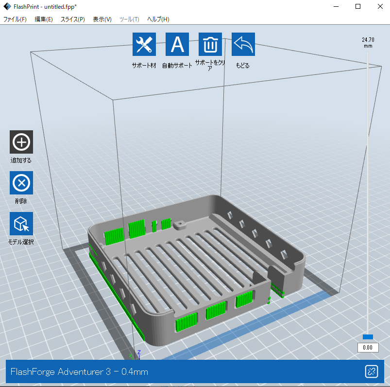

***********************************************************
3Dプリント部品を作ろう
***********************************************************

例として、FLASHFORGE社製3Dプリンタでの造形方法を説明します。

1.  FLASHFORGEのスライサーソフト「FlashPrint」を起動し、ロードを選択します。

.. image:: ../../images/assembly/3dprint/3dprint01-01.PNG
    :width: 400px

2. ファイル選択ダイアログで、akari_hardwareリポジトリにある、造形したいSTLファイルを選択します。

.. image:: ../../images/assembly/3dprint/3dprint01-02.PNG
    :width: 400px

3.  表示されたモデルを移動・回転させ、枠内に収まるようにします。

.. image:: ../../images/assembly/3dprint/3dprint01-03.PNG
    :width: 400px

4. サポート材-自動サポートを選択し、サポート材を設定します。

5. スライスを選択し、3Dプリンタに合わせた細かな設定を行います。

.. image:: ../../images/assembly/3dprint/3dprint01-05.PNG
    :width: 400px

6. その後、gxファイルが出力され、3Dプリンタで造形可能です。
