***********************************************************
ボディーを組み立てよう
***********************************************************

| 次にボディー部分を組み立てます。

必要な道具
-----------------------------------------------------------
| - 精密ドライバ(＋)
| - No.2サイズのドライバ(＋)
| - ニッパ

1 M5基板の搭載
-----------------------------------------------------------

必要な部品
^^^^^^^^^^^^^^^^^^^^^^^^^^^^^^^^^^^^^^^^^^^^^^^^^^^^^^^^^^^
| (1) M5基板( :doc:`assembly_pcb` で組み立て済みのもの) 1個
| (3) AKARI Body 1個
| (38) タッピングビスM2.5-6 4個

.. image:: ../../images/assembly/body/body01-01.jpg
    :width: 400px

手順
^^^^^^^^^^^^^^^^^^^^^^^^^^^^^^^^^^^^^^^^^^^^^^^^^^^^^^^^^^^
組付けアニメーション

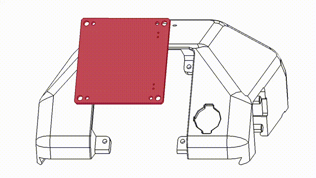

1. `(1) M5基板` を表側から載せる。

**CN9のピンヘッダが右前に来るようにすること**

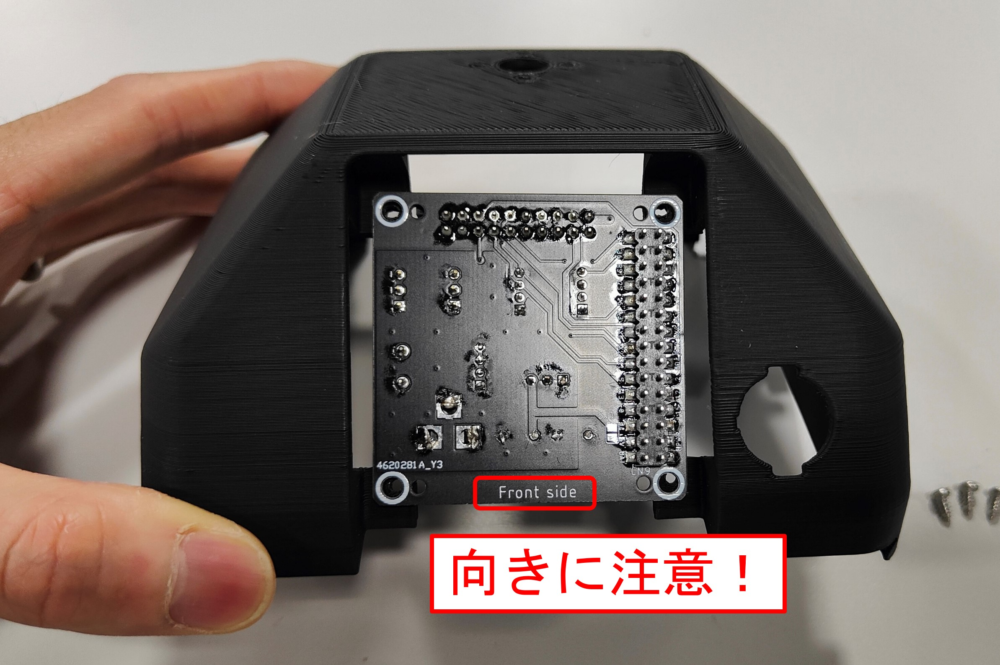

2. `(38) タッピングビスM2.5-6` で４点を表面からねじ留めする。

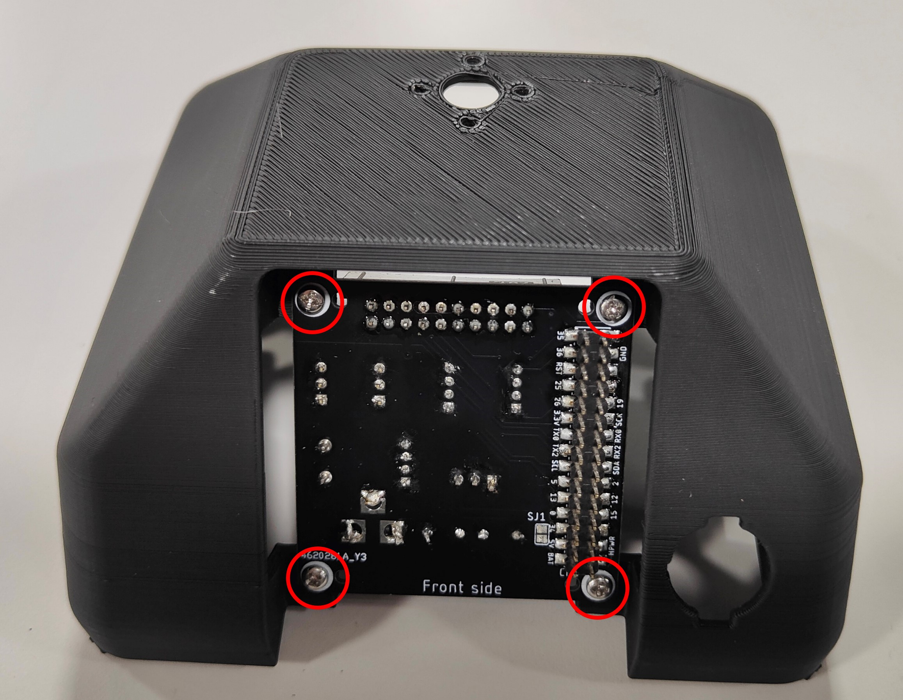

2 温湿度気圧センサユニットの搭載
-----------------------------------------------------------

必要な部品
^^^^^^^^^^^^^^^^^^^^^^^^^^^^^^^^^^^^^^^^^^^^^^^^^^^^^^^^^^^
| (9) 温湿度気圧センサユニット ENVⅢ 1個

.. image:: ../../images/assembly/body/body02-01.jpg
    :width: 400px

手順
^^^^^^^^^^^^^^^^^^^^^^^^^^^^^^^^^^^^^^^^^^^^^^^^^^^^^^^^^^^
組付けアニメーション

.. image:: ../../images/assembly/body/body02-ex.gif
    :width: 400px

1. `(9) 温湿度気圧センサユニット ENVⅢ` 付属の配線をボディーの右側面から通す。

.. image:: ../../images/assembly/body/body02-02.jpg
    :width: 400px

2. `(9) 温湿度気圧センサユニット ENVⅢ` を配線のコネクタに接続する。

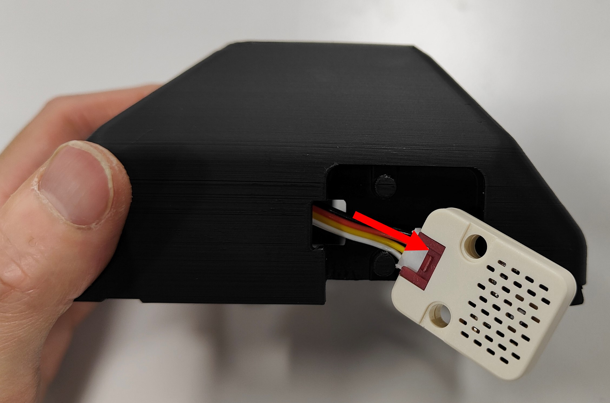

3. ENVⅢをボディーの突起に差し込む。

**ENVⅢのラベルがボディーの内向きになるようにすること**

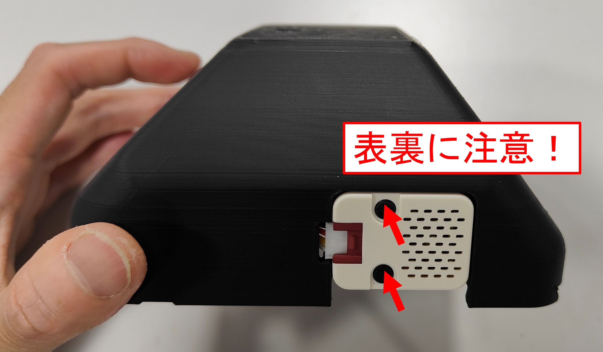

4. ケーブルの反対側(ボディー内部側)のコネクタをM5基板のCN6に差し込む。

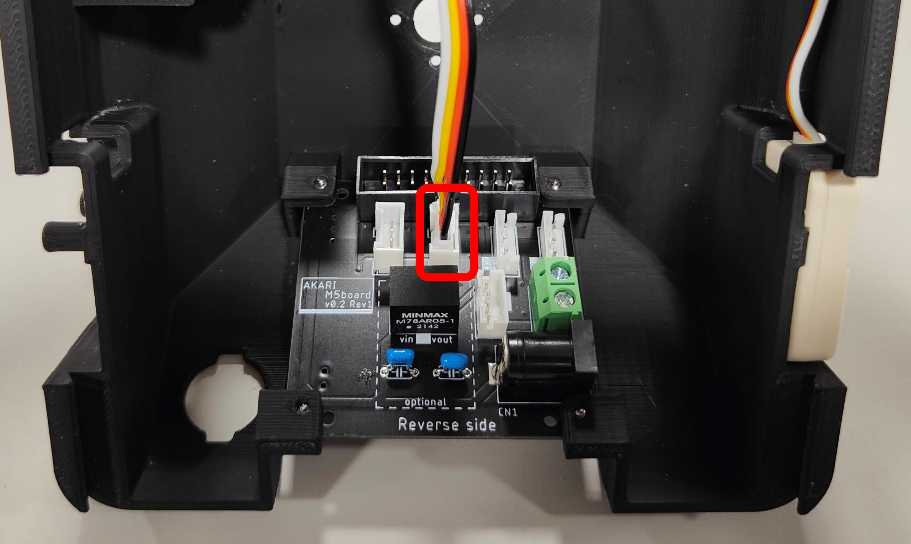

3 光センサユニットの搭載
-----------------------------------------------------------

必要な部品
^^^^^^^^^^^^^^^^^^^^^^^^^^^^^^^^^^^^^^^^^^^^^^^^^^^^^^^^^^^
| (10) 光センサユニット 1個

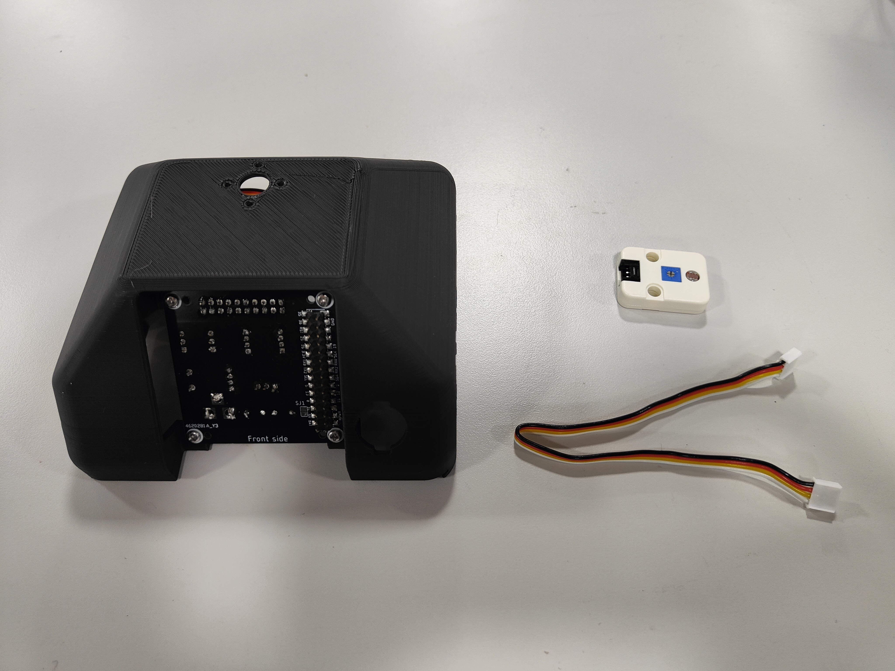

手順
^^^^^^^^^^^^^^^^^^^^^^^^^^^^^^^^^^^^^^^^^^^^^^^^^^^^^^^^^^^
組付けアニメーション

.. image:: ../../images/assembly/body/body03-ex.gif
    :width: 400px

1. `(10) 光センサユニット` 付属のケーブルをボディーの左側面から通す。

.. image:: ../../images/assembly/body/body03-02.jpg
    :width: 400px

2. `(10) 光センサユニット` を配線のコネクタに接続する。

.. image:: ../../images/assembly/body/body03-03.jpg
    :width: 400px

3. 光センサをボディーの突起に差し込む。

**光センサのラベルがボディーの内向きになるようにすること**

.. image:: ../../images/assembly/body/body03-04.jpg
    :width: 400px

4. ケーブルの反対側(ボディー内部側)のコネクタをM5基板のCN7に差し込む。

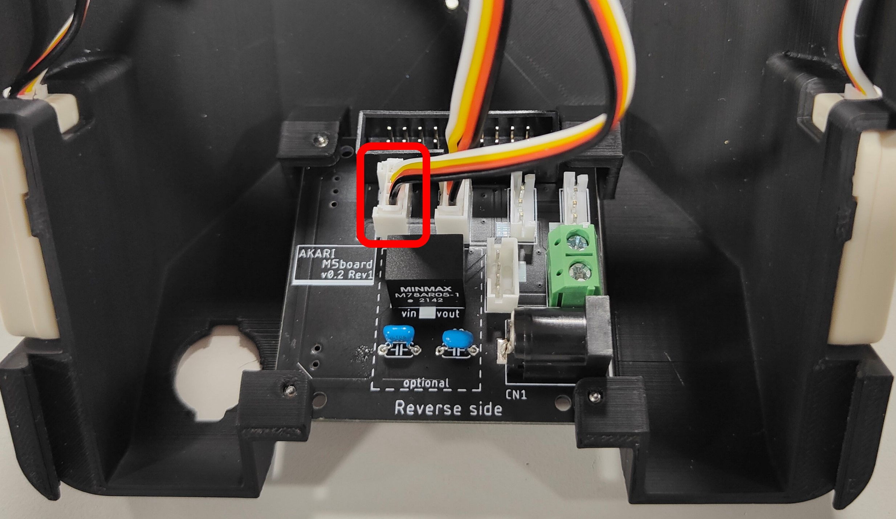

4 ヘッドとボディーの結合
-----------------------------------------------------------

必要な部品
^^^^^^^^^^^^^^^^^^^^^^^^^^^^^^^^^^^^^^^^^^^^^^^^^^^^^^^^^^^
| :doc:`assembly_head` で組み立てたヘッド 1個
| (25) Dynamixel 2XL430-W250-T付属のネジ(黒) 4個

.. image:: ../../images/assembly/body/body04-01.jpg
    :width: 400px

手順
^^^^^^^^^^^^^^^^^^^^^^^^^^^^^^^^^^^^^^^^^^^^^^^^^^^^^^^^^^^
組付けアニメーション

.. image:: ../../images/assembly/body/body04-ex.gif
    :width: 400px

1. ヘッドとボディーを図のように合わせ、内部から `(25)(24)付属のネジ(黒)` で4点ねじ留めする。

| **ヘッドとボディーが同じ方向を向いた状態で固定すること！**
| **締結向きがずれるとモータの初期位置とヘッドの初期位置がずれます！**

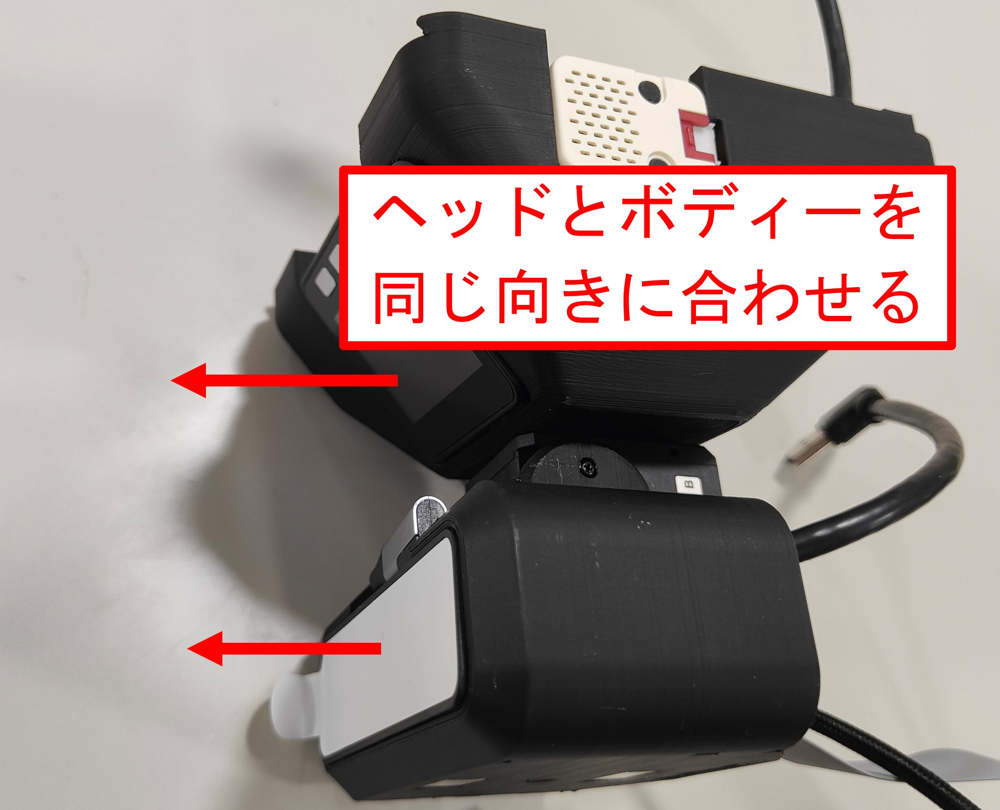

.. image:: ../../images/assembly/body/body04-03.jpg
    :width: 400px

5 電源スイッチの搭載
-----------------------------------------------------------

必要な部品
^^^^^^^^^^^^^^^^^^^^^^^^^^^^^^^^^^^^^^^^^^^^^^^^^^^^^^^^^^^
| (35) ロッカースイッチ 小型 丸型 2ピン 2極 1個
| (42) テフロン線（フッ素樹脂絶縁電線）26AWG 赤色10cm 2個

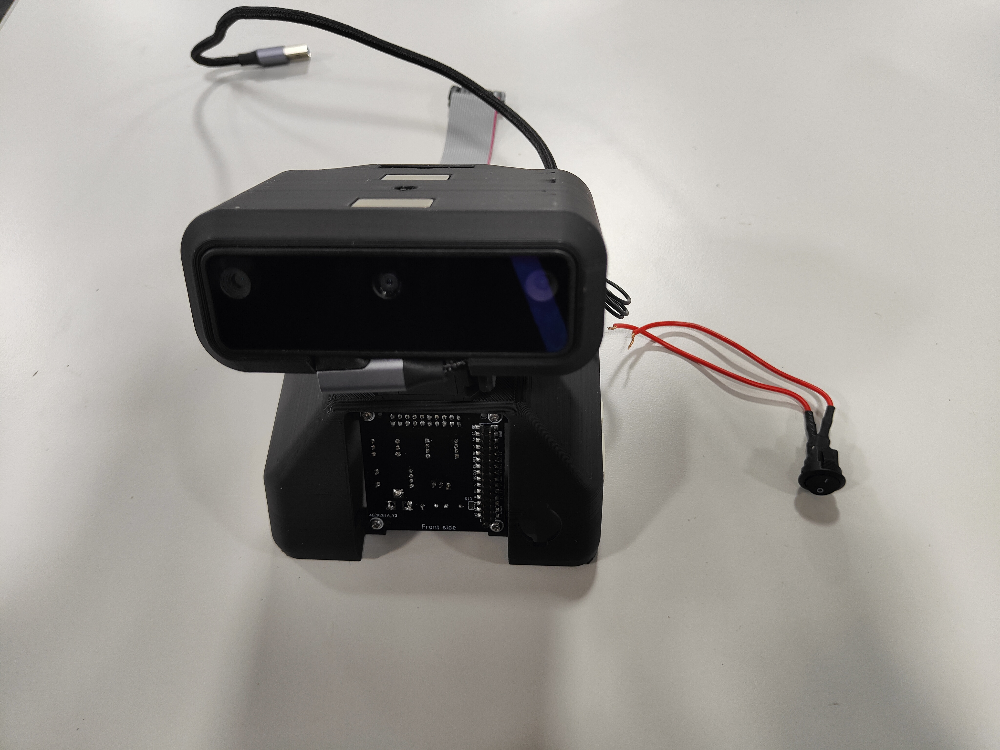

手順
^^^^^^^^^^^^^^^^^^^^^^^^^^^^^^^^^^^^^^^^^^^^^^^^^^^^^^^^^^^
組付けアニメーション

.. image:: ../../images/assembly/body/body05-ex.gif
    :width: 400px

1. `(35) ロッカースイッチ 小型 丸型 2ピン` の端子2箇所に、 `(42) テフロン線（フッ素樹脂絶縁電線）26AWG 赤色10cm` を1本ずつはんだ付けする。

.. image:: ../../images/assembly/body/body05-07.jpg
    :width: 400px

2. ボディー表面のスイッチ用の穴に表から2. の配線を通していき、 `(35) ロッカースイッチ 小型 丸型 2ピン` を押してはめ込む。

**○マークが下になるように**

.. image:: ../../images/assembly/body/body05-02.jpg
    :width: 400px

.. image:: ../../images/assembly/body/body05-03.jpg
    :width: 400px

3. ケーブルの反対側をM5基板のCN3のターミナルブロックに差し込み、ネジを締めて固定する。

| **線の順序は問わない。どちらの線をどちらの穴に差し込んでも問題ない。**

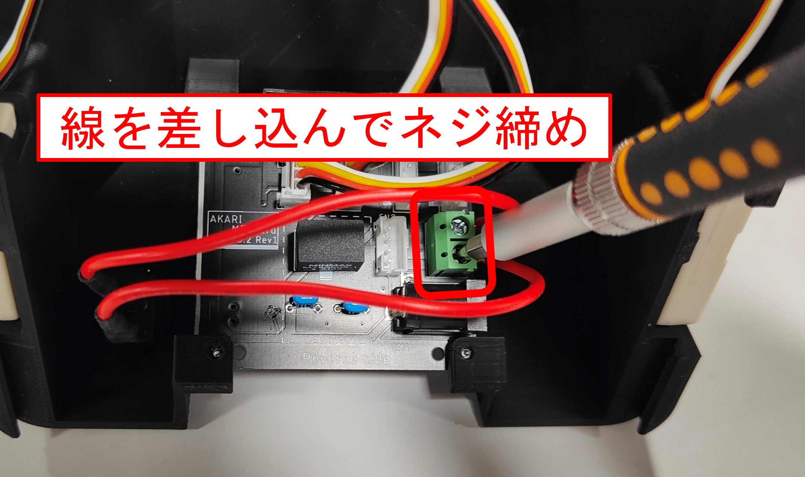

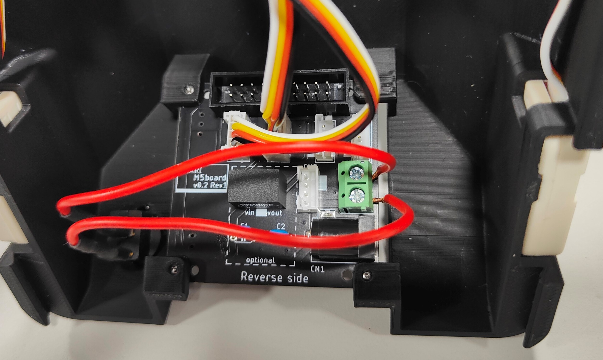

6 DCジャックの搭載
-----------------------------------------------------------

必要な部品
^^^^^^^^^^^^^^^^^^^^^^^^^^^^^^^^^^^^^^^^^^^^^^^^^^^^^^^^^^^
| (20) コネクタ付コード4P PH(赤黒黄緑) 1個
| (21) 2.1mm標準DCジャック パネル取付用 1個

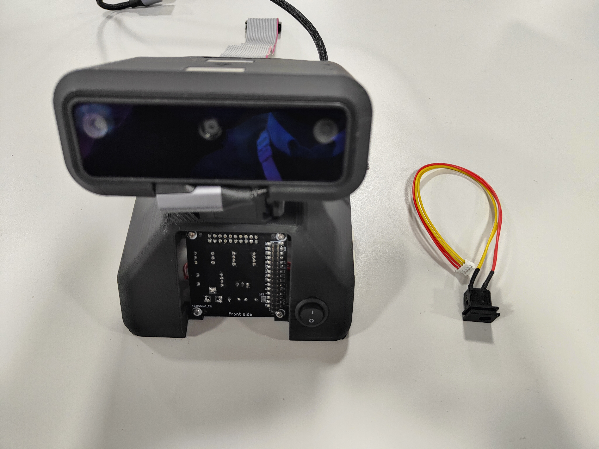

手順
^^^^^^^^^^^^^^^^^^^^^^^^^^^^^^^^^^^^^^^^^^^^^^^^^^^^^^^^^^^
組付けアニメーション

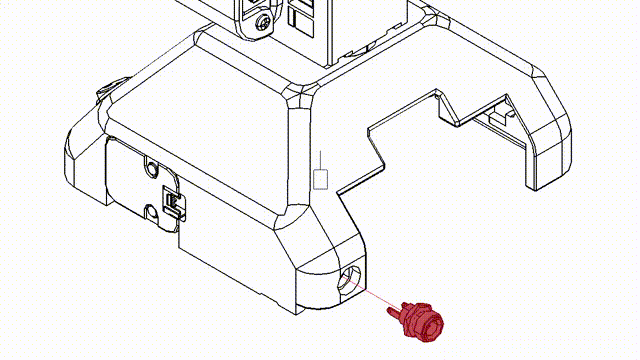

1. `(21) 2.1mm標準DCジャック パネル取付用` 付属のナットを、あらかじめ `(20) コネクタ付コード4P PH(赤黒黄緑)` に通す。

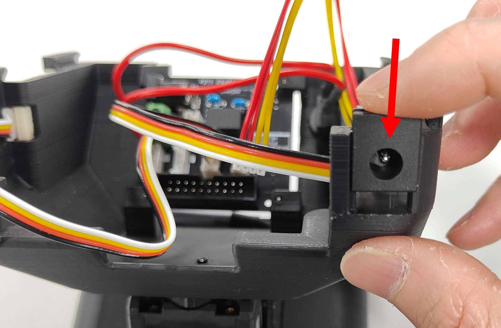

2. 1.を、ボディー背面のDCジャック用の穴に内側から通し、端線を外に出す。

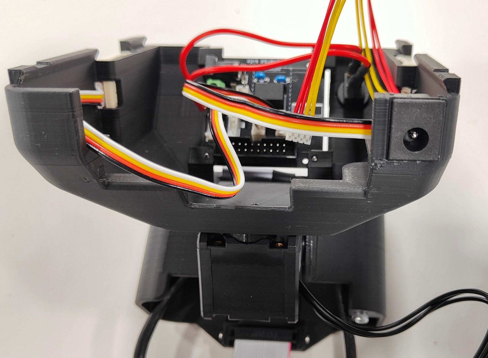

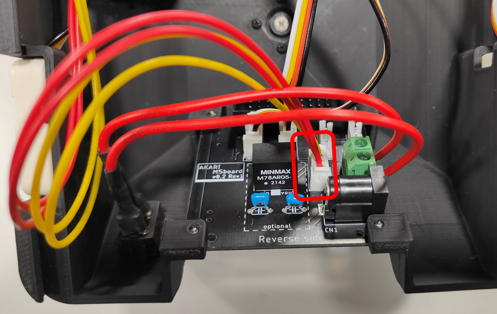

3. `(21) 2.1mm標準DCジャック パネル取付用` にはんだ付けする。

**+側(端子が短い方)に赤黒、-側(端子が長い方)に黄緑をはんだ付けすること。**

.. image:: ../../images/assembly/body/body06-05.jpg
    :width: 400px

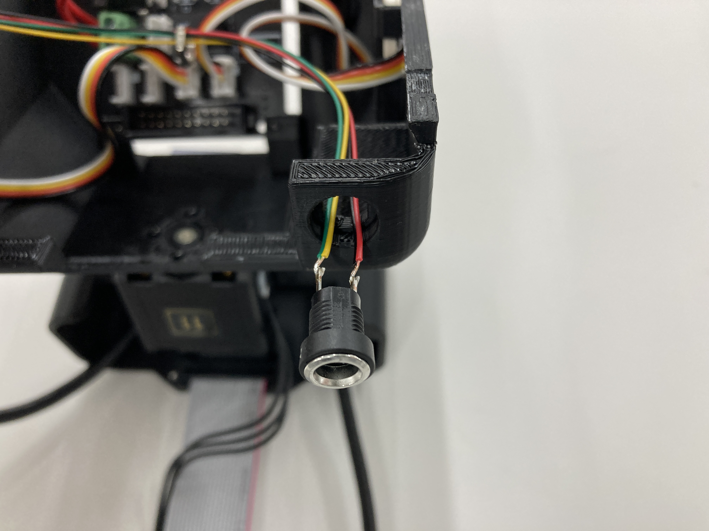

4. DCジャックをボディーの外側から押してはめ込む。

.. image:: ../../images/assembly/body/body06-08.jpg
    :width: 400px

5. ケーブルの反対側(ボディー内部側)のコネクタをM5基板のCN2に差し込む。

.. image:: ../../images/assembly/body/body06-09.jpg
    :width: 400px

6. ナットを内側から締める。

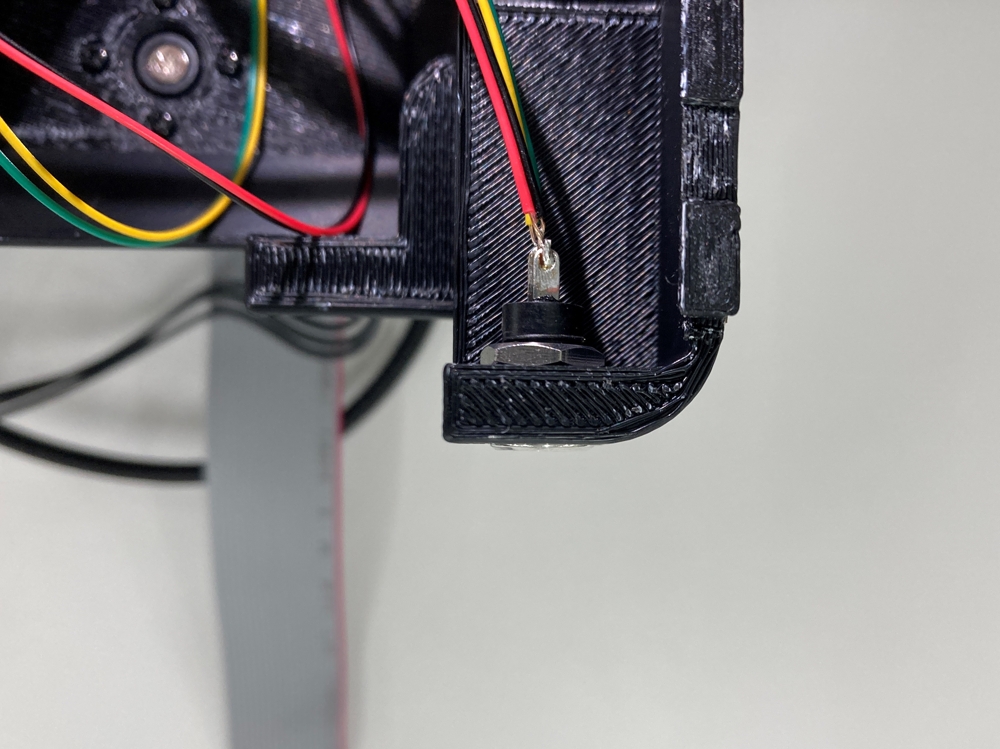

7 M5Stackの搭載
-----------------------------------------------------------

必要な部品
^^^^^^^^^^^^^^^^^^^^^^^^^^^^^^^^^^^^^^^^^^^^^^^^^^^^^^^^^^^
| (8) M5Stack BASIC 1個

.. image:: ../../images/assembly/body/body07-01.jpg
    :width: 400px

手順
^^^^^^^^
組付けアニメーション

.. image:: ../../images/assembly/body/body07-ex.gif
    :width: 400px

1. `(8) M5Stack BASIC` の背面を外す。

| **外れにくい場合は、マイナスドライバーをM5Stack側面の溝に差し込んで開く。**

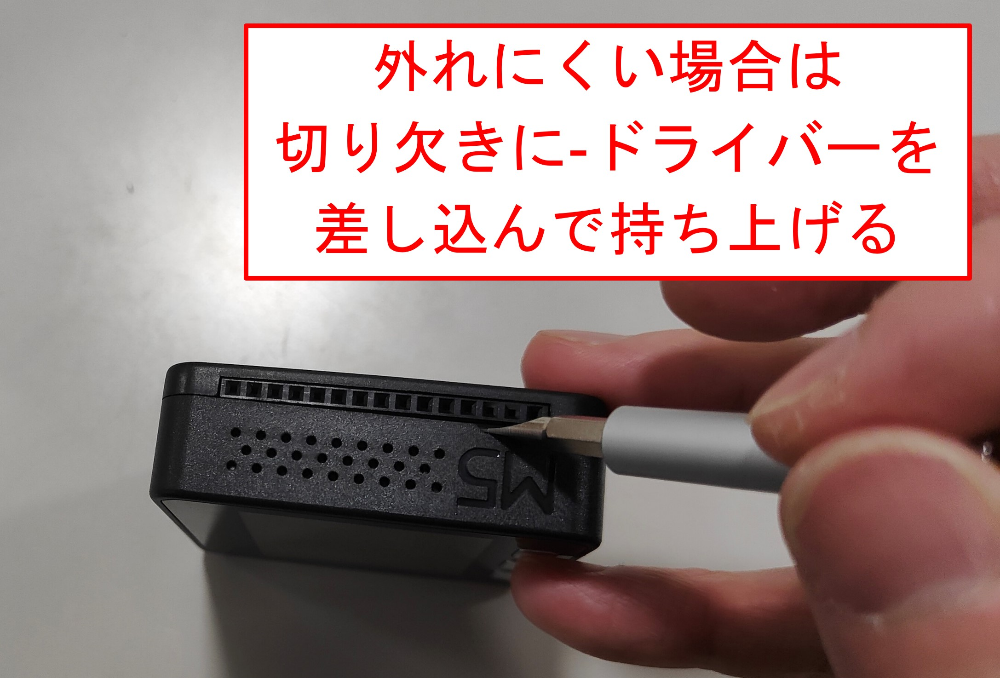

.. image:: ../../images/assembly/body/body07-03.jpg
    :width: 400px

2. `(8) M5Stack BASIC` の前面を、ボディーに取り付けたM5stack用基板に表から差し込む。

| **ディスプレイ中央部分に強い力をかけないこと。ディスプレイが割れる場合があります！**

.. image:: ../../images/assembly/body/body07-04.jpg
    :width: 400px

.. image:: ../../images/assembly/body/body07-05.jpg
    :width: 400px

8 GPIOケーブルの接続
-----------------------------------------------------------

必要な部品
^^^^^^^^^^^^^^^^^^^^^^^^^^^^^^^^^^^^^^^^^^^^^^^^^^^^^^^^^^^
| なし

手順
^^^^^^^^^^^^^^^^^^^^^^^^^^^^^^^^^^^^^^^^^^^^^^^^^^^^^^^^^^^
1. ヘッドのリボンケーブルをボディー背面から内部に通す。

.. image:: ../../images/assembly/body/body08-01.jpg
    :width: 400px

2. M5stack基板のCN8に差し込む。

.. image:: ../../images/assembly/body/body08-02.jpg
    :width: 400px

9 USB2DXIFの接続
-----------------------------------------------------------

必要な部品
^^^^^^^^^^^^^^^^^^^^^^^^^^^^^^^^^^^^^^^^^^^^^^^^^^^^^^^^^^^
| (27) USB2DXIF 1個
| (28) Robot Cable-X3P 180mm 1個
| (29) USB-CオスtoUSB-Aオス 変換アダプタ 1個

.. image:: ../../images/assembly/body/body09-01.jpg
    :width: 400px

手順
^^^^^^^^^^^^^^^^^^^^^^^^^^^^^^^^^^^^^^^^^^^^^^^^^^^^^^^^^^^
1. `(27) USB2DXIF` に `(28) Robot Cable-X3P` を差し込む。

.. image:: ../../images/assembly/body/body09-02.jpg
    :width: 400px

2. `(27) USB2DXIF` に `(29) USB-CオスtoUSB-Aオス 変換アダプタ` を差し込む。

| **変換アダプタのラベルが表を向くように接続すること**

.. image:: ../../images/assembly/body/body09-03.jpg
    :width: 400px

3. 2.の反対側のコネクタをCN4に差し込む。

 **基板側コネクタに(13-B) 2mmピッチピンヘッダ 1✕3を採用した場合は、図を見て同じ向きに接続すること！**

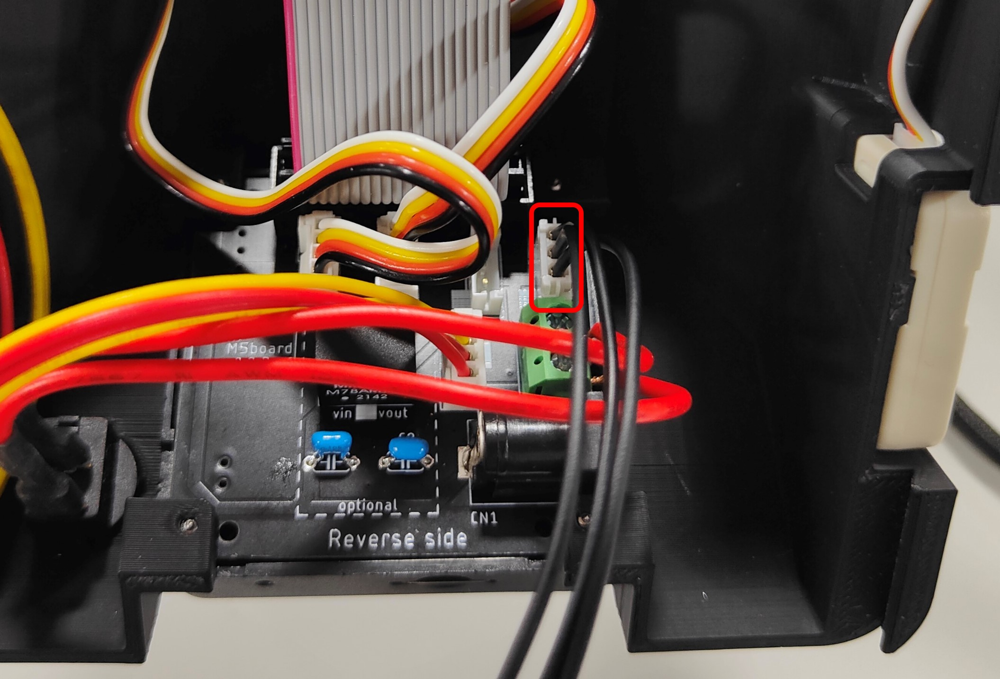

10 M5StackのUSB接続
-----------------------------------------------------------

必要な部品
^^^^^^^^^^^^^^^^^^^^^^^^^^^^^^^^^^^^^^^^^^^^^^^^^^^^^^^^^^^
| (32) USB Type-Cケーブル 0.3mL字 1個

.. image:: ../../images/assembly/body/body10-01.jpg
    :width: 400px

手順
^^^^^^^^^^^^^^^^^^^^^^^^^^^^^^^^^^^^^^^^^^^^^^^^^^^^^^^^^^^
1. `(32) USB Type-Cケーブル 0.3mL字` をボディー部の内側からM5Stack本体側面に差し込む。

.. image:: ../../images/assembly/body/body10-02.jpg
    :width: 400px

11 モータ線の接続
-----------------------------------------------------------

必要な部品
^^^^^^^^^^^^^^^^^^^^^^^^^^^^^^^^^^^^^^^^^^^^^^^^^^^^^^^^^^^
| なし

手順
^^^^^^^^^^^^^^^^^^^^^^^^^^^^^^^^^^^^^^^^^^^^^^^^^^^^^^^^^^^
1. ヘッドのDynamixelから出ているケーブルをボディー背面から内部に通す。

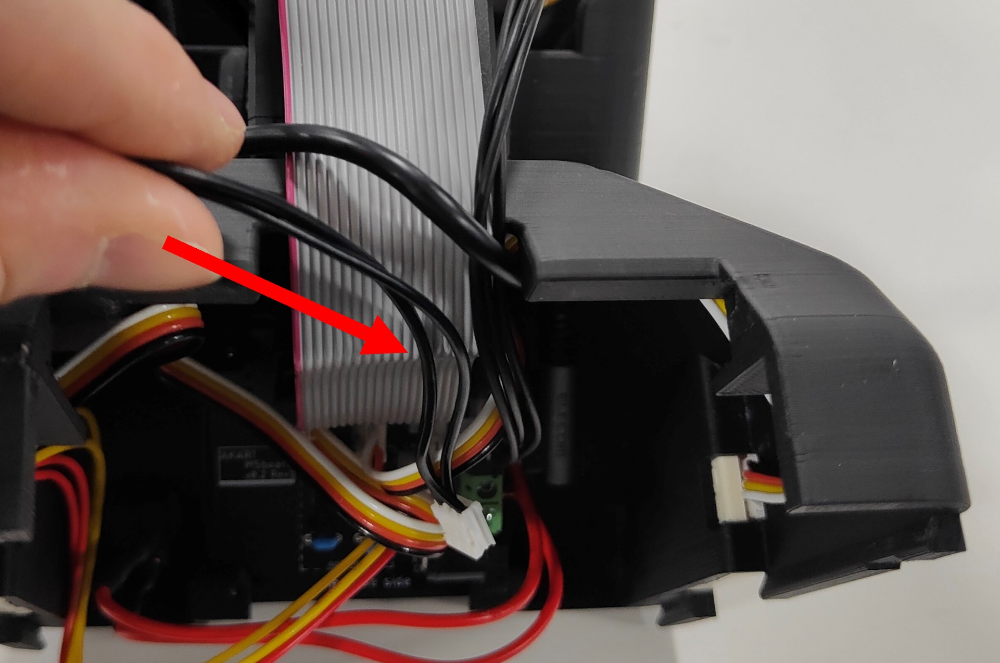

2. M5stack基板のCN5に差し込む。

 **基板側コネクタに(13-B) 2mmピッチピンヘッダ 1✕3を採用した場合は、図を見て同じ向きに接続すること！**

.. image:: ../../images/assembly/body/body11-02.jpg
    :width: 400px

12 カバーの取り付け
-----------------------------------------------------------

必要な部品
^^^^^^^^^^^^^^^^^^^^^^^^^^^^^^^^^^^^^^^^^^^^^^^^^^^^^^^^^^^
| (4) AKARI Cover 1個

.. image:: ../../images/assembly/body/body12-01.jpg
    :width: 400px

手順
^^^^^^^^^^^^^^^^^^^^^^^^^^^^^^^^^^^^^^^^^^^^^^^^^^^^^^^^^^^
組付けアニメーション

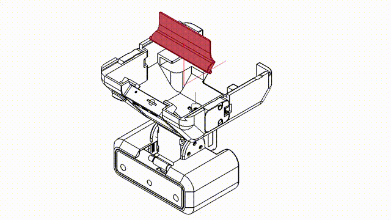

1. `(3) AKARI Body` 背面の溝に、ヘッドからの線(GPIOケーブル、OAK-D LITEのケーブル、モータケーブル、USBパネルマウントケーブル)が収まっている状態にする。

.. image:: ../../images/assembly/body/body12-02.jpg
    :width: 400px

2. 1.の線が `(3) AKARI Body` と `(4) AKARI Cover` の間を通るようにしながら、 `(3) AKARI Body` 内部から `(4) AKARI Cover` をカチッと奥まで差し込む。

.. image:: ../../images/assembly/body/body12-03.jpg
    :width: 400px

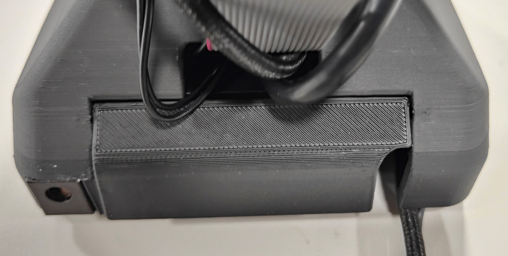

13 USBハブの搭載
-----------------------------------------------------------

必要な部品
^^^^^^^^^^^^^^^^^^^^^^^^^^^^^^^^^^^^^^^^^^^^^^^^^^^^^^^^^^^
| (30) USBハブ 4ポート15cm 1個

.. image:: ../../images/assembly/body/body13-01.jpg
    :width: 400px

手順
^^^^^^^^^^^^^^^^^^^^^^^^^^^^^^^^^^^^^^^^^^^^^^^^^^^^^^^^^^^
組付けアニメーション

.. image:: ../../images/assembly/body/body13-ex.gif
    :width: 400px

1. `(30) USBハブ 4ポート15cm` をボディー内部にスライドさせて挿入する。

.. image:: ../../images/assembly/body/body13-02.jpg
    :width: 400px

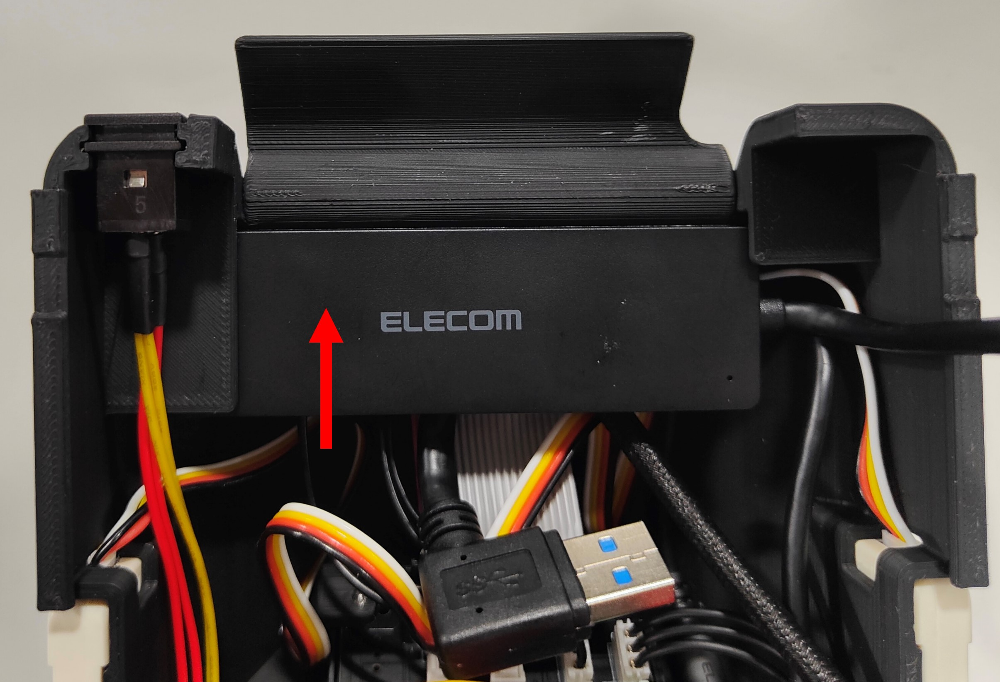

2. OAK-DのUSB線、`(30) USBハブ 4ポート15cm` のUSB線は、背面のカバーの溝から外部に出す。

.. image:: ../../images/assembly/body/body13-04.jpg
    :width: 400px

14 USBハブへのUSB接続
-----------------------------------------------------------

必要な部品
^^^^^^^^^^^^^^^^^^^^^^^^^^^^^^^^^^^^^^^^^^^^^^^^^^^^^^^^^^^
| なし

手順
^^^^^^^^^^^^^^^^^^^^^^^^^^^^^^^^^^^^^^^^^^^^^^^^^^^^^^^^^^^

1. USB2DXIFのUSBをボディー内部のUSBハブ(一番左)に差し込む。

.. image:: ../../images/assembly/body/body14-01.jpg
    :width: 400px

2. M5StackのUSBをボディー内部のUSBハブ(左から2番目)に差し込む。

.. image:: ../../images/assembly/body/body14-02.jpg
    :width: 400px

3. ヘッドのUSBパネルマウントからのUSBをボディー内部のUSBハブ(左から3番目)に差し込む。

.. image:: ../../images/assembly/body/body14-03.jpg
    :width: 400px

15 可動域の確認
-----------------------------------------------------------

必要な部品
^^^^^^^^^^^^^^^^^^^^^^^^^^^^^^^^^^^^^^^^^^^^^^^^^^^^^^^^^^^
| なし

手順
^^^^^^^^^^^^^^^^^^^^^^^^^^^^^^^^^^^^^^^^^^^^^^^^^^^^^^^^^^^

1. ヘッドを上下左右に外から動かしてみて、ケーブルの引っ掛かりがないか確認する。

.. image:: ../../images/assembly/body/body15-01.jpg
    :width: 400px

| 以上でボディーの組み立ては終わりです。
| 次はベースの組み立てを行います。

:doc:`assembly_base` へ進む

:doc:`part_list` へ戻る
