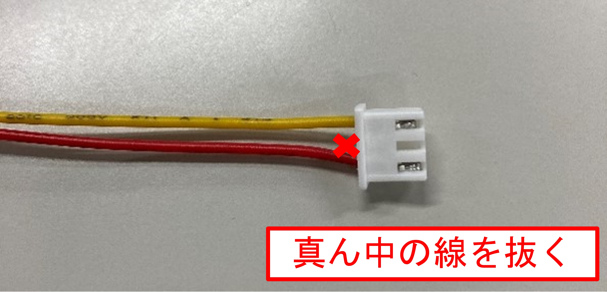
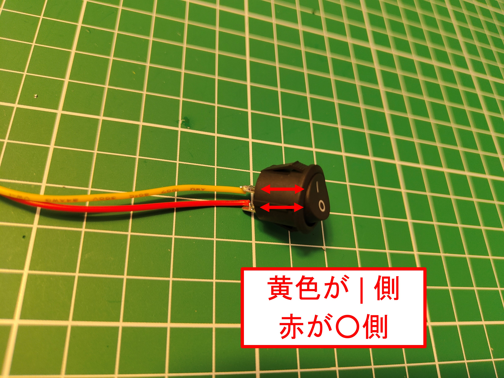
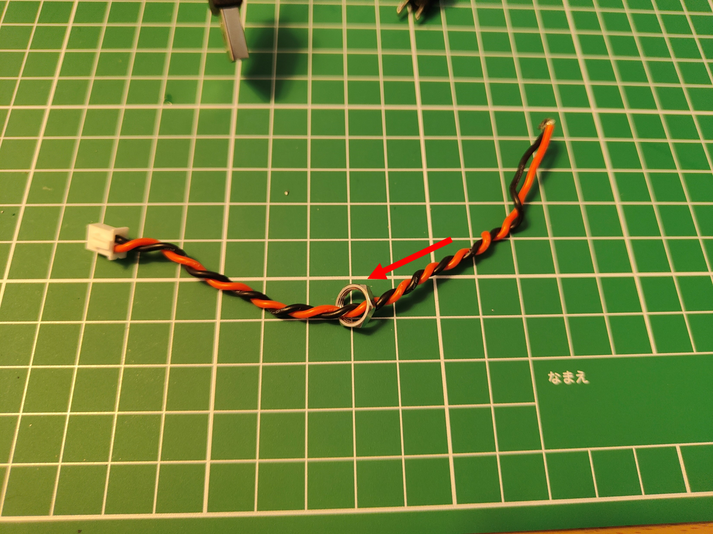
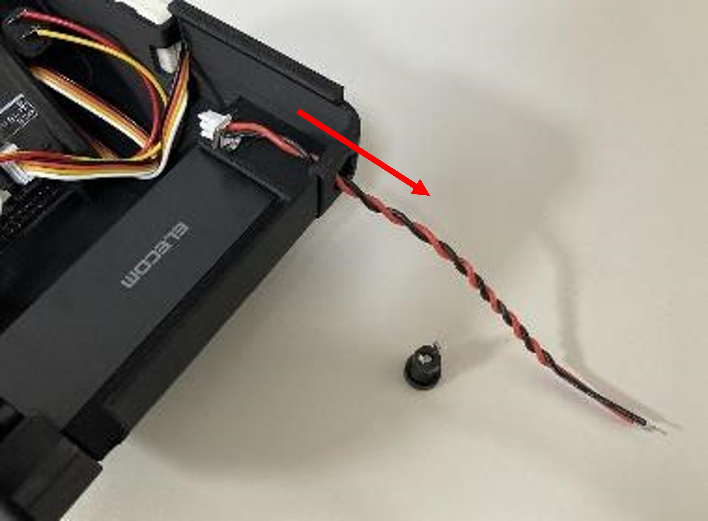
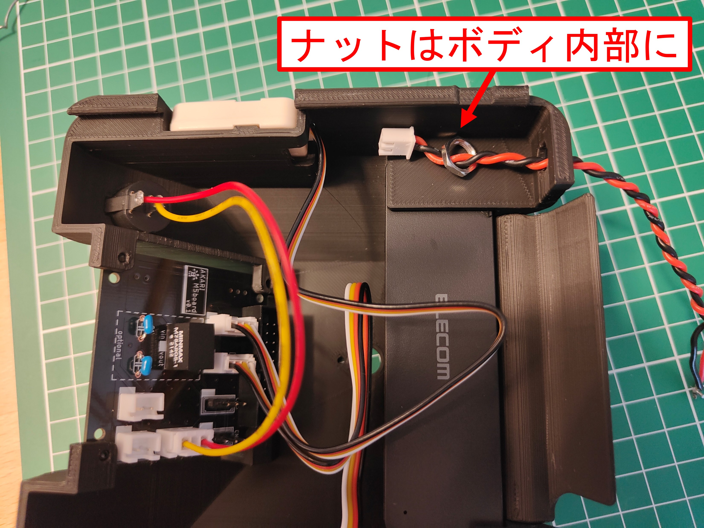
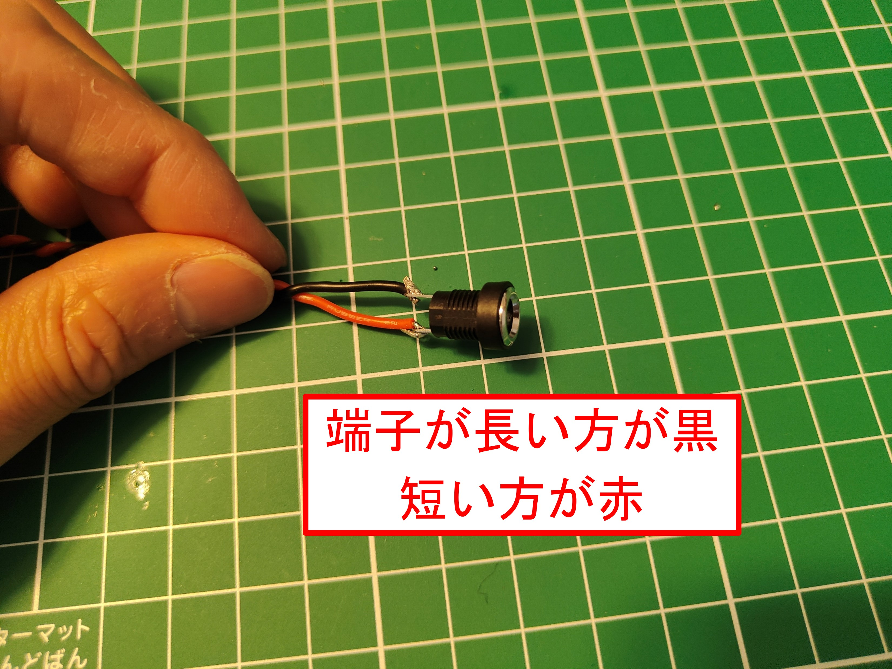
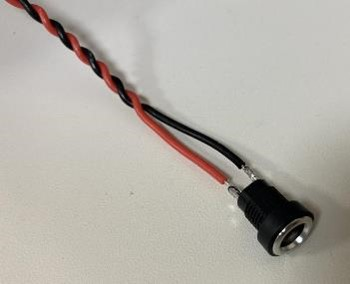
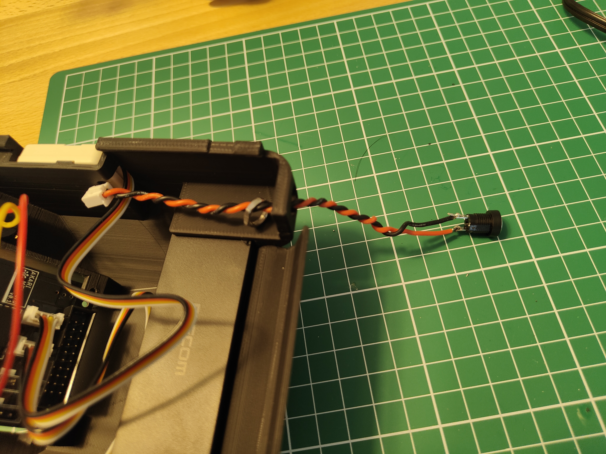
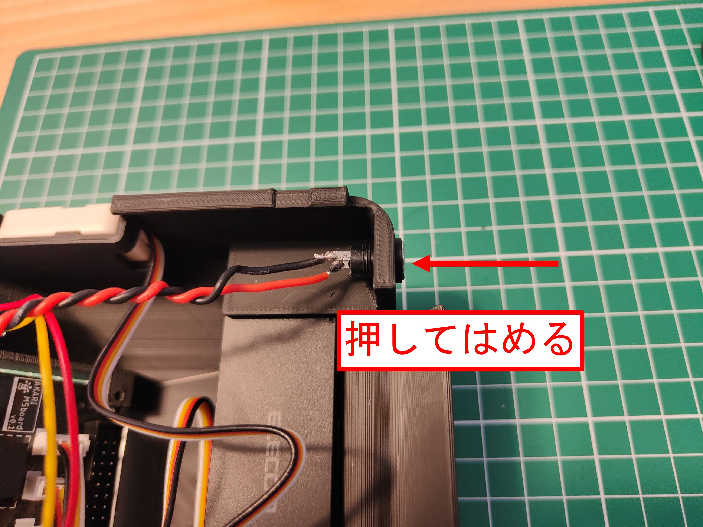

***********
ボディーを組み立てよう
***********

| 次にボディー部分を組み立てます。

必要な道具
--------
| - 精密ドライバ(＋)
| - はんだごて
| - はんだ線
| - ニッパ

１ カバーの取り付け
--------

必要な部品
^^^^^^^^
| (3) AKARI Body 1個
| (4) AKARI Cover 1個

.. image:: ../../images/assembly/body/body1-0.jpg
    :width: 300px

手順
^^^^^^^^
1. `(3) AKARI Body` 内部から `(4)AKARI Cover` をカチッと奥まで差し込む。

.. image:: ../../images/assembly/body/body1-1.jpg
    :width: 300px

.. image:: ../../images/assembly/body/body1-2.jpg
    :width: 300px

2 USB-Hubの搭載
--------

必要な部品
^^^^^^^^
| (29) USBハブ 4ポート15cm 1個
| (23) OAK-D Lite  1個
| (39) ボルトM4-5  2個

.. image:: ../../images/assembly/body/body2-0.jpg
    :width: 300px

手順
^^^^^^^^
1. `(29)USBハブ 4ポート15cm` をボディー内部にスライドさせて挿入する。

.. image:: ../../images/assembly/body/body2-1.jpg
    :width: 300px

3 M5基板の搭載
--------

必要な部品
^^^^^^^^
| (1) M5基板( :doc:`assembly_pcb` で組み立て済みのもの) 1個
| (40) タッピングビスM2.5-6 4個

.. image:: ../../images/assembly/body/body3-0.jpg
    :width: 300px

手順
^^^^^^^^
1. `(1) M5基板` を表側から載せる。

**CN9のピンヘッダが右前に来るようにすること**

.. image:: ../../images/assembly/body/body3-1.jpg
    :width: 300px

2. `(40) タッピングビスM2.5-6` で４点を表面からねじ留めする。

.. image:: ../../images/assembly/body/body3-2.jpg
    :width: 300px

4 温湿度気圧センサユニットの搭載
--------

必要な部品
^^^^^^^^
| (9) 温湿度気圧センサユニット ENVⅢ 1個

.. image:: ../../images/assembly/body/body4-0.jpg
    :width: 300px

手順
^^^^^^^^
1. `(9)温湿度気圧センサユニット ENVⅢ` 付属の配線をボディーの右側面から通す。

.. image:: ../../images/assembly/body/body4-1.jpg
    :width: 300px

2. `(9)温湿度気圧センサユニット ENVⅢ` を配線のコネクタに接続する。

.. image:: ../../images/assembly/body/body4-2.jpg
    :width: 300px

3. ENVⅢをボディーの突起に差し込む。

**ENVⅢのラベルがボディーの内向きになるようにすること**

.. image:: ../../images/assembly/body/body4-3.jpg
    :width: 300px

4. ケーブルの反対側(ボディー内部側)のコネクタをM5基板のCN6に差し込む。

.. image:: ../../images/assembly/body/body4-4.jpg
    :width: 300px

5 光センサユニットの搭載
--------

必要な部品
^^^^^^^^
| (10) 光センサユニット 1個

.. image:: ../../images/assembly/body/body5-0.jpg
    :width: 300px

手順
^^^^^^^^
1. `(10) 光センサユニット` 付属のケーブルをボディーの左側面から通す。

.. image:: ../../images/assembly/body/body5-1.jpg
    :width: 300px

2. `(10) 光センサユニット` を配線のコネクタに接続する。

.. image:: ../../images/assembly/body/body5-2.jpg
    :width: 300px

3. 光センサをボディーの突起に差し込む。

**光センサのラベルがボディーの内向きになるようにすること**

.. image:: ../../images/assembly/body/body5-3.jpg
    :width: 300px

4. ケーブルの反対側(ボディー内部側)のコネクタをM5基板のCN7に差し込む。

.. image:: ../../images/assembly/body/body5-4.jpg
    :width: 300px

6 電源スイッチの搭載
--------

必要な部品
^^^^^^^^
| (33) XHコネクタ付ケーブル 3P 1個
| (35) ロッカスイッチ 1個
.. image:: ../../images/assembly/body/body6-0.jpg
    :width: 300px

手順
^^^^^^^^
1. `(33) XHコネクタ付ケーブル 3P` の真ん中の黒線を抜く。もしくは切る。

2. `(35) ロッカスイッチ` の端子に `(33) XHコネクタ付ケーブル 3P` の赤、黃の線をはんだ付けする。

| **黃はスイッチのON側端子( | マーク側)**
| **赤はスイッチのOFF側端子(○マーク側)**

3. ボディー表面のスイッチ用の穴に表から2. の配線を通していき、ロッカスイッチを押してはめ込む。
**○マークが下になるように**

.. image:: ../../images/assembly/body/body6-3.jpg
    :width: 300px

.. image:: ../../images/assembly/body/body6-4.jpg
    :width: 300px

.. image:: ../../images/assembly/body/body6-5.jpg
    :width: 300px

4. ケーブルの反対側(ボディー内部側)のコネクタをM5基板のCN3に差し込む。

.. image:: ../../images/assembly/body/body6-6.jpg
    :width: 300px

7 DCジャックの搭載
--------

必要な部品
^^^^^^^^
| (19) コネクタ付コード2P XH 1個
| (20) 2.1mm標準DCジャック パネル取付用 1個

.. image:: ../../images/assembly/body/body7-0.jpg
    :width: 300px

手順
^^^^^^^^
1. `(19) コネクタ付コード2P XH` をツイスト線にする。

.. image:: ../../images/assembly/body/body7-1.jpg
    :width: 300px

2. `(20) 2.1mm標準DCジャック パネル取付用` 付属のナットを、あらかじめ `(19) コネクタ付コード2P XH` に通す。

3. 2.を、ボディー背面のDCジャック用の穴に内側から通し、端線を外に出す。

4. `(20) 2.1mm標準DCジャック パネル取付用` にはんだ付けする。

**+側(端子が短い方)に赤、-側(端子が長い方)に黒をはんだ付けすること。**

5. DCジャックをボディーの外側から押してはめ込む。

6. ケーブルの反対側(ボディー内部側)のコネクタをM5基板のCN2に差し込む。

7. ナットを内側から締める。

.. image:: ../../images/assembly/body/body7-9.jpg
    :width: 300px

| 以上でヘッドの組み立ては終わりです。
| 次はボディー部の組み立てを行います。

:doc:`assembly_base` へ進む

:doc:`part_list` へ戻る
