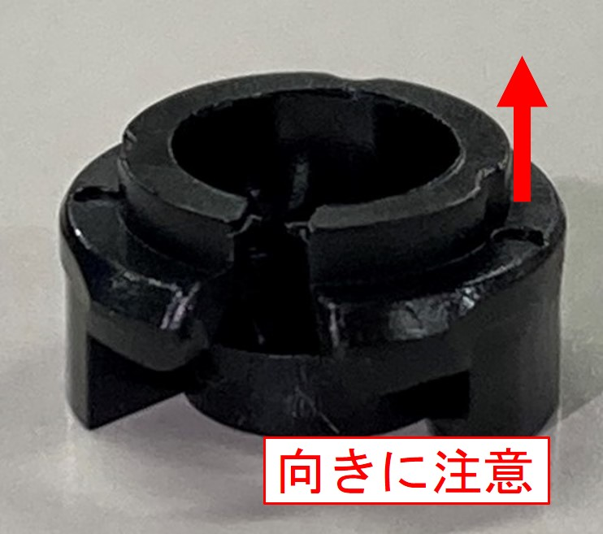
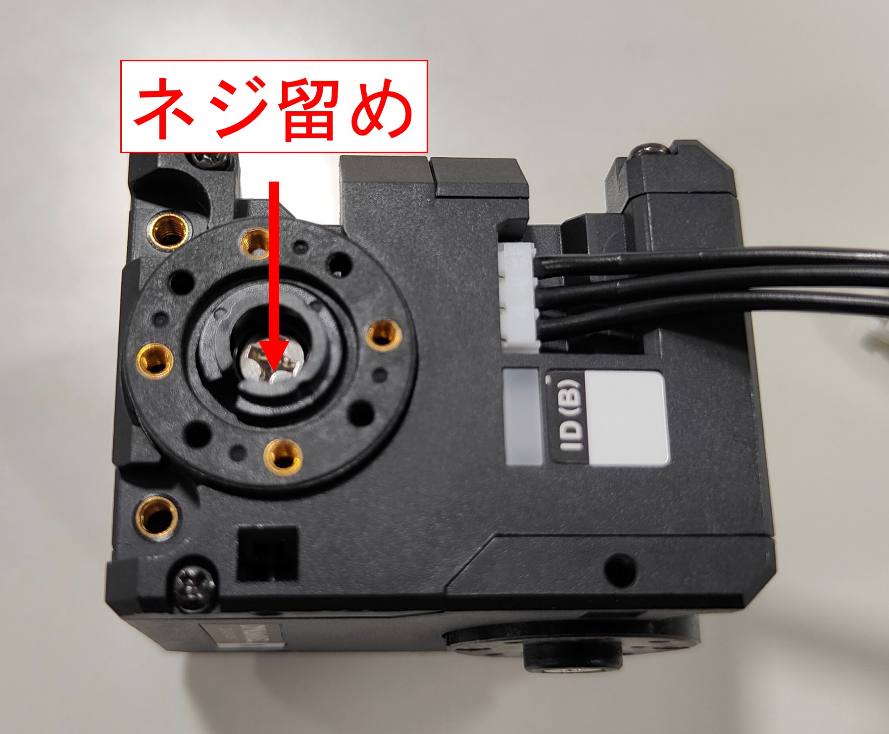
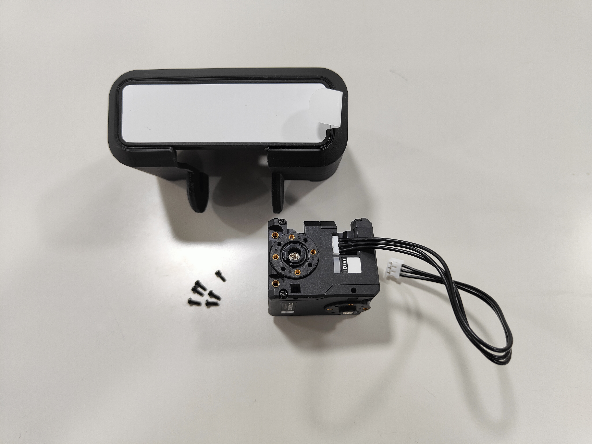
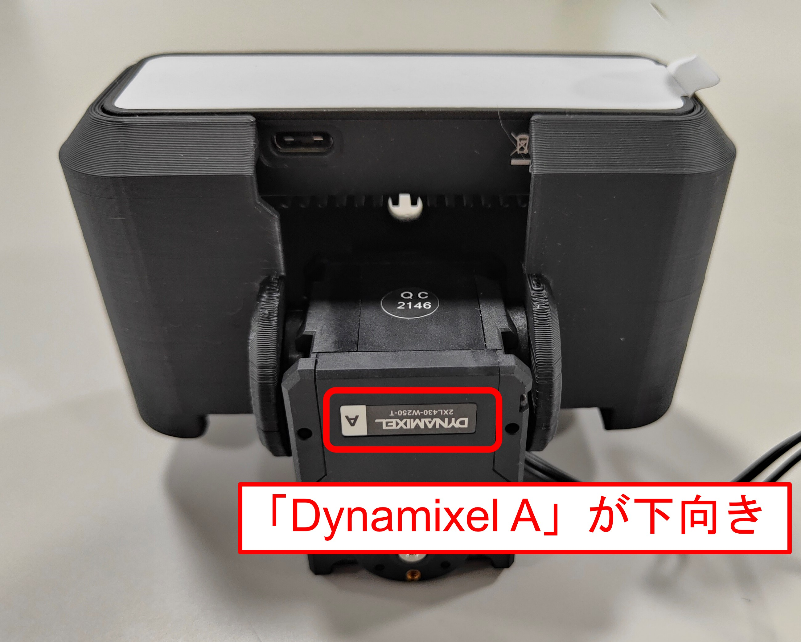
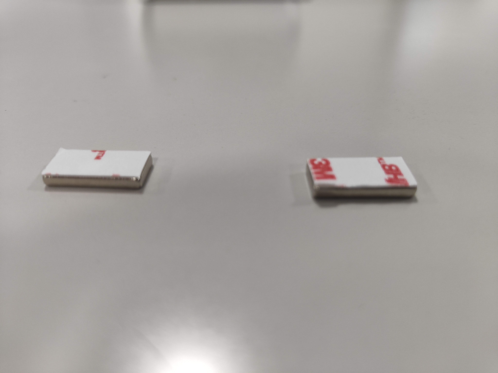
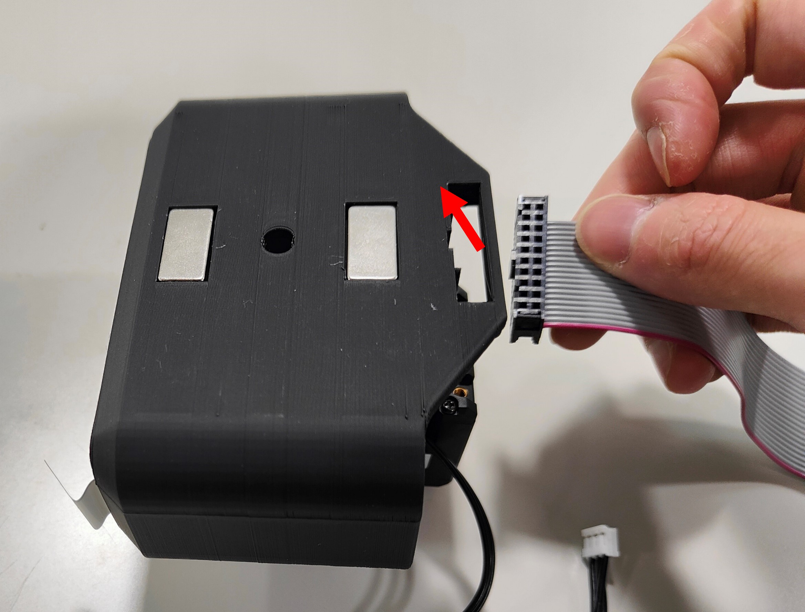
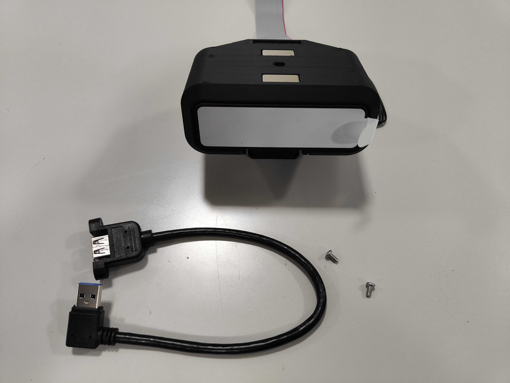
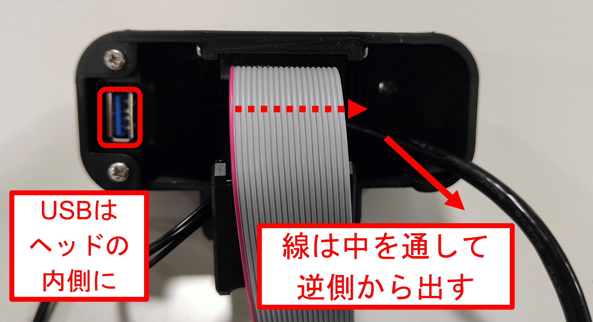
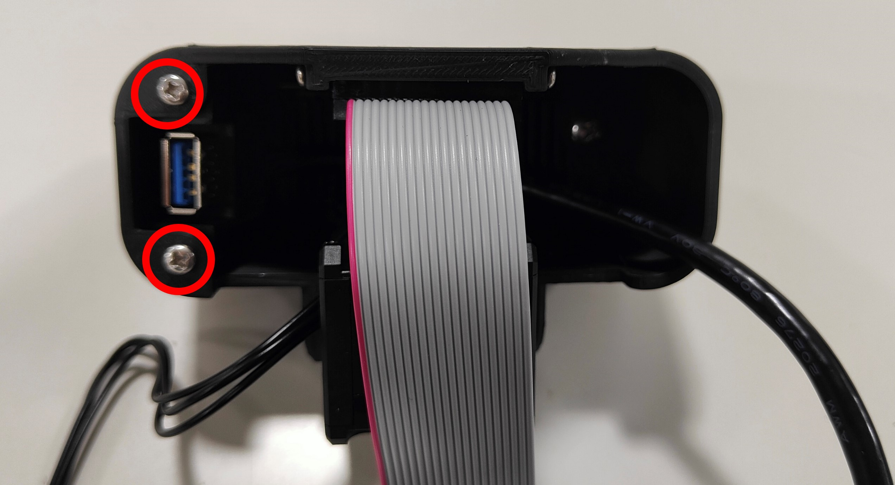

***********************************************************
ヘッドを組み立てよう
***********************************************************

| いよいよ組み立てを始めます。
| ここでは、ヘッド部分を組み立てます。

必要な道具
-----------------------------------------------------------
| - 精密ドライバ(＋)

1 モーター部の組み立て
-----------------------------------------------------------

必要な部品
^^^^^^^^^^^^^^^^^^^^^^^^^^^^^^^^^^^^^^^^^^^^^^^^^^^^^^^^^^^
| (23) Dynamixel 2XL430-W250-T 1個
| (24) HN11-I101  1個

.. image:: ../../images/assembly/head/head01-01.jpg
    :width: 300px

手順
^^^^^^^^^^^^^^^^^^^^^^^^^^^^^^^^^^^^^^^^^^^^^^^^^^^^^^^^^^^
1. `(23) Dynamixel 2XL430-W250-T` のID(B)ポートに付属のケーブルを接続する。

.. image:: ../../images/assembly/head/head01-02.jpg
    :width: 300px

2. `(24) HN11-I101` の大きいリングを載せる。

.. image:: ../../images/assembly/head/head01-03.jpg
    :width: 300px

.. image:: ../../images/assembly/head/head01-04.jpg
    :height: 230px

3. `(24) HN11-I101` の留め具を載せる。

.. image:: ../../images/assembly/head/head01-05.jpg
    :width: 300px

4. `(24) HN11-I101` 付属のネジ(銀)で留める。

2 OAK-Dのヘッドへの搭載
-----------------------------------------------------------

必要な部品
^^^^^^^^^^^^^^^^^^^^^^^^^^^^^^^^^^^^^^^^^^^^^^^^^^^^^^^^^^^
| (2) AKARI Head 1個
| (20) OAK-D Lite  1個
| (36) ボルトM4-5  2個

.. image:: ../../images/assembly/head/head02-01.jpg
    :width: 300px

手順
^^^^^^^^^^^^^^^^^^^^^^^^^^^^^^^^^^^^^^^^^^^^^^^^^^^^^^^^^^^
1. `(20) OAK-D Lite` のUSBポートが `(2) AKARI Head` の下向きになるように、表から挿入する。

.. image:: ../../images/assembly/head/head02-02.jpg
    :width: 300px

2. 裏面から `(36) ボルトM4-5` で2点ネジ留めする。

.. image:: ../../images/assembly/head/head02-03.jpg
    :width: 300px

3 Dynamixelのヘッドへの搭載
-----------------------------------------------------------

必要な部品
^^^^^^^^^^^^^^^^^^^^^^^^^^^^^^^^^^^^^^^^^^^^^^^^^^^^^^^^^^^
| (23) Dynamixel 2XL430-W250-T(1で組み立て済みのもの) 1個
| (23) Dynamixel 2XL430-W250-T付属のネジ(黒) 6個

手順
^^^^^^^^^^^^^^^^^^^^^^^^^^^^^^^^^^^^^^^^^^^^^^^^^^^^^^^^^^^
1. `(23) Dynamixel 2XL430-W250-T` を"dynamixelA"の表示が下向きになるようにヘッドにモータを挿入する。

.. image:: ../../images/assembly/head/head03-02.jpg
    :width: 300px

2. ヘッドの左側面とDynamixelを `(23) Dynamixel 2XL430-W250-T` 付属のネジ(黒)で3点ねじ留めする。

.. image:: ../../images/assembly/head/head03-04.jpg
    :width: 300px

3. ヘッドの右側面とDynamixelを `(23) Dynamixel 2XL430-W250-T` 付属のネジ(黒)で3点ねじ留めする。

|   **モータがヘッドに対して水平な状態で固定すること！**
|   **締結穴がずれるとモータの初期位置とヘッドの初期位置がずれます！**

.. image:: ../../images/assembly/head/head03-05.jpg
    :width: 300px

4 磁石の貼り付け
-----------------------------------------------------------

必要な部品
^^^^^^^^^^^^^^^^^^^^^^^^^^^^^^^^^^^^^^^^^^^^^^^^^^^^^^^^^^^
| (39) 磁石角型20x10x3 2個
| (40) 両面テープ 1個

.. image:: ../../images/assembly/head/head04-01.jpg
    :width: 300px

手順
^^^^^^^^^^^^^^^^^^^^^^^^^^^^^^^^^^^^^^^^^^^^^^^^^^^^^^^^^^^
1. `(40) 両面テープ` を `(39) 磁石角型20x10x3` 2個に貼って、サイズに合わせて切る。

|   **2つの磁石の極性を合わせること！**

.. image:: ../../images/assembly/head/head04-02.jpg
    :height: 220px

2. 両面テープを剥がし、ヘッド上部のくぼみに貼りつける。

.. image:: ../../images/assembly/head/head04-04.jpg
    :width: 300px

5 リボンケーブルの搭載
-----------------------------------------------------------

必要な部品
^^^^^^^^^^^^^^^^^^^^^^^^^^^^^^^^^^^^^^^^^^^^^^^^^^^^^^^^^^^
| (18) 2x10(20P)両端コネクタ付IDCリボンケーブル 1個
| (37) タッピングビスM2.5-6 2個

.. image:: ../../images/assembly/head/head05-01.jpg
    :width: 300px

手順
^^^^^^^^^^^^^^^^^^^^^^^^^^^^^^^^^^^^^^^^^^^^^^^^^^^^^^^^^^^
1. `(18)2x10(20P)両端コネクタ付IDCリボンケーブル` をヘッドの裏からはめ込む。

.. image:: ../../images/assembly/head/head05-03.jpg
    :width: 300px

2. `(37) タッピングビスM2.5-6` でリボンケーブルの左右側面から2点ビス留めする。

| ** タッピングビスは、少し時計回りに進めてから一度反時計回りに戻す、を繰り返しながら、少しずつ締めていくこと。 **
| ** 無理に進めようとするとヘッドが割れます！ **

.. image:: ../../images/assembly/head/head05-04.jpg
    :width: 300px

.. image:: ../../images/assembly/head/head05-05.jpg
    :width: 300px

6 USBパネルマウントの搭載
-----------------------------------------------------------

必要な部品
^^^^^^^^^^^^^^^^^^^^^^^^^^^^^^^^^^^^^^^^^^^^^^^^^^^^^^^^^^^
| (29) パネルマウントUSB3.0ケーブル 30cm 左角 1個
| (35) ボルトM3-6 2個

手順
^^^^^^^^^^^^^^^^^^^^^^^^^^^^^^^^^^^^^^^^^^^^^^^^^^^^^^^^^^^
1. ヘッド内部に裏から `(29) パネルマウントUSB3.0ケーブル 30cm 左角` を通す。

2. `(35) ボルトM3-6` で表側から2点ネジ留めする。

7 OAK-D LiteのUSB接続
-----------------------------------------------------------

必要な部品
^^^^^^^^^^^^^^^^^^^^^^^^^^^^^^^^^^^^^^^^^^^^^^^^^^^^^^^^^^^
| (31) USB Type-Cケーブル 0.5mL字 1個

.. image:: ../../images/assembly/head/head07-01.jpg
    :width: 300px

手順
^^^^^^^^^^^^^^^^^^^^^^^^^^^^^^^^^^^^^^^^^^^^^^^^^^^^^^^^^^^
1. ヘッド内部に裏から `(31) USB Type-Cケーブル 0.5mL字` を入れ、ヘッド正面に出す。

|  通りにくい場合は、サーボの角度を変えると隙間が出来る。

.. image:: ../../images/assembly/head/head07-02.jpg
    :width: 300px

2. OAK-D LiteのUSBポートにUSBケーブルを接続する。

.. image:: ../../images/assembly/head/head07-03.jpg
    :width: 300px

| 以上でヘッドの組み立ては終わりです。
| 次はボディー部の組み立てを行います。

:doc:`assembly_body` へ進む

:doc:`assembly_pcb` へ戻る
