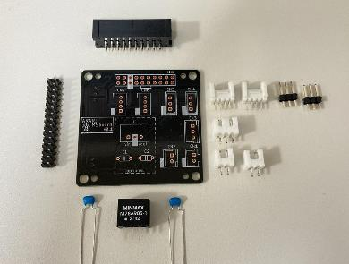
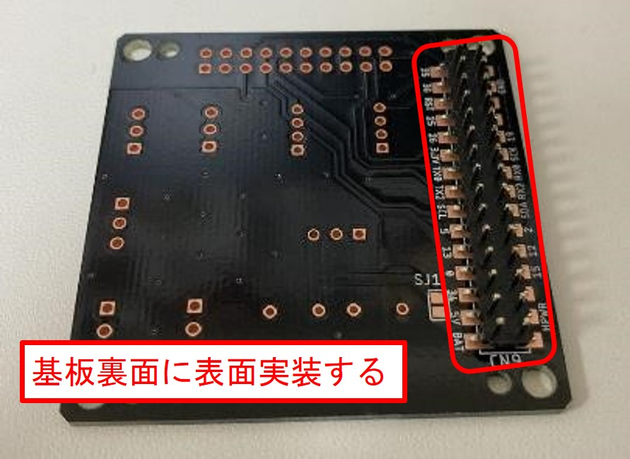
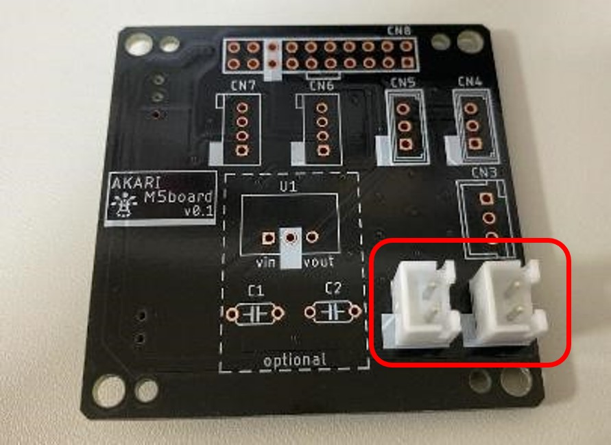
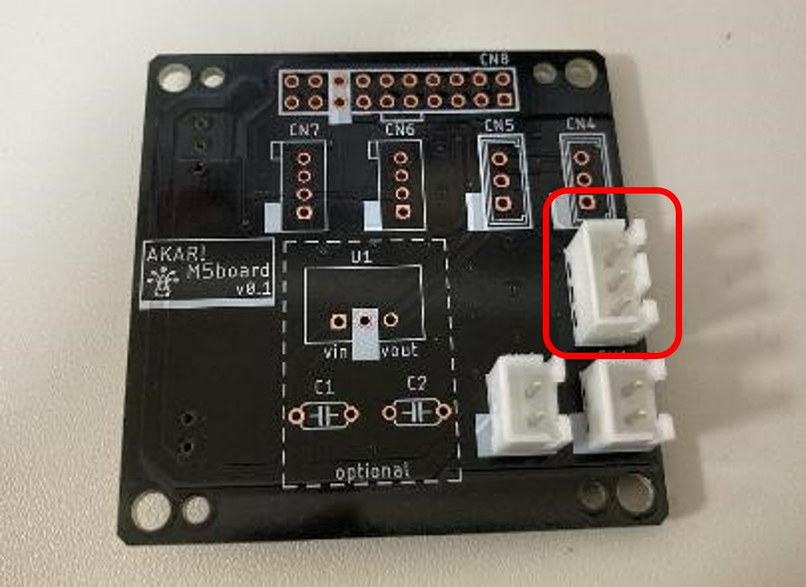
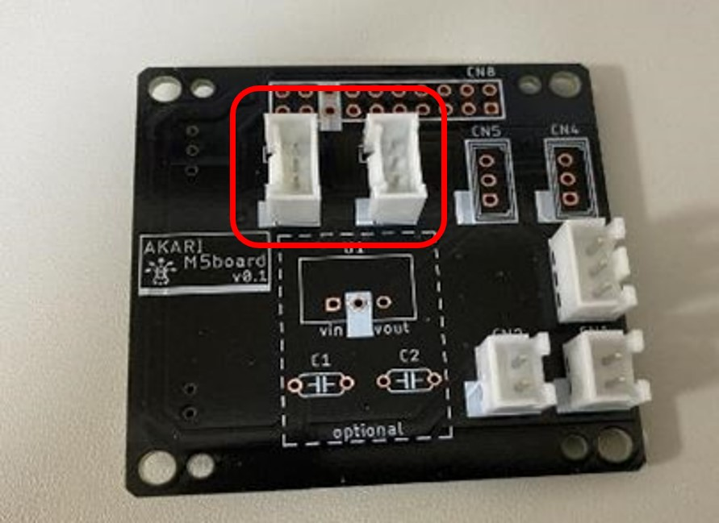
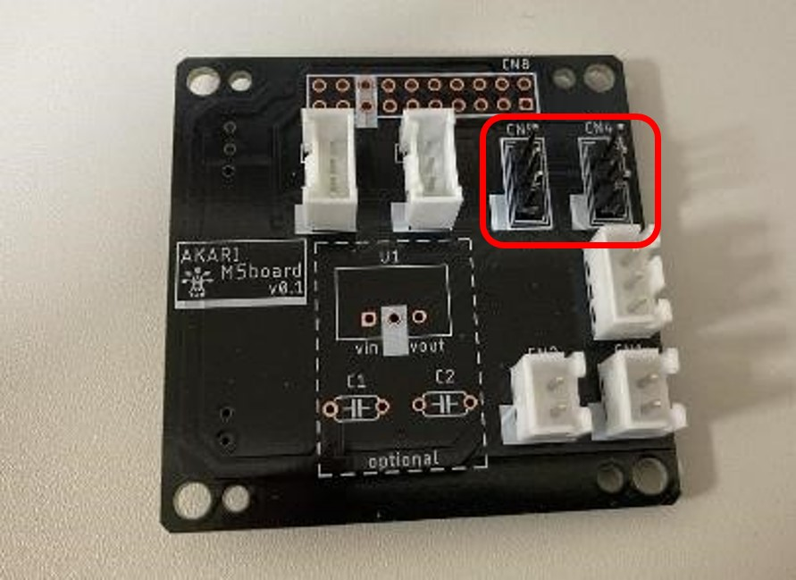
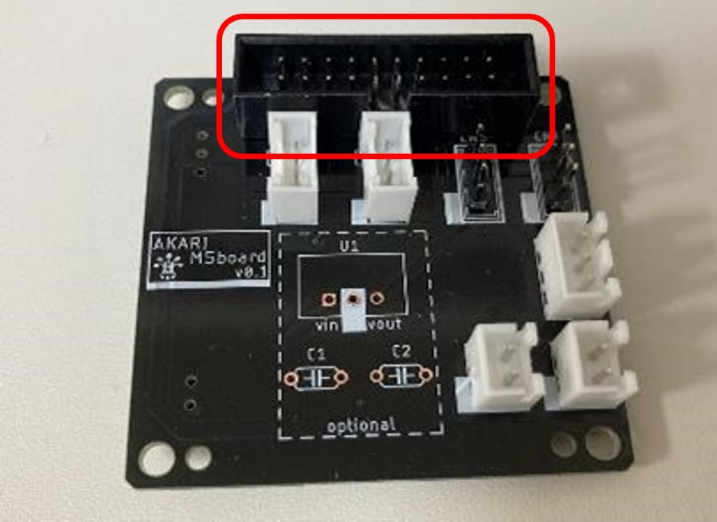
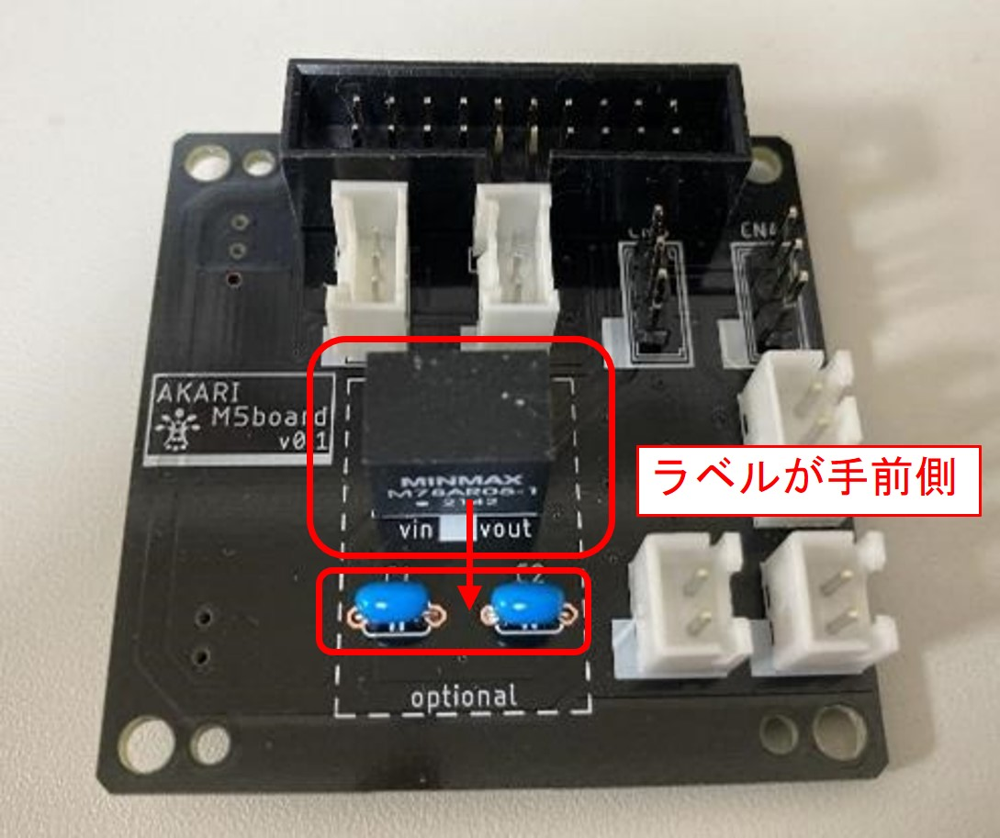
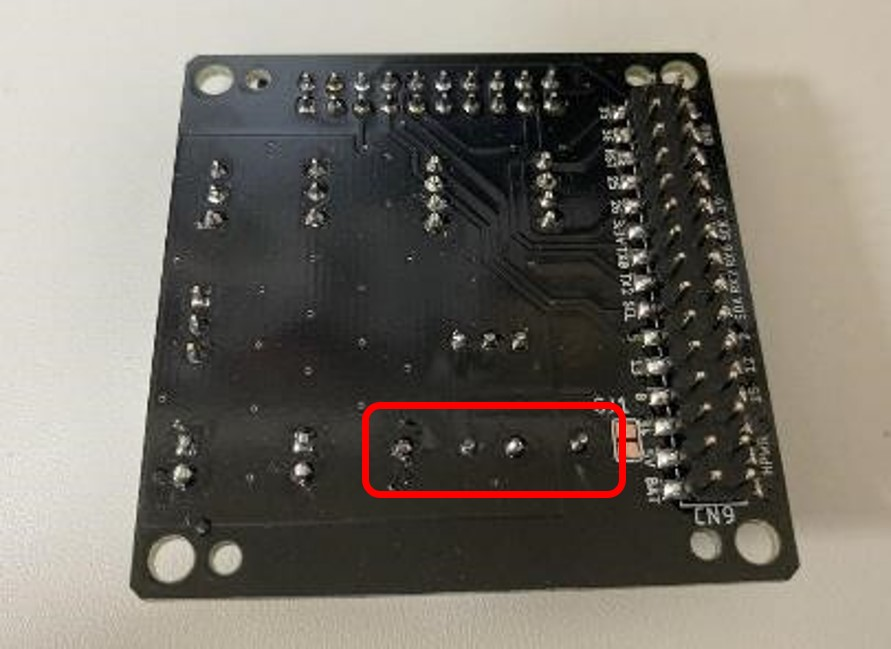

***********
基板に部品を実装しよう
***********

まずは基板に回路部品を実装していきましょう。

必要な道具
--------
| - はんだごて
| - はんだ線
| - ニッパ

必要な部品
^^^^^^^^
| (1) M5stack基板 1個
| (24) M5Stack用2x15ピンヘッダ・ソケットセット 1個
| (11) XHコネクタ2P トップ型 2個
| (12) XHコネクタ3P トップ型 1個
| (25) Groveコネクタトップ型 2個
| (13) 2mmピッチピンヘッダ 1✕3 2個 (もしくはEHコネクタ3P トップ型 2個)
| (14) ボックスヘッダ 20P 1個
| (15) DCDCコンバーター 1個
| (16) 積層セラミックコンデンサー 10μF 2個

手順
^^^^^^^^
1. `(24) M5Stack用2x15ピンヘッダ・ソケットセット` をCN9にはんだ付けする。

2. `(11) XHコネクタ2P トップ型` をCN1,CN2にはんだ付けする。

3. `(12) XHコネクタ3P トップ型` をCN3にはんだ付けする。

4. `(25) Groveコネクタ トップ型` をCN7, CN8にはんだ付けする。

5. `(13) 2mmピッチピンヘッダ 1✕3` (もしくは `(13) EHコネクタ 3P トップ型` )をCN4, CN5にはんだ付けする。

6. `(14) ボックスヘッダ 20P` をCN6にはんだ付けする。

7. `(15) DC-DCコンバーター` をU1にはんだ付けする。
8. `(16) 積層セラミックコンデンサー 10μF` 2個をC1,C2にはんだ付けする。

9. 基板を裏返し `(16) 積層セラミックコンデンサー 10μF` の足を切断する。

:doc:`assembly_head` へ進む

:doc:`part_list` へ戻る
