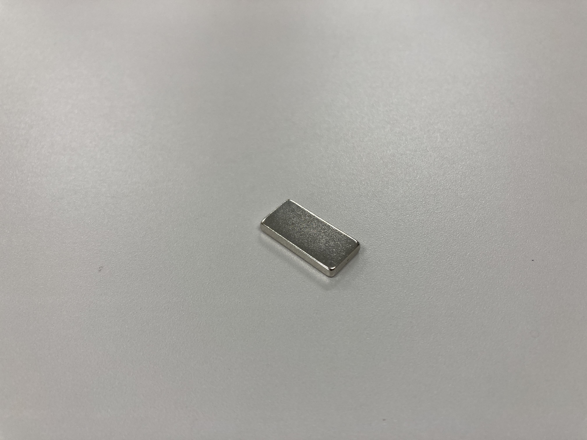

***********
組み立てに必要なもの
***********
.. |1| image:: ../../images/assembly/part/01.jpg
   :width: 400px
.. |2| image:: ../../images/assembly/part/02.jpg
   :width: 400px
.. |3| image:: ../../images/assembly/part/03.jpg
   :width: 400px
.. |4| image:: ../../images/assembly/part/04.jpg
   :width: 400px
.. |5| image:: ../../images/assembly/part/05.jpg
   :width: 400px
.. |6| image:: ../../images/assembly/part/06.jpg
   :width: 400px
.. |7| image:: ../../images/assembly/part/07.jpg
   :width: 400px
.. |8| image:: ../../images/assembly/part/08.jpg
   :width: 400px
.. |9| image:: ../../images/assembly/part/09.jpg
   :width: 400px
.. |10| image:: ../../images/assembly/part/10.jpg
   :width: 400px
.. |11| image:: ../../images/assembly/part/11.jpg
   :width: 400px
.. |12| image:: ../../images/assembly/part/12.jpg
   :width: 400px
.. |13| image:: ../../images/assembly/part/13.jpg
   :width: 400px
.. |14| image:: ../../images/assembly/part/14.jpg
   :width: 400px
.. |15| image:: ../../images/assembly/part/15.jpg
   :width: 400px
.. |16| image:: ../../images/assembly/part/16.jpg
   :width: 400px
.. |17| image:: ../../images/assembly/part/17.jpg
   :width: 400px
.. |18| image:: ../../images/assembly/part/18.jpg
   :width: 400px
.. |19| image:: ../../images/assembly/part/19.jpg
   :width: 400px
.. |20| image:: ../../images/assembly/part/20.jpg
   :width: 400px
.. |21| image:: ../../images/assembly/part/21.jpg
   :width: 400px
.. |22| image:: ../../images/assembly/part/22.jpg
   :width: 400px
.. |23| image:: ../../images/assembly/part/23.jpg
   :width: 400px
.. |24| image:: ../../images/assembly/part/24.jpg
   :width: 400px
.. |25| image:: ../../images/assembly/part/25.jpg
   :width: 400px
.. |26| image:: ../../images/assembly/part/26.jpg
   :width: 400px
.. |27| image:: ../../images/assembly/part/27.jpg
   :width: 400px
.. |28| image:: ../../images/assembly/part/28.jpg
   :width: 400px
.. |29| image:: ../../images/assembly/part/29.jpg
   :width: 400px
.. |30| image:: ../../images/assembly/part/30.jpg
   :width: 400px
.. |31| image:: ../../images/assembly/part/31.jpg
   :width: 400px
.. |32| image:: ../../images/assembly/part/32.jpg
   :width: 400px
.. |33| image:: ../../images/assembly/part/33.jpg
   :width: 400px
.. |34| image:: ../../images/assembly/part/34.jpg
   :width: 400px
.. |35| image:: ../../images/assembly/part/35.jpg
   :width: 400px
.. |36| image:: ../../images/assembly/part/36.jpg
   :width: 400px
.. |37| image:: ../../images/assembly/part/37.jpg
   :width: 400px
.. |38| image:: ../../images/assembly/part/38.jpg
   :width: 400px
.. |39| image:: ../../images/assembly/part/39.jpg
   :width: 400px

.. |41| image:: ../../images/assembly/part/41.jpg
   :width: 400px

AKARIの組み立てに必要な道具、部品の一覧を記載します。
各部品には購入先リンクも貼ってありますので、各自で購入をしてください。

必要な道具
--------
| - 精密ドライバ(＋)
| - 精密ドライバ(ー)
| - はんだごて
| - はんだ線
| - ニッパ

部品表
--------

.. csv-table::

   "No.","分類","画像","名称","型番","必要数 [個]","購入数[組]","購入先リンク","備考"
   1,"製造品","|1|","M5stack基板",,1,1,,
   2,"製造品","|2|","AKARI Head",,1,1,,
   3,"製造品","|3|","AKARI Body",,1,1,,
   4,"製造品","|4|","AKARI Cover",,1,1,,
   5,"製造品","|5|","AKARI Base",,1,1,,
   6,"製造品","|6|","AKARI Plate",,1,1,,
   7,"購入品","|7|","Lattepanda Alpha","Lattepanda Alpha 864S DFR0546",1,1,"`秋月電子 <https://akizukidenshi.com/catalog/g/gM-13736/>`_",
   8,"購入品","|8|","M5Stack BASIC","M5Stack BASIC v2.6",1,1,"`秋月電子 <https://akizukidenshi.com/catalog/g/gM-16008>`_",
   9,"購入品","|9|","温湿度気圧センサユニット ENVⅢ","M5STACK-U001-C",1,1,"`秋月電子 <https://akizukidenshi.com/catalog/g/gM-17213>`_",
   10,"購入品","|10|","光センサユニット","M5STACK-LIGHT-UNIT",1,1,"`秋月電子 <https://akizukidenshi.com/catalog/g/gM-17217>`_",
   11,"購入品","|11|","XHコネクタ2P トップ型","B2B-XH-A(LF)(SN)",2,2,"`秋月電子 <https://akizukidenshi.com/catalog/g/gC-12247>`_",
   12,"購入品","|12|","XHコネクタ3P トップ型","B3B-XH-A(LF)(SN)",1,1,"`秋月電子 <https://akizukidenshi.com/catalog/g/gC-12248>`_",
   13,"購入品",,"EHコネクタ3P トップ型","B3B-EH-A",2,2,,"↓とどちらか選択"
   13,"購入品","|13|","2mmピッチピンヘッダ 1✕3","PH2-1x3SBG",2,2,"`秋月電子 <https://akizukidenshi.com/catalog/g/gC-06192>`_","↑とどちらか選択"
   14,"購入品","|14|","ボックスヘッダ 20P","BH-20SG",1,1,"`秋月電子 <https://akizukidenshi.com/catalog/g/gC-13176>`_",
   15,"購入品","|15|","DC-DCコンバーター","M78AR05-1",1,1,"`秋月電子 <https://akizukidenshi.com/catalog/g/gM-13536>`_",
   16,"購入品","|16|","積層セラミックコンデンサー 10μF","RDEC71H106K3K1H03B",2,2,"`秋月電子 <https://akizukidenshi.com/catalog/g/gP-08155>`_",
   17,"購入品","|17|","2x10(20P)両端コネクタ付IDCリボンケーブル","DG01032-0041-01-180mm",1,1,"`秋月電子 <https://akizukidenshi.com/catalog/g/gC-13378>`_",
   18,"購入品","|18|","コネクタ付コード 4P PH(赤黒黄緑)","DG01032-0049-01",2,2,"`秋月電子 <https://akizukidenshi.com/catalog/g/gC-15554>`_",
   19,"購入品","|19|","コネクタ付コード2P XH(赤黒)",,2,2,"`秋月電子 <https://akizukidenshi.com/catalog/g/gC-05682>`_",
   20,"購入品","|20|","2.1mm標準DCジャック パネル取付用","C-17108",2,2,"`秋月電子 <https://akizukidenshi.com/catalog/g/gC-17108>`_",
   21,"購入品","|21|","2.1mm標準DCプラグ　L型",,1,1,"`秋月電子 <https://akizukidenshi.com/catalog/g/gC-00092>`_",
   22,"購入品","|22|","コネクタ付コード2P PH(赤白)",,1,1,"`秋月電子 <https://akizukidenshi.com/catalog/g/gC-05679>`_",
   23,"購入品","|23|","ACアダプター12V5A","ATS065-P120",1,1,"`秋月電子 <https://akizukidenshi.com/catalog/g/gM-06961>`_",
   24,"購入品","|24|","OAK-D Lite","OAK-D-LITE OpenCV DepthAIカメラ",1,1,"`スイッチサイエンス <https://www.switch-science.com/catalog/7651>`_",
   25,"購入品","|25|","M5Stack用2x15ピンヘッダ・ソケットセット",,1,1,"`スイッチサイエンス <https://www.switch-science.com/catalog/3654>`_",
   26,"購入品","|26|","Groveコネクタ トップ型",,2,2,"`スイッチサイエンス <https://www.switch-science.com/catalog/1122>`_",
   27,"購入品","|27|","Dynamixel 2XL430-W250-T","BTX079",1,1,"`ベストテクノロジー <https://www.besttechnology.co.jp/modules/onlineshop/index.php?fct=photo&p=262>`_",
   28,"購入品","|28|","HN11-I101 Set","BTX098",1,1,"`ベストテクノロジー <https://www.besttechnology.co.jp/modules/onlineshop/index.php?fct=photo&p=204>`_",
   29,"購入品","|29|","USB2TTL dongle","BTE080C",1,1,"`ベストテクノロジー <https://www.besttechnology.co.jp/modules/onlineshop/index.php?fct=photo&p=268>`_",
   30,"購入品","|30|","USBハブ 4ポート15cm","U3H-FC02BBK",1,1,"`Amazon <https://www.amazon.co.jp/dp/B07CMF41B5>`_",
   31,"購入品","|31|","パネルマウントUSB3.0ケーブル 30cm",,1,1,"`Amazon <https://www.amazon.co.jp/dp/B08LPBS15D?th=1>`_",
   32,"購入品","|32|","USB Type-Cケーブル 0.3mL字",,1,1,"`Amazon <https://www.amazon.co.jp/dp/B097PJLG39>`_",
   33,"購入品","|33|","USB Type-Cケーブル 0.5mL字",,1,1,"`Amazon <https://www.amazon.co.jp/dp/B07CMF41B5www.amazon.co.jp/dp/B08RMFTGHZ>`_",
   34,"購入品","|34|","XHコネクタ付ケーブル 3P",,1,1,"`Amazon <https://www.amazon.co.jp/dp/B07CMF41B5www.amazon.co.jp/dp/B011HFRYNW>`_",
   35,"購入品","|35|","ロッカスイッチ",,1,1,"`Amazon <https://www.amazon.co.jp/dp/B07CMF41B5www.amazon.co.jp/dp/B00HUHBP8C>`_",
   36,"購入品","|36|","モーメンタリスイッチ","JSANKG-01",1,1,"`Amazon <https://www.amazon.co.jp/dp/B076KBJVH3>`_",
   37,"購入品","|37|","ボルトM3-6",,4,1,"`Amazon <https://www.amazon.co.jp/dp/B012TE12CY>`_",
   38,"購入品","|38|","ボルトM4-5",,2,1,"`Amazon <https://www.amazon.co.jp/dp/B07MZQTTTV>`_",
   39,"購入品","|39|","タッピングビスM2.5-6",,6,1,"`Amazon <https://www.amazon.co.jp/dp/B076ZF94HR>`_",
   40,"購入品","|40|","MicroSDカード",,1,1,"`Amazon <https://www.amazon.co.jp/dp/B07CMF41B5www.amazon.co.jp/dp/B00VQOEWYO>`_","容量1GB以上推奨"
   41,"購入品","|41|","磁石角型20x10x3",,2,1,"`Amazon <https://www.amazon.co.jp/dp/B07CMF41B5www.amazon.co.jp/dp/B08LK9669N>`_",
   42,"購入品",,"両面テープ","SRE-19",1,1,"`Amazon <https://www.amazon.co.jp/dp/B00BPJKM4E>`_","強めの両面テープなら代替可"

:doc:`assembly_head` へ進む

:doc:`pcb` へ戻る
