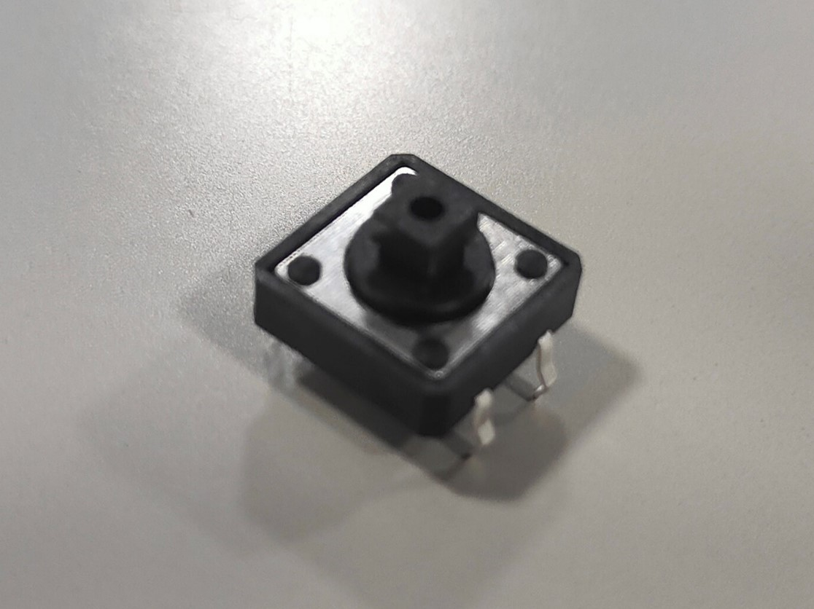
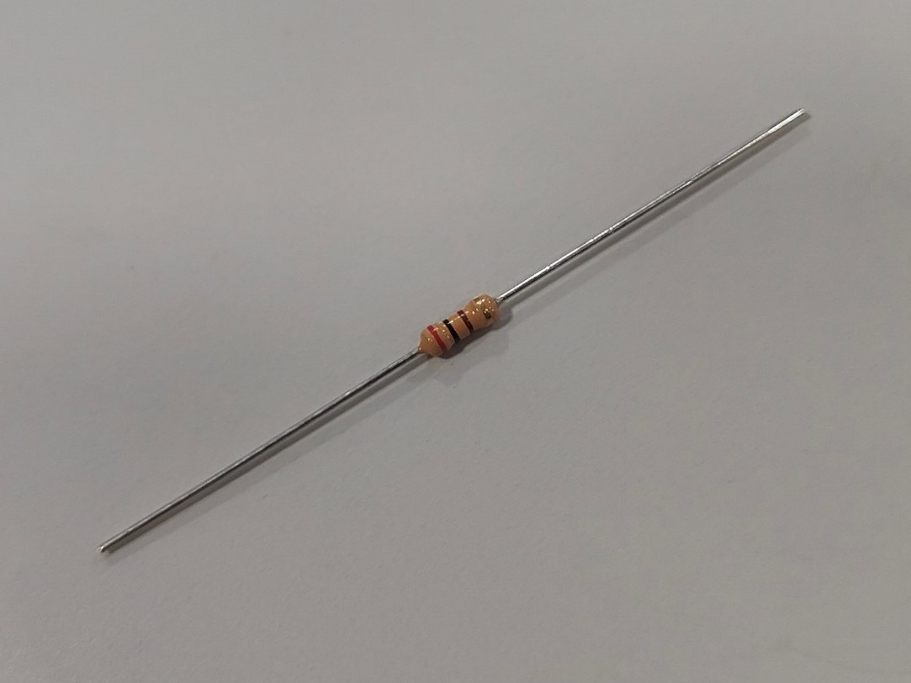
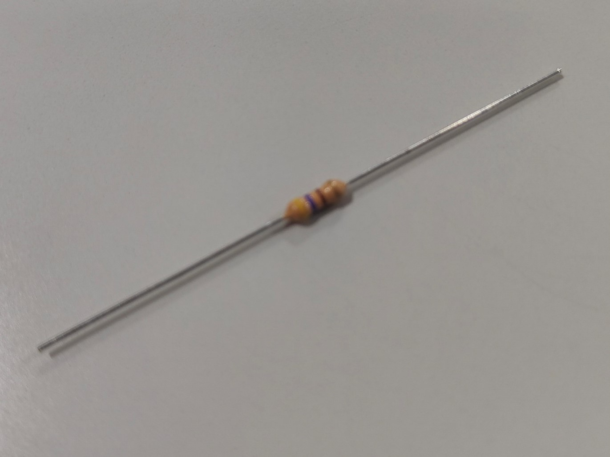
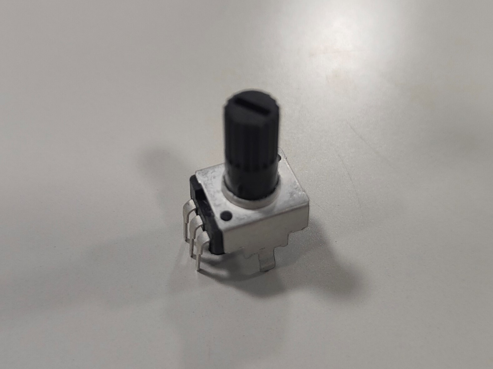

***********************************************************
組み立てに必要なもの
***********************************************************
.. |T1| image:: ../../images/assembly/part_test_unit/t01.jpg
   :width: 200px
.. |T2| image:: ../../images/assembly/part_test_unit/t02.jpg
   :width: 200px

.. |T4| image:: ../../images/assembly/part_test_unit/t04.jpg
   :width: 200px
.. |T5| image:: ../../images/assembly/part_test_unit/t05.jpg
   :width: 200px
.. |T6| image:: ../../images/assembly/part_test_unit/t06.jpg
   :width: 200px
.. |T7| image:: ../../images/assembly/part_test_unit/t07.jpg
   :width: 200px

| AKARIのテストユニットの組み立てに必要な道具、部品の一覧を記載します。
| 各部品にはご参考までに自分達の購入先のリンクを掲載してあります(秋月電子に関しては通販コードを用いて参照ください)。
| **購入先はあくまで一例ですので、同じ部品であれば他の購入先でも問題ありません。**

必要な道具
-----------------------------------------------------------
| - はんだごて
| - はんだ線
| - ニッパ

部品表
-----------------------------------------------------------

.. csv-table::

   "No.","分類","画像","名称","型番","必要数 [個]","購入数[組]","購入先リンク","備考"
   T1,"製造品","|T1|","TEST UNIT基板",,1,1,ー,
   T2,"購入品","|T2|","10×2ピンヘッダ",PH-2x10SG,1,1," `秋月電子 <https://akizukidenshi.com/catalog/g/g100078/>`__",
   T3,"購入品","|T3|","タクトスイッチ 12mm",TVGP01-G73BB,2,2," `秋月電子 <https://akizukidenshi.com/catalog/g/g112226/>`__",
   T4,"購入品","|T4|","3mm赤色LED 625nm 70度",OSR5JA3Z74A,3,3," `秋月電子 <https://akizukidenshi.com/catalog/g/g111577/>`__",他の色でもOK
   T5,"購入品","|T5|","3mm黄色LED 595nm 70度",OSY5JA3Z74A,2,2," `秋月電子 <https://akizukidenshi.com/catalog/g/g111639/>`__",他の色でもOK
   T6,"購入品","|T6|","3mm緑色LED 525nm 70度",OSG5TA3Z74A,1,1," `秋月電子 <https://akizukidenshi.com/catalog/g/g111635/>`__",他の色でもOK
   T7,"購入品","|T7|","カーボン抵抗（炭素皮膜抵抗）120Ω","CF25J120RB",4,1," `秋月電子 <https://akizukidenshi.com/catalog/g/g125121/>`__",推奨抵抗値
   T8,"購入品","|T8|","カーボン抵抗（炭素皮膜抵抗）200Ω","CF25J200RB",1,1," `秋月電子 <https://akizukidenshi.com/catalog/g/g125201/>`__",推奨抵抗値
   T9,"購入品","|T9|","カーボン抵抗（炭素皮膜抵抗）470Ω","CF25J470RB",1,1," `秋月電子 <https://akizukidenshi.com/catalog/g/g125471/>`__",推奨抵抗値
   T10,"購入品","|T10|","可変抵抗器 10KΩ","",1,1,"`Amazon <https://www.amazon.co.jp/dp/B07TFTK41V>`__",

:doc:`assembly_test_unit` へ進む

:doc:`../assembly_hard/assembly_base` へ戻る
