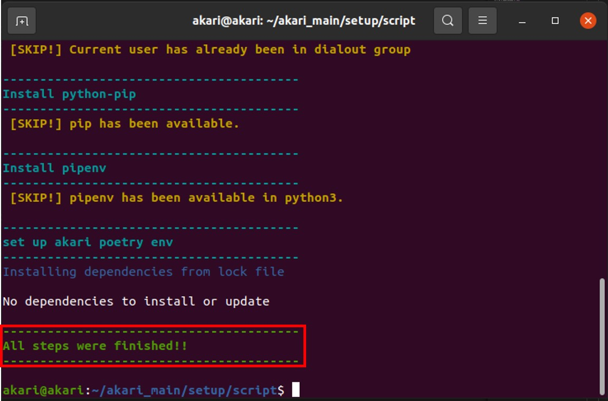

***********
AKARI環境のセットアップ
***********

次にUbuntu20.04にAKARI用の環境セットアップをしていきます。

=============================
必要なもの
=============================

* lattepanda alpha(Ubuntu20.04インストール済)
* キーボード
* マウス

=============================
gitのインストール
=============================
| まずはlattepandaにgitをインストールします。

.. code-block:: bash

    sudo apt install git

=============================
akari_mainレポジトリのclone
=============================
| lattepandaのUbuntuにakari_mainレポジトリをcloneします。
| home直下で下記のコマンドを実行します。

.. code-block:: bash

    git clone https://github.com/AkariGroup/akari_main.git

=============================
自動セットアップスクリプトの実行
=============================
| 自動セットアップスクリプトを実行していきます。
1. 下記コマンドでセットアップスクリプトの保存場所に移動します。

.. code-block:: bash

    cd akari_main/setup/script

2. セットアップスクリプト1を実行します。

| これにより、必要なライブラリのインストールが行われます。
.. code-block:: bash

    ./1_mainpc_setup_libraries.sh

| 下図のように、最後に `All steps were finished!!` と表示されたら成功です。

3. セットアップスクリプト2を実行します。

| これにより、周辺機器の設定やarduino IDEのインストールなどが行われます。
| 2.と同様最後に `All steps were finished!!` と表示されたら成功です。

.. code-block:: bash

    ./2_mainpc_setup_peripherals.sh

4. セットアップスクリプト3を実行します。

| これにより、自動起動の設定が行われます。
| これも2.と同様最後に `All steps were finished!!` と表示されたら成功です。

.. code-block:: bash

    ./3_mainpc_setup_autostart.sh

| 以上で自動セットアップスクリプトによる設定は完了です。
| 次はM5Stackへのソフト書き込みを行います。

:doc:`setup_m5` へ進む

:doc:`setup_autostart_bios` へ戻る

