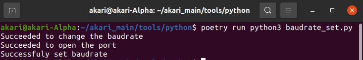

***********************************************************
Dynamixelのセットアップ
***********************************************************

| 次にDynamixelサーボモータの設定をしていきます。
| AKARIでは、Dynamixelサーボモータとのシリアル通信の速度(Baudrate)を1Mbpsに書き換える必要があります。
| これは、Dynamixel内部に書き込んで保存する作業が必要です。

===========================================================
必要なもの
===========================================================

* AKARI本体( :doc:`setup_ansible` 終了済みのもの)
* キーボード
* マウス

===========================================================
Baudrate書き換えスクリプトの実行
===========================================================

AKARIでは、Baudrateの書き換えをpythonスクリプトで実行しています。

1. akari_softwareのtools/python内へ移動します。

.. code-block:: bash

    cd akari_software/tools/python

1. 下記コマンドでBaudrate書き換えを実行します。

.. code-block:: bash

    poetry run python3 baudrate_set.py

1. コマンドラインに「Successfly set baudrate」と表示されれば成功です。

| 以上でAKARIのソフト周りの環境設定は終了です。

:doc:`main` へ戻る

:doc:`setup_m5` へ戻る
