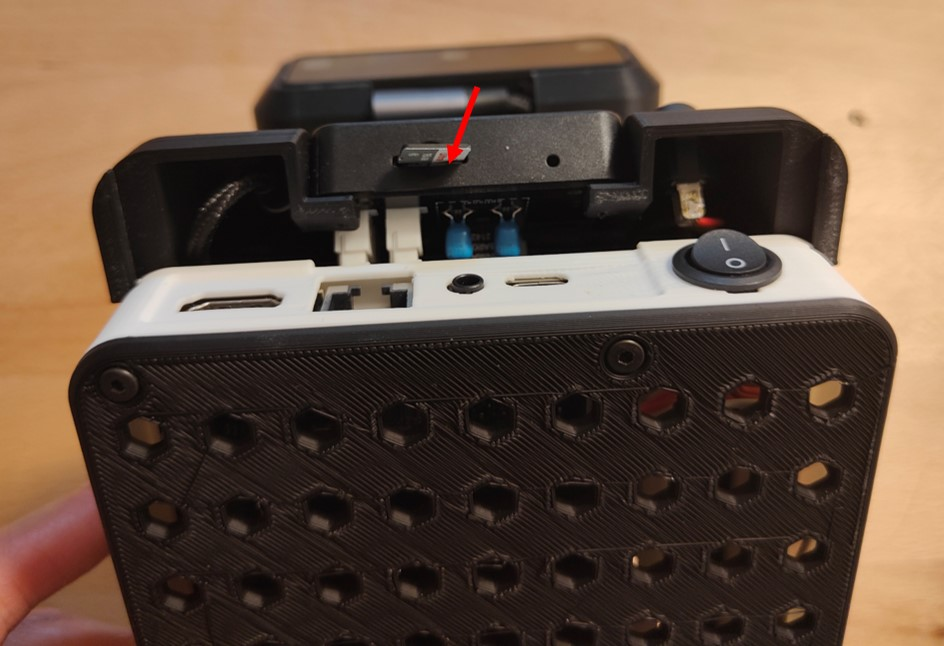

***********
M5stackのSDカードのセットアップ
***********

次にM5stackのデータを保存している、SDカードのセットアップをしていきます。

=============================
必要なもの
=============================

* microSDカードにデータコピーできる環境(PC、またはUSB-microSDカードリーダ)
* キーボード
* マウス
* microSDカード

=============================
microSDカードの準備
=============================
| M5stack用のmicroSDカードを準備します。
| microSDカードをPCに挿入し、 `akari_main/setup/m5_sd` の中身を、microSDカードの直下に全てコピーします。
| USB-microSDカードリーダを使う場合は、AKARI本体に接続してakari_mainからデータをコピーします。
| PCを使う場合は、PC側でも :doc:`setup_ansible` と同様にgitのインストール、クローンが必要です。

=============================
microSDカードの挿入
=============================

| microSDカードをPCから抜き、M5stackに挿入します。

| 以上でM5StackのSDカードのセットアップは完了です。
|

:doc:`setup_dynamixel` へ進む

:doc:`setup_akari_main` へ戻る

