***********************************************************
ボディーを組み立てよう(AKARI Light)
***********************************************************

| まずはボディー部分を組み立てます。

必要な道具
-----------------------------------------------------------
| - 精密ドライバ(＋)
| - No.2サイズのドライバ(＋)

1 サーボモータの取り付け
-----------------------------------------------------------

必要な部品
^^^^^^^^^^^^^^^^^^^^^^^^^^^^^^^^^^^^^^^^^^^^^^^^^^^^^^^^^^^
| (15) AKARI Light Body 1個
| (20) STS3215 1個
| (20) STS3215付属のタッピングビス 4個

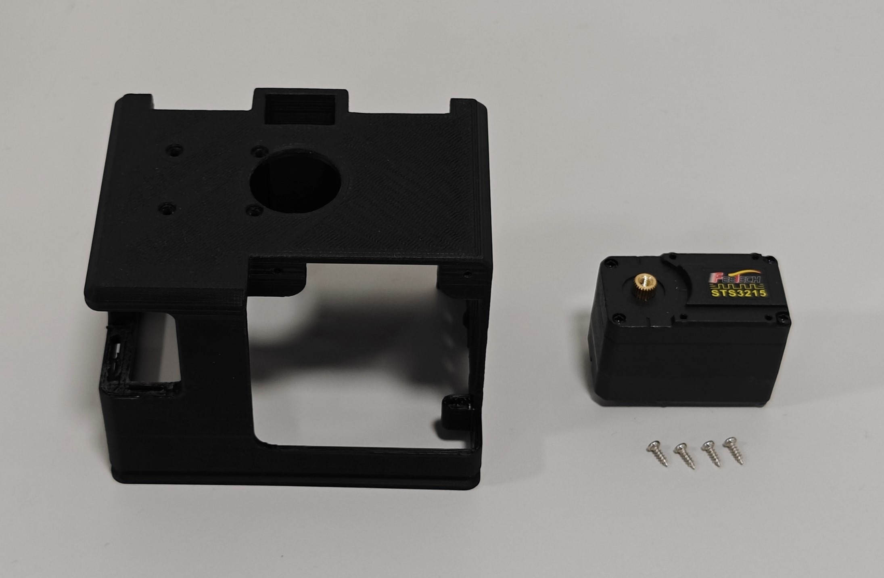

手順
^^^^^^^^^^^^^^^^^^^^^^^^^^^^^^^^^^^^^^^^^^^^^^^^^^^^^^^^^^^
1. `(20) STS3215` を `(15) AKARI Light Body` 内部の溝に入れ、STS3215付属のタッピングビスで外側上部から4点ネジ留めする。

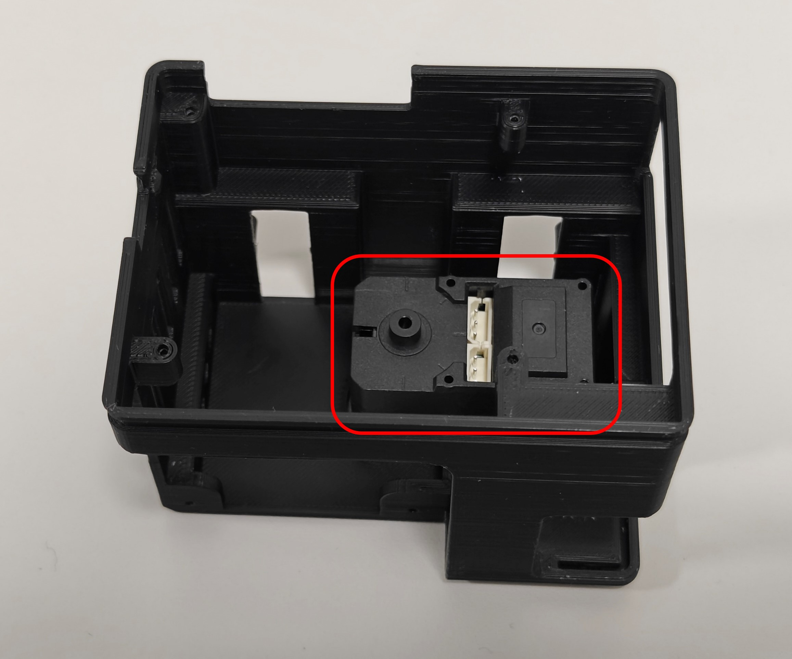

.. image:: ../../images/assembly_light/body/body01-03.jpg
    :width: 400px

2 サーボモータケーブルの配線
-----------------------------------------------------------

必要な部品
^^^^^^^^^^^^^^^^^^^^^^^^^^^^^^^^^^^^^^^^^^^^^^^^^^^^^^^^^^^
| (1) M5stack基板(Light用) ( :doc:`assembly_pcb` で組み立て済みのもの) 1個
| (20) STS3215付属のケーブル 1個

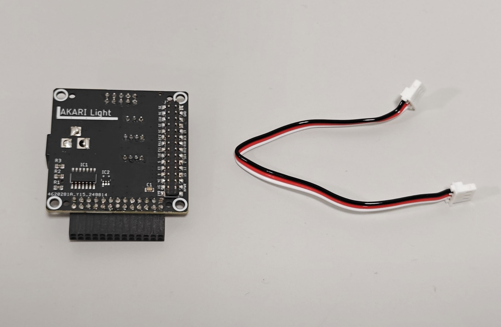

手順
^^^^^^^^^^^^^^^^^^^^^^^^^^^^^^^^^^^^^^^^^^^^^^^^^^^^^^^^^^^
1. `(20) STS3215` 付属のケーブルを `(1) M5stack基板(Light用)` のJ6に接続する。

.. image:: ../../images/assembly_light/body/body02-02.jpg
    :width: 400px

2. 1.のケーブルを  `(15) AKARI Light Body` の前面から中に通し、先程取り付けた `(20) STS3215` に接続する。

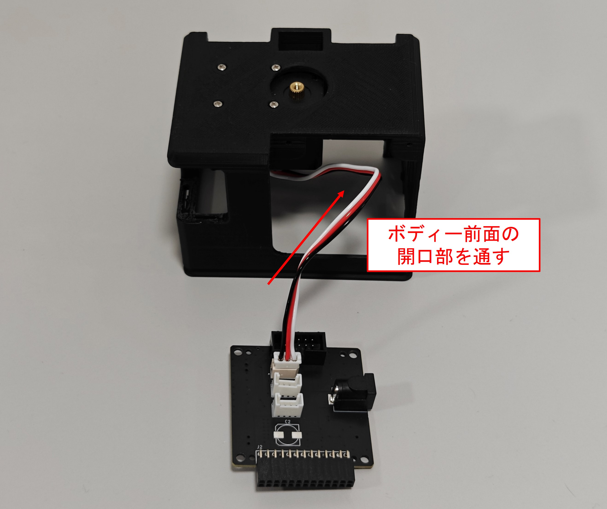

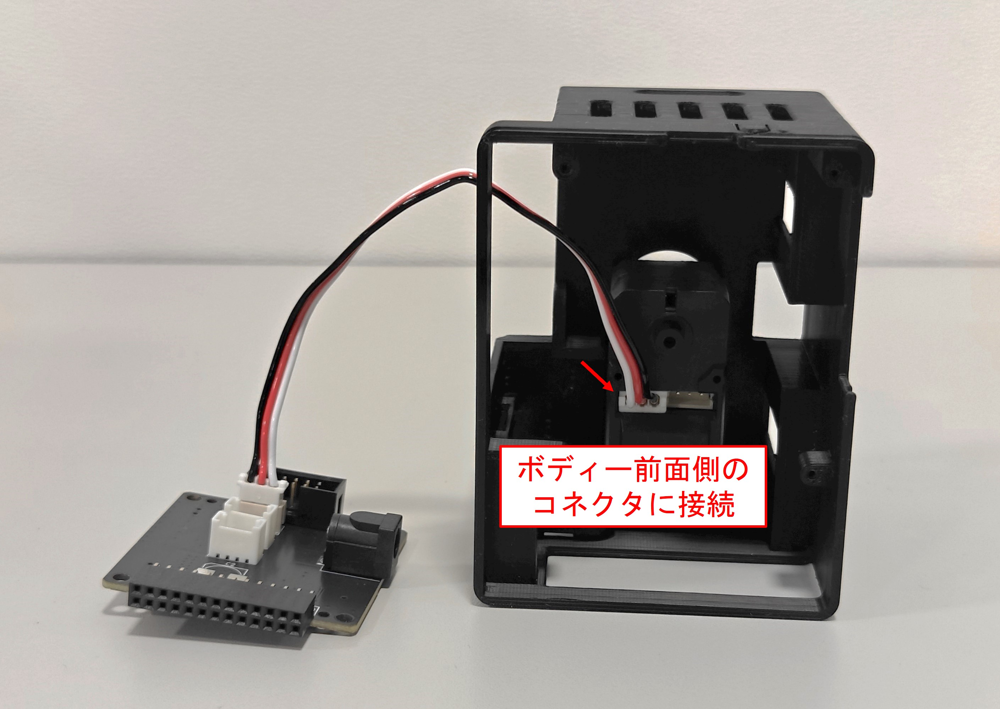

3 リボンケーブルの取り付け
-----------------------------------------------------------

必要な部品
^^^^^^^^^^^^^^^^^^^^^^^^^^^^^^^^^^^^^^^^^^^^^^^^^^^^^^^^^^^^
| (24) 2x5両端コネクター付IDCリボンケーブル 1個

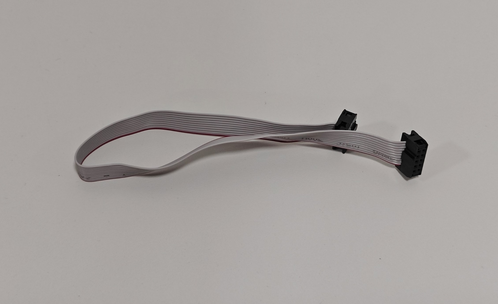

手順
^^^^^^^^^^^^^^^^^^^^^^^^^^^^^^^^^^^^^^^^^^^^^^^^^^^^^^^^^^^
1. `(24) 2x5両端コネクター付IDCリボンケーブル` を `(1) M5stack基板(Light用)` のJ7に接続する。

| **向きに注意！ケーブルが基板内側を向くようにすること**

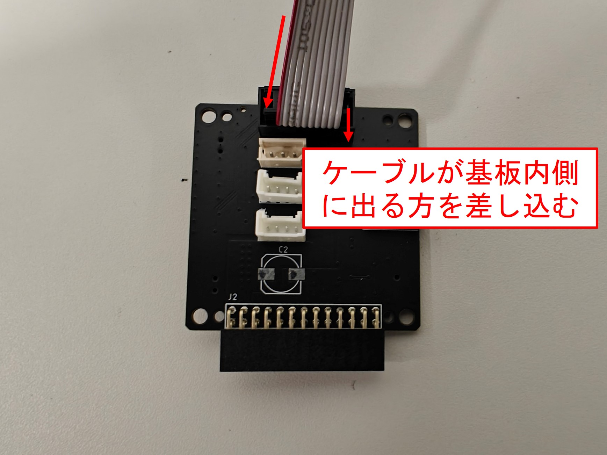

2. `(24) 2x5両端コネクター付IDCリボンケーブル` を  `(15) AKARI Light Body` の前面から中に通し、背面の穴を通して、上に引き出す。

.. image:: ../../images/assembly_light/body/body03-03.jpg
    :width: 400px

4 (オプション) 温湿度気圧センサユニットの搭載
-----------------------------------------------------------
**温湿度気圧センサユニットを使用しない場合はこの工程は不要です。**

必要な部品
^^^^^^^^^^^^^^^^^^^^^^^^^^^^^^^^^^^^^^^^^^^^^^^^^^^^^^^^^^^^
| (29) 温湿度気圧センサユニット ENVIV 1個

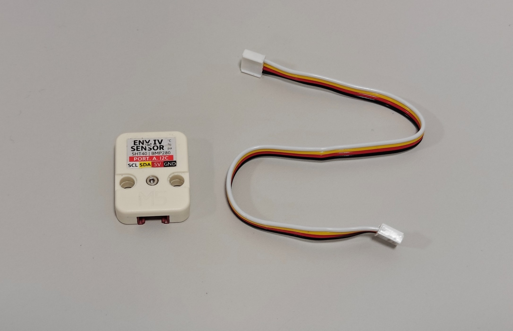

手順
^^^^^^^^^^^^^^^^^^^^^^^^^^^^^^^^^^^^^^^^^^^^^^^^^^^^^^^^^^^
1. `(29) 温湿度気圧センサユニット ENVIV` 付属のケーブルを `(29) 温湿度気圧センサユニット ENVIV` のコネクタに接続する。

.. image:: ../../images/assembly_light/body/body04-02.jpg
    :width: 400px

2. 1.のケーブルを `(15) AKARI Light Body` 背面の右側の穴から中に通し、 `(29) 温湿度気圧センサユニット ENVIV` を背面の凸部に差し込む。

| **ENVIVのラベルがボディーの内向きになるようにすること**

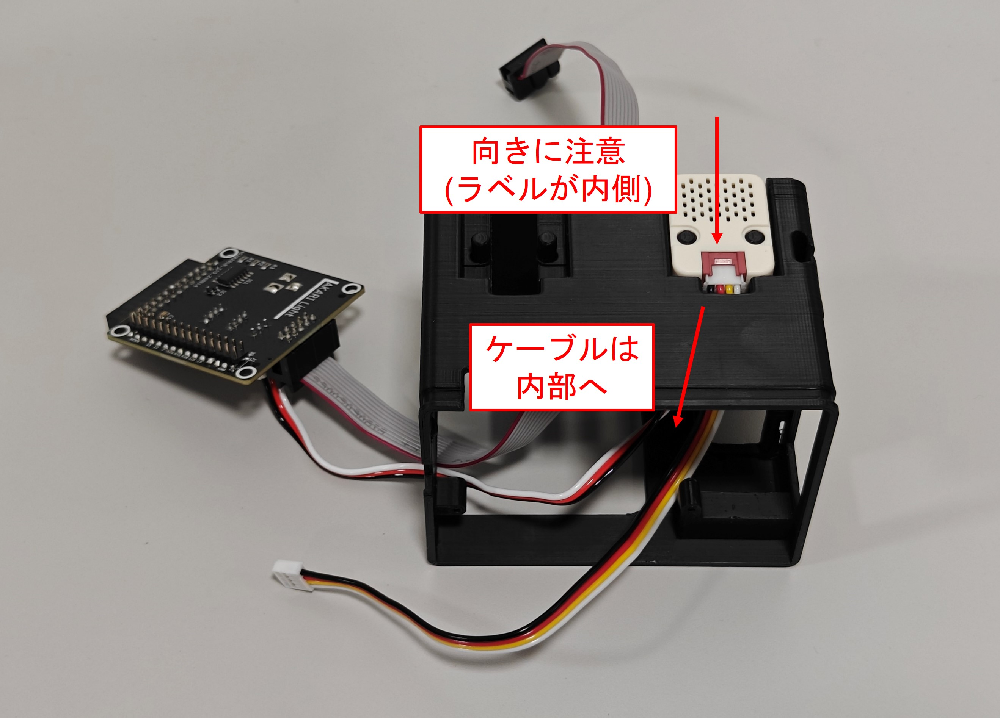

3.  2.のケーブルを `(1) M5stack基板(Light用)` のJ5に接続する。

.. image:: ../../images/assembly_light/body/body04-04.jpg
    :width: 400px

5 (オプション) 光センサユニットの搭載
-----------------------------------------------------------
**光センサユニットを使用しない場合はこの工程は不要です。**

必要な部品
^^^^^^^^^^^^^^^^^^^^^^^^^^^^^^^^^^^^^^^^^^^^^^^^^^^^^^^^^^^^
| (30) 光センサユニット 1個

.. image:: ../../images/assembly_light/body/body05-01.jpg
    :width: 400px

手順
^^^^^^^^^^^^^^^^^^^^^^^^^^^^^^^^^^^^^^^^^^^^^^^^^^^^^^^^^^^
1. `(30) 光センサユニット` 付属のケーブルを  `(30) 光センサユニット` のコネクタに取り付ける。

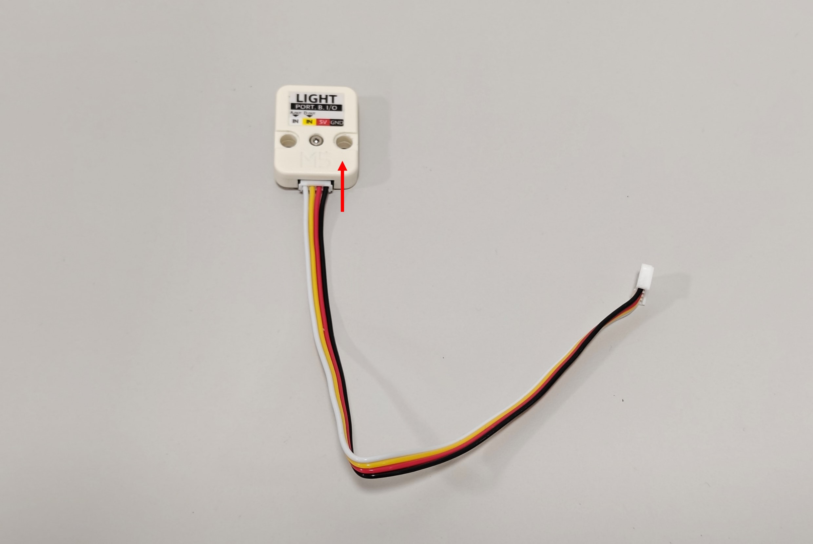

2. 1.のケーブルを `(15) AKARI Light Body` 背面の左側の穴から中に通し、 `(30) 光センサユニット` を背面の凸部に差し込む。

| **光センサのラベルがボディーの内向きになるようにすること**

.. image:: ../../images/assembly_light/body/body05-03.jpg
    :width: 400px

3. 2. のケーブルを `(1) M5stack基板(Light用)` のJ4に接続する。

.. image:: ../../images/assembly_light/body/body05-04.jpg
    :width: 400px

6 ボディー部サーボモータの配線
-----------------------------------------------------------

必要な部品
^^^^^^^^^^^^^^^^^^^^^^^^^^^^^^^^^^^^^^^^^^^^^^^^^^^^^^^^^^^
| (20) STS3215 に付属のケーブル 1個
    ※ 2個目のSTS3215のものを使用

.. image:: ../../images/assembly_light/body/body06-01.jpg
    :width: 400px

手順
^^^^^^^^^^^^^^^^^^^^^^^^^^^^^^^^^^^^^^^^^^^^^^^^^^^^^^^^^^^

1. `(20) STS3215` に付属のケーブルを、1. の `(20) STS3215` の空いているポートに接続する。

.. image:: ../../images/assembly_light/body/body06-02.jpg
    :width: 400px

2. ケーブルの反対側を、 `(15) AKARI Light Body` 背面の穴から上部へ引き出す。

.. image:: ../../images/assembly_light/body/body06-03.jpg
    :width: 400px

7 OAK-D用USBケーブルの配線
-----------------------------------------------------------

必要な部品
^^^^^^^^^^^^^^^^^^^^^^^^^^^^^^^^^^^^^^^^^^^^^^^^^^^^^^^^^^^
| (26) USB Type-Cケーブル 0.5mL字 1個

.. image:: ../../images/assembly_light/body/body07-01.jpg
    :width: 400px

手順
^^^^^^^^^^^^^^^^^^^^^^^^^^^^^^^^^^^^^^^^^^^^^^^^^^^^^^^^^^^
1. `(26) USB Type-Cケーブル 0.5mL字` のtype-A側を `(15) AKARI Light Body` の上面から、背面穴に通して内部から下方向に引き出す。

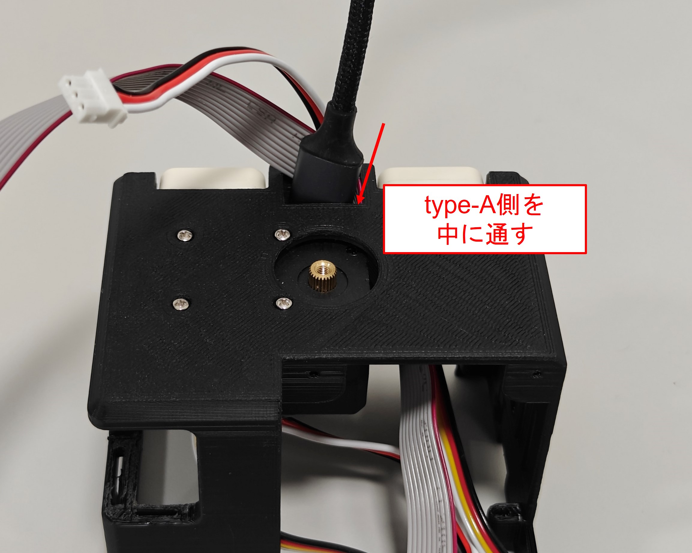

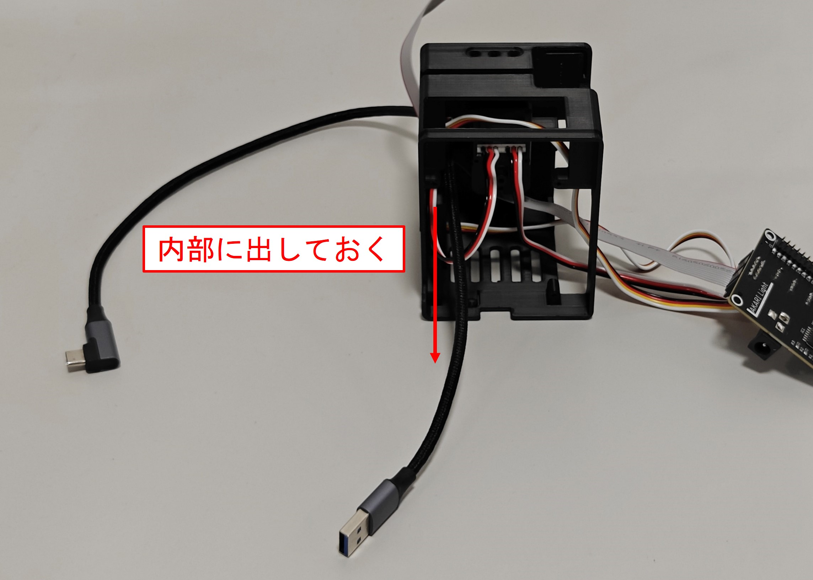

8 Raspberry Piの準備
-----------------------------------------------------------

必要な部品
^^^^^^^^^^^^^^^^^^^^^^^^^^^^^^^^^^^^^^^^^^^^^^^^^^^^^^^^^^^
| (18) Raspberry Pi5 8GB 1個
| (22) Raspberry Pi5用アクティブクーラー 1個
| (27) MicroSDカード(RaspberryPi用) (:doc:`setup_raspi_os`でセットアップ済みのもの) 1個

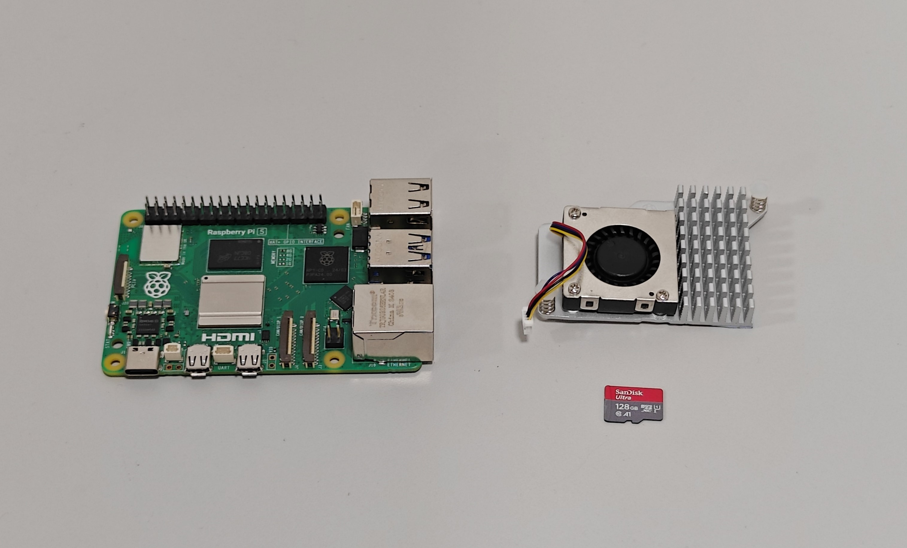

手順
^^^^^^^^^^^^^^^^^^^^^^^^^^^^^^^^^^^^^^^^^^^^^^^^^^^^^^^^^^^
1. `(27) MicroSDカード(RaspberryPi用)` を `(18) Raspberry Pi5 8GB` に挿入する。

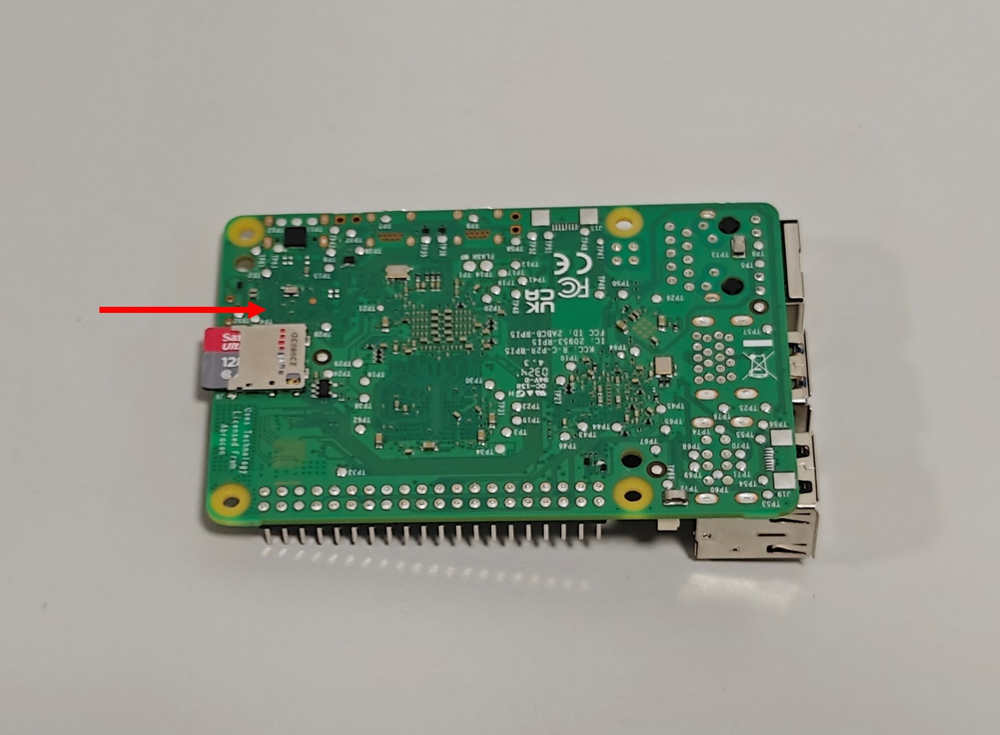

2. `(22) Raspberry Pi5用アクティブクーラー` の裏のシートを剥がす。

.. image:: ../../images/assembly_light/body/body08-03.jpg
    :width: 400px

3. `(22) Raspberry Pi5用アクティブクーラー` を `(18) Raspberry Pi5 8GB` に載せ、2箇所のピンを押して差し込み固定する。

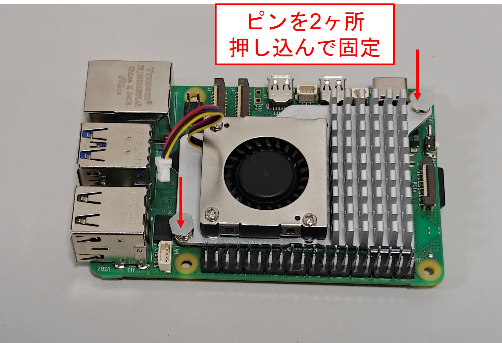

4. `(18) Raspberry Pi5 8GB`の FANコネクタのキャップを外し、 `(22) Raspberry Pi5用アクティブクーラー` のコネクタを差し込む。

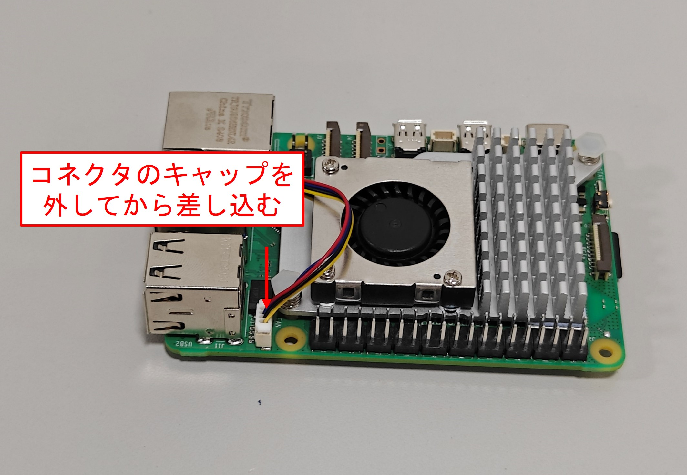

9 Raspberry Piの取り付け
-----------------------------------------------------------

必要な部品
^^^^^^^^^^^^^^^^^^^^^^^^^^^^^^^^^^^^^^^^^^^^^^^^^^^^^^^^^^^
| (19) M5stack BASIC付属のUSBケーブル 1個
| (20) STS3215付属のタッピングビス 4個

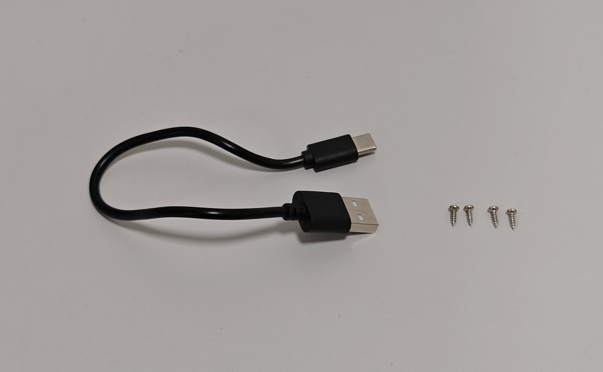

手順
^^^^^^^^^^^^^^^^^^^^^^^^^^^^^^^^^^^^^^^^^^^^^^^^^^^^^^^^^^^

1. 7 OAK-D用USBケーブルの配線で接続したUSBケーブルをBody右側面の穴から外に出す。

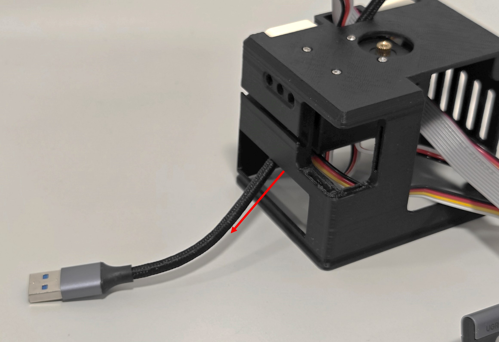

2. `(19) M5stack BASIC` 付属のUSBケーブルを、同じくBody右側面の穴から外に出す。

.. image:: ../../images/assembly_light/body/body09-03.jpg
    :width: 400px

3. `(18) Raspberry Pi5 8GB` を本体内部下側からM5Stack基板のピンソケットに接続する。

.. image:: ../../images/assembly_light/body/body09-04.jpg
    :width: 400px

4. `(20) STS3215` に付属のタッピングビスを使って `(18) Raspberry Pi5 8GB` を `(15) AKARI Light Body` に4点ネジ留めする。

.. image:: ../../images/assembly_light/body/body09-05.jpg
    :width: 400px

5. `(19) M5stack BASIC` 付属のUSBケーブルのtype-C側を `(18) Raspberry Pi5 8GB` のUSBポートとBodyの隙間から内部に差し入れ、前面開口部から外に出す。

.. image:: ../../images/assembly_light/body/body09-06.jpg
    :width: 400px

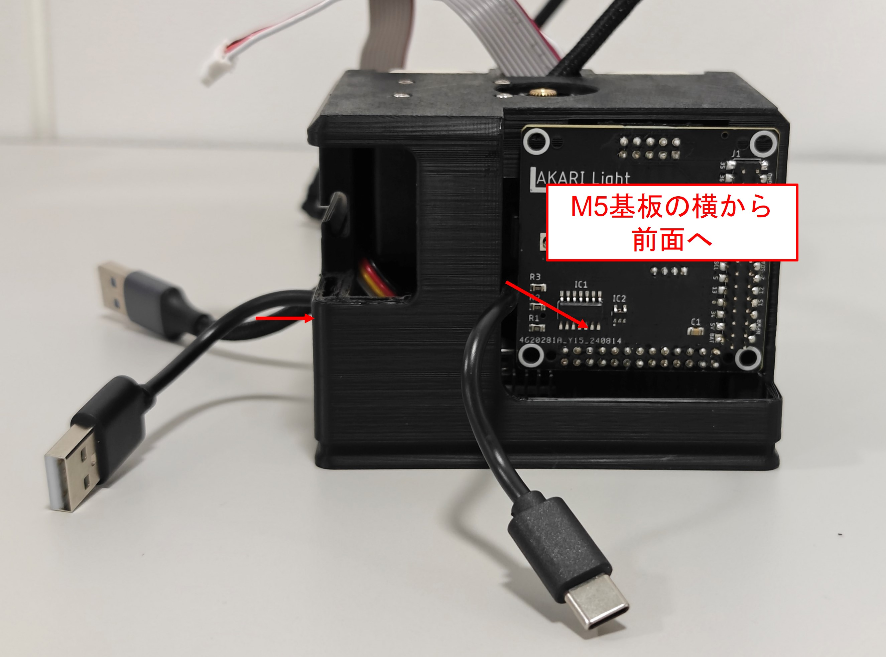

6. `(18) Raspberry Pi5 8GB` のUSB3.0ポートに、7 OAK-D用USBケーブルの配線で接続したUSBケーブルを接続する。

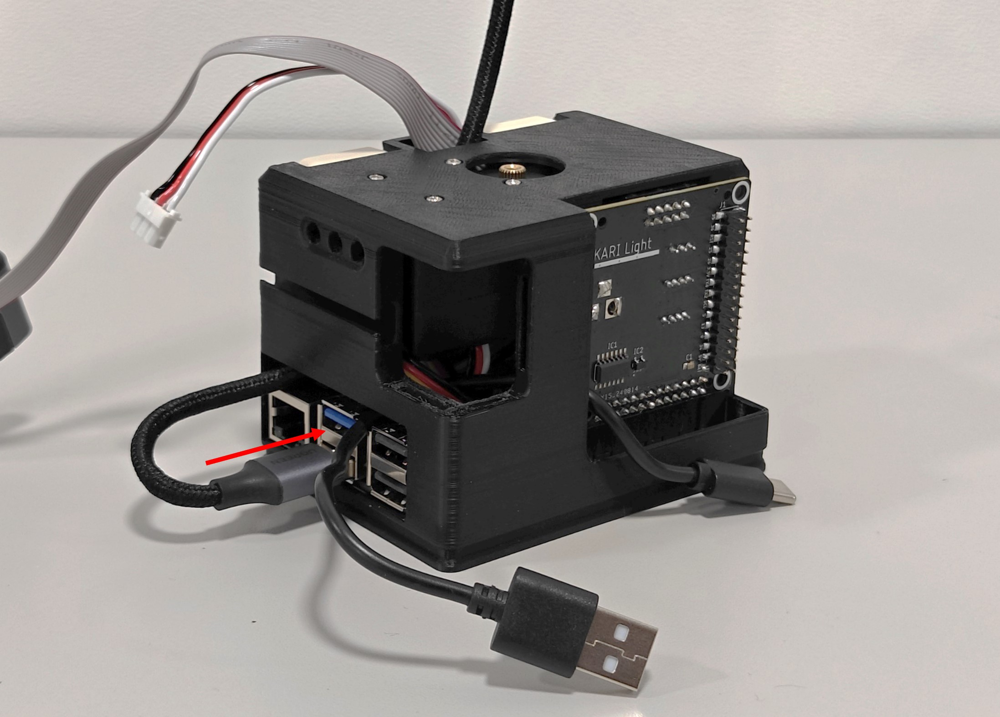

7. `(18) Raspberry Pi5 8GB` のUSB2.0ポートに `(19) M5stack BASIC` 付属のUSBケーブルを接続する。

.. image:: ../../images/assembly_light/body/body09-09.jpg
    :width: 400px

10 M5stackの取り付け
-----------------------------------------------------------

必要な部品
^^^^^^^^^^^^^^^^^^^^^^^^^^^^^^^^^^^^^^^^^^^^^^^^^^^^^^^^^^^
| (19) M5stack BASIC 1個
| (20) STS3215付属のタッピングビス 2個
| (28) MicroSDカード(M5Stack用) ※必要ファイル書き込み済みのもの 1個

.. image:: ../../images/assembly_light/body/body10-01.jpg
    :width: 400px

手順
^^^^^^^^^^^^^^^^^^^^^^^^^^^^^^^^^^^^^^^^^^^^^^^^^^^^^^^^^^^
1. `(20) STS3215` に付属のタッピングビスを使って `(1) M5stack基板(Light用)` を `(15) AKARI Light Body` に2点ネジ留めする。

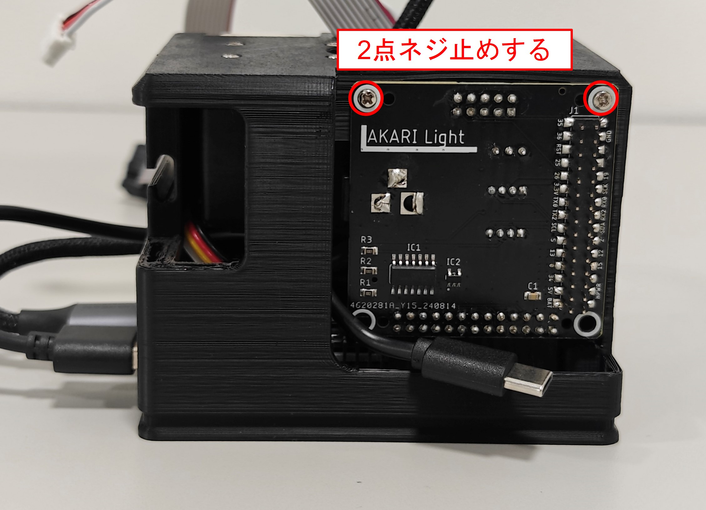

2. `(19) M5Stack BASIC` の背面を外す。

| **外れにくい場合は、マイナスドライバーをM5Stack側面の溝に差し込んで開く。**

.. image:: ../../images/assembly_light/body/body10-03.jpg
    :width: 400px

.. image:: ../../images/assembly_light/body/body10-04.jpg
    :width: 400px

3. `(28) MicroSDカード(M5Stack用)` を `(19) M5Stack BASIC` に挿入する。

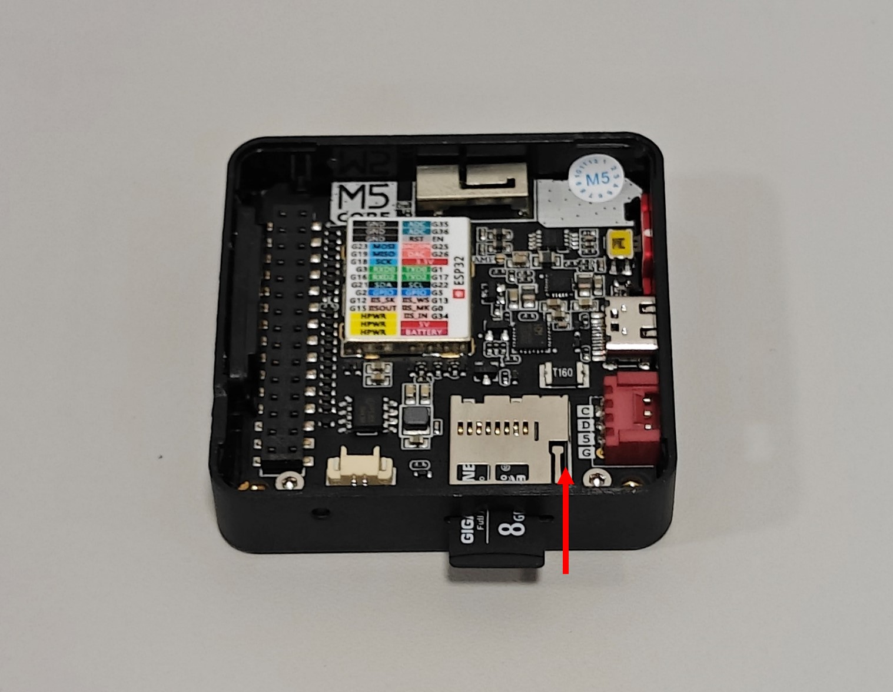

4. 8 Raspberry Piの取り付けの手順2.で接続したUSBケーブルを、 `(19) M5stack BASIC` に接続する。

.. image:: ../../images/assembly_light/body/body10-06.jpg
    :width: 400px

5. `(19) M5Stack BASIC` の前面を、ボディーに取り付けたM5stack基板に表から差し込む。

| **ディスプレイ中央部分に強い力をかけないこと。ディスプレイが割れる場合があります！**

.. image:: ../../images/assembly_light/body/body10-07.jpg
    :width: 400px

11 Baseの取り付け
-----------------------------------------------------------

必要な部品
^^^^^^^^^^^^^^^^^^^^^^^^^^^^^^^^^^^^^^^^^^^^^^^^^^^^^^^^^^^
| (17) AKARI Light Base 1個

.. image:: ../../images/assembly_light/body/body11-01.jpg
    :width: 400px

手順
^^^^^^^^^^^^^^^^^^^^^^^^^^^^^^^^^^^^^^^^^^^^^^^^^^^^^^^^^^^

1. `(17) AKARI Light Base` を `(15) AKARI Light Body` の下部にはめ込む。

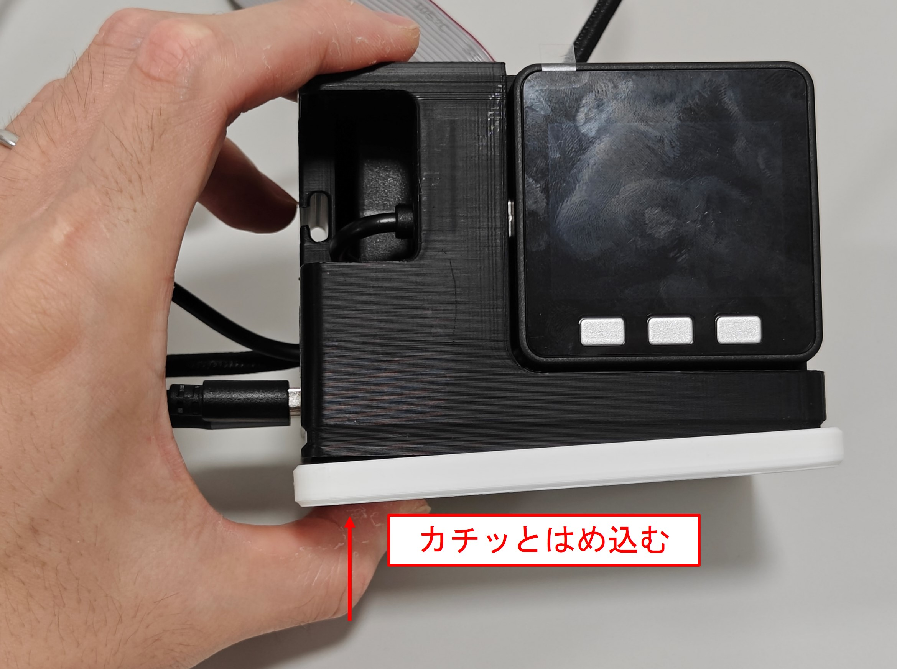

.. image:: ../../images/assembly_light/body/body11-03.jpg
    :width: 400px

12 Coverの取り付け
-----------------------------------------------------------

必要な部品
^^^^^^^^^^^^^^^^^^^^^^^^^^^^^^^^^^^^^^^^^^^^^^^^^^^^^^^^^^^
| (16) AKARI Light Cover 1個

.. image:: ../../images/assembly_light/body/body12-01.jpg
    :width: 400px

手順
^^^^^^^^^^^^^^^^^^^^^^^^^^^^^^^^^^^^^^^^^^^^^^^^^^^^^^^^^^^

1. `(16) AKARI Light Cover` を `(15) AKARI Light Body` の前面に取り付ける。

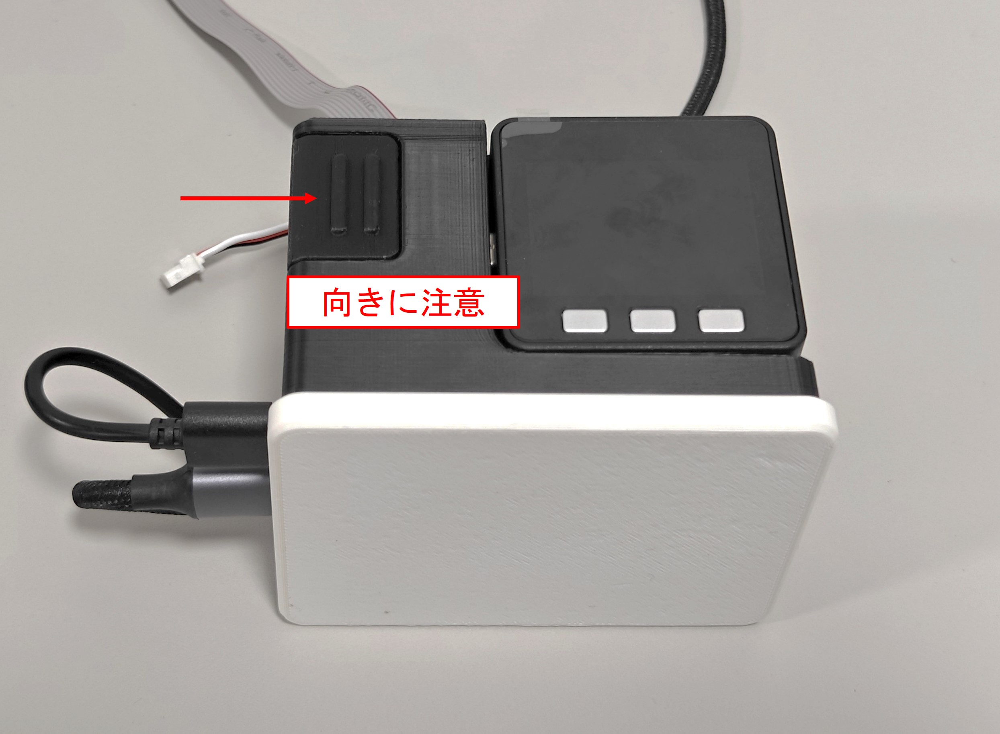

.. image:: ../../images/assembly_light/body/body12-03.jpg
    :width: 400px

| 以上でボディーの組み立ては終わりです。
| 次はヘッド部の組み立てを行います。

:doc:`assembly_head` へ進む

:doc:`assembly_pcb` へ戻る

