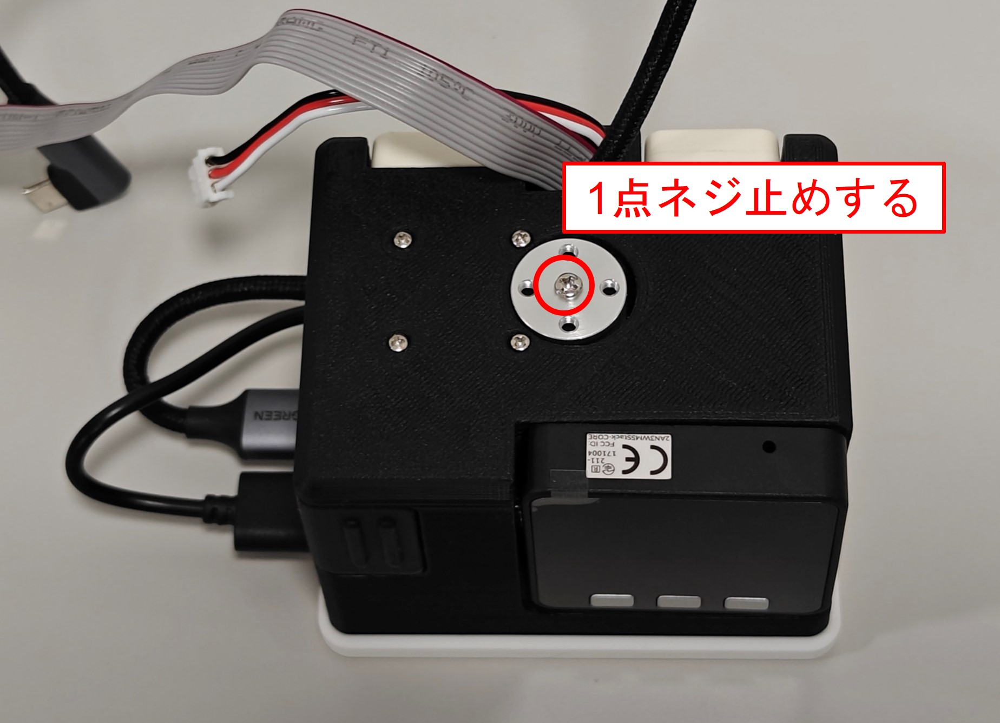
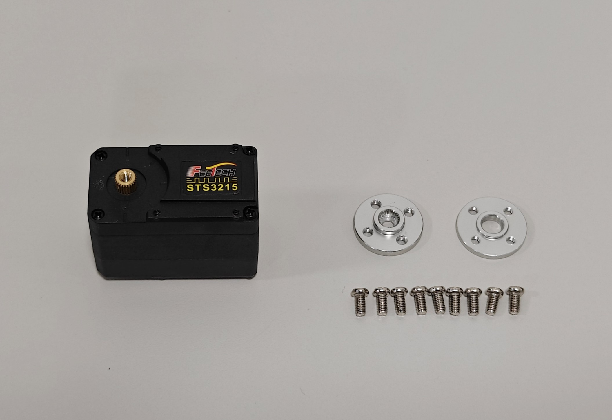
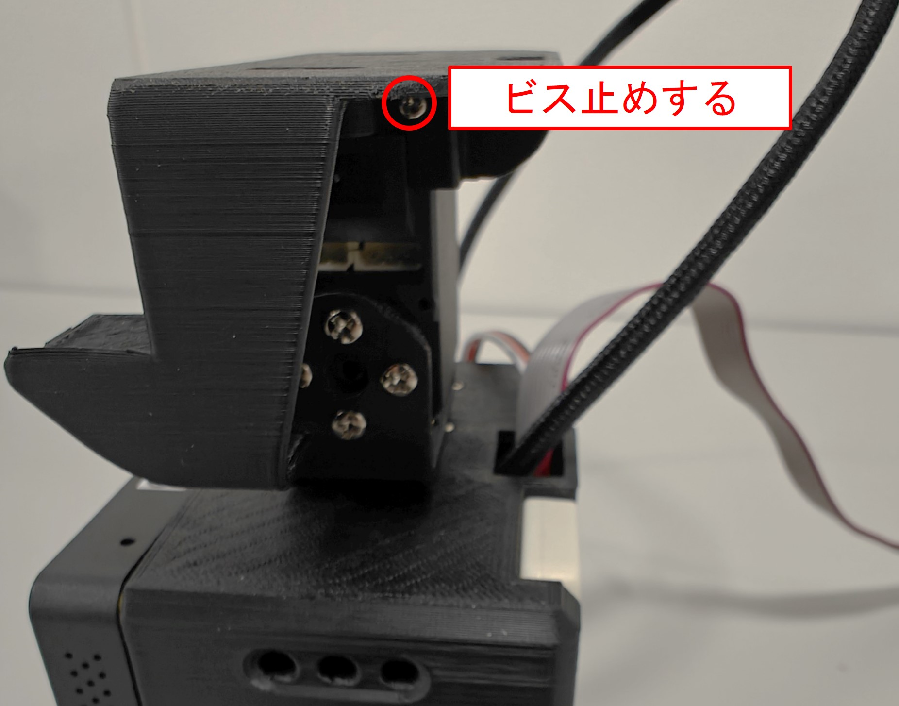
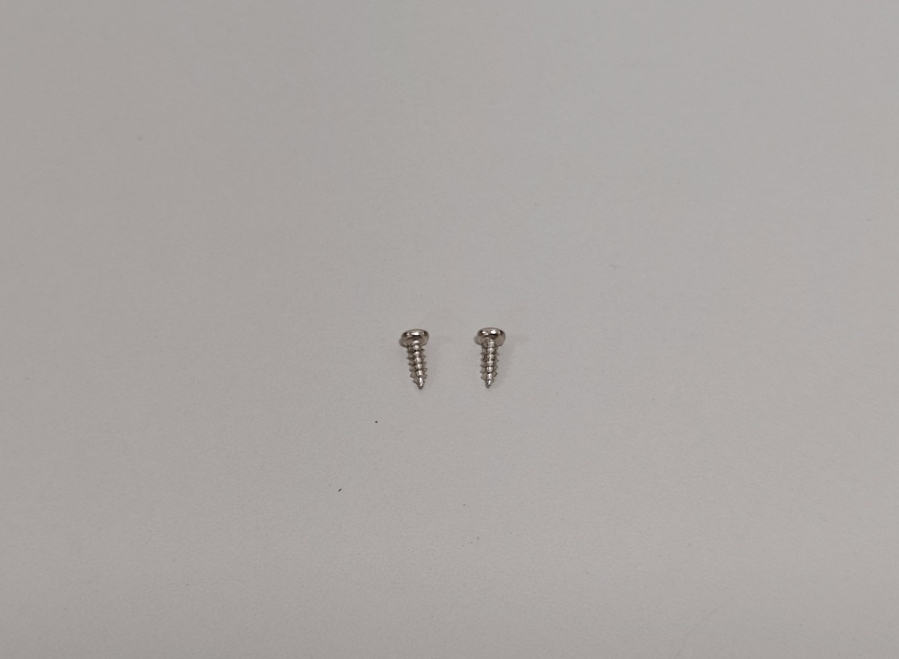
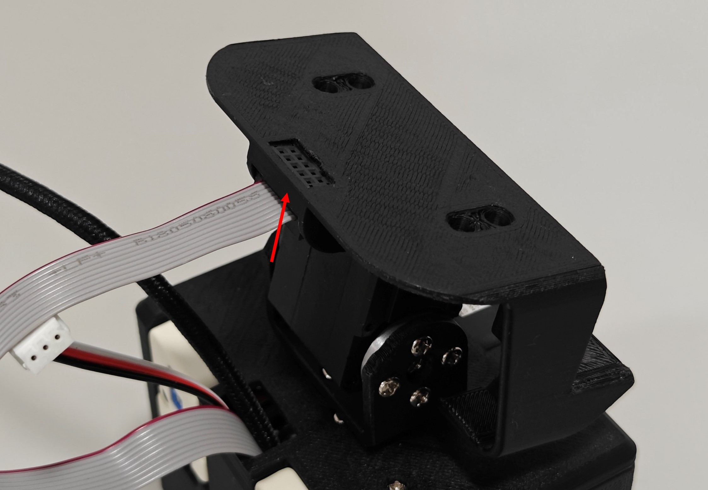
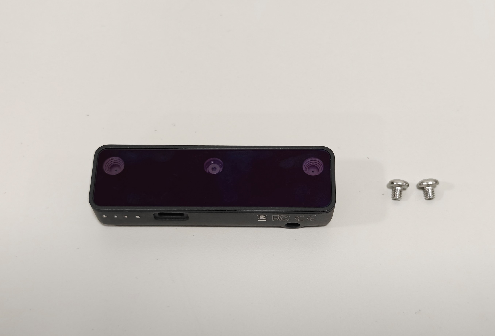
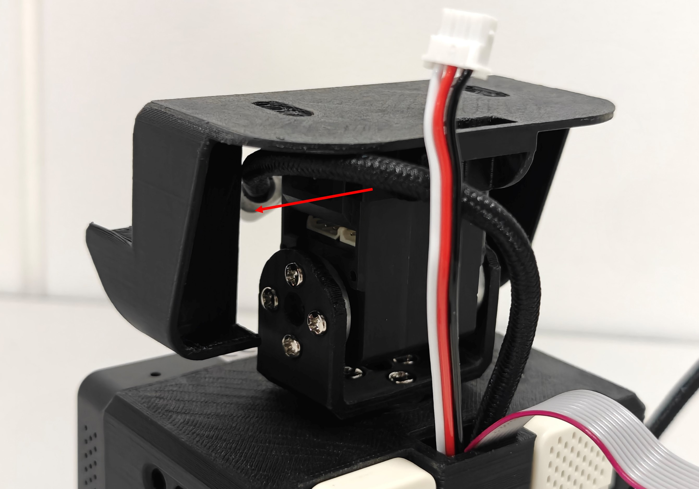
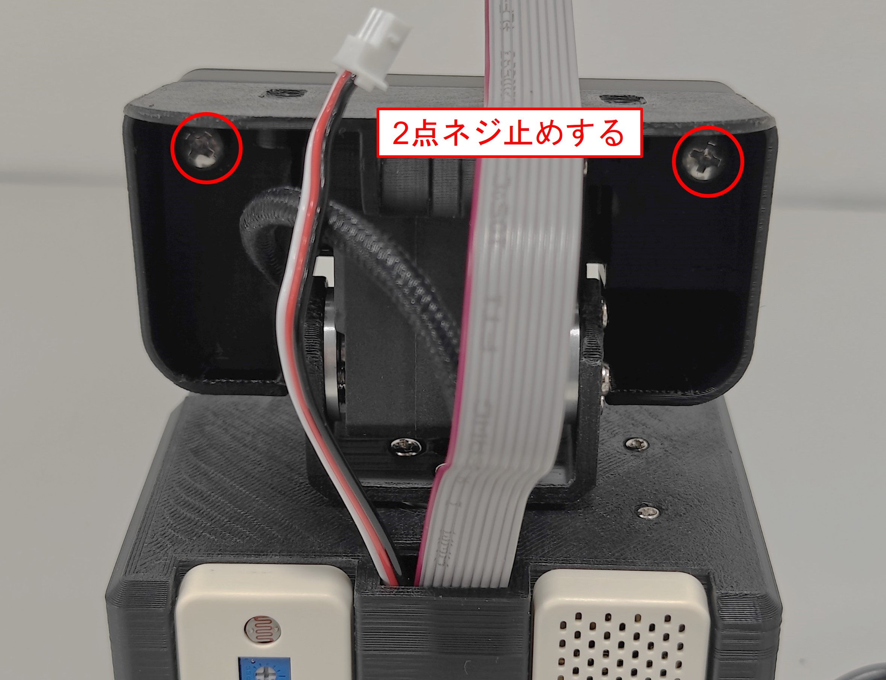

***********************************************************
ヘッドを組み立てよう(AKARI Light)
***********************************************************

| 次に、ヘッド部分を組み立てます。

必要な道具
-----------------------------------------------------------
| - 精密ドライバ(＋)
| - No.2サイズのドライバ(＋)

1 Armの取り付け
-----------------------------------------------------------

必要な部品
^^^^^^^^^^^^^^^^^^^^^^^^^^^^^^^^^^^^^^^^^^^^^^^^^^^^^^^^^^^
| :doc:`assembly_body` で組み立てたボディー 1個
| (14) AKARI Light Arm 1個
| (20) STS3215 に付属のサーボホーン 1個
| (20) STS3215付属のM3ネジ 5個

.. image:: ../../images/assembly_light/head/head01-01.jpg
    :width: 400px

手順
^^^^^^^^^^^^^^^^^^^^^^^^^^^^^^^^^^^^^^^^^^^^^^^^^^^^^^^^^^^
1. `(20) STS3215` に付属のサーボホーンを取り付け、付属のM3ネジでネジ留めする。

.. image:: ../../images/assembly_light/head/head01-02.jpg
    :width: 400px

|  **締結穴がずれるとモータの初期位置とヘッドの初期位置がずれます！**
|  **取り付け後も極力回転させないようにすること**

2. `(14) AKARI Light Arm` をBodyに取り付けた `(20) STS3215` に、付属のM3ネジでネジ留めする。

.. image:: ../../images/assembly_light/head/head01-04.jpg
    :width: 400px

2 モーターの取り付け
-----------------------------------------------------------

必要な部品
^^^^^^^^^^^^^^^^^^^^^^^^^^^^^^^^^^^^^^^^^^^^^^^^^^^^^^^^^^^
| (20) STS3215  1個
| (20) STS3215付属のサーボホーン(軸用) 1個
| (20) STS3215付属のサーボホーン(受け用) 1個
| (20) STS3215付属のM3ねじ 9個

手順
^^^^^^^^^^^^^^^^^^^^^^^^^^^^^^^^^^^^^^^^^^^^^^^^^^^^^^^^^^^
1. `(20) STS3215` の軸に、付属のサーボホーン(軸用)を取り付ける。

.. image:: ../../images/assembly_light/head/head02-02.jpg
    :width: 400px

2. `(20) STS3215` の軸の反対側に、付属のサーボホーン(受け用)を取り付ける。

.. image:: ../../images/assembly_light/head/head02-03.jpg
    :width: 400px

3. `(20) STS3215` に取り付けたサーボホーン(軸用)が、本体を背面から見た時に右側に来るようにし、ボディーに取り付けたアームに付属のM3ネジで5点ネジ留めする。

.. image:: ../../images/assembly_light/head/head02-04.jpg
    :width: 400px

5. 反対側のサーボホーン(受け用)を、付属のM3ネジで4点ネジ留めする。

| **ボディーからのケーブルは、まだコネクタに接続しないこと！モータのセットアップ作業の途中で接続します。**

.. image:: ../../images/assembly_light/head/head02-05.jpg
    :width: 400px

3 ヘッドの取り付け
-----------------------------------------------------------

必要な部品
^^^^^^^^^^^^^^^^^^^^^^^^^^^^^^^^^^^^^^^^^^^^^^^^^^^^^^^^^^^
| (13) AKARI Light Head 1個
| (20) STS3215に付属のタッピングビス 2個

.. image:: ../../images/assembly_light/head/head03-01.jpg
    :width: 400px

手順
^^^^^^^^^^^^^^^^^^^^^^^^^^^^^^^^^^^^^^^^^^^^^^^^^^^^^^^^^^^

1. `(13) AKARI Light Head`を、ボディーに取り付けた `(20) STS3215` の上に載せ、左右両側面からSTS3215のネジ穴に `(20) STS3215` に付属のタッピングビスで2点ネジ留めする。

.. image:: ../../images/assembly_light/head/head03-03.jpg
    :width: 400px

4 リボンケーブルの取り付け
-----------------------------------------------------------

必要な部品
^^^^^^^^^^^^^^^^^^^^^^^^^^^^^^^^^^^^^^^^^^^^^^^^^^^^^^^^^^^
| (20) STS3215に付属のタッピングビス 2個

手順
^^^^^^^^^^^^^^^^^^^^^^^^^^^^^^^^^^^^^^^^^^^^^^^^^^^^^^^^^^^

1. ボディー上端から出ているリボンケーブルをヘッドの後部に接続し、(20) STS3215に付属のタッピングビスでヘッドの両端から2点ネジ留めする。

5 カメラの取り付け
-----------------------------------------------------------

必要な部品
^^^^^^^^^^^^^^^^^^^^^^^^^^^^^^^^^^^^^^^^^^^^^^^^^^^^^^^^^^^
| (21) OAK-D Lite 1個
| (25) ボルトM4-5 2個

手順
^^^^^^^^^^^^^^^^^^^^^^^^^^^^^^^^^^^^^^^^^^^^^^^^^^^^^^^^^^^
1. ボディー上端から出ているUSBケーブルを、ヘッドの左後部から前方に差し入れ、 `(21) OAK-D Lite` に接続する。

.. image:: ../../images/assembly_light/head/head05-03.jpg
    :width: 400px

1. `(21) OAK-D Lite` をヘッドの前面に載せ、裏側から`(25) ボルトM4-5` で2点ネジ留めする。

| 以上でAKARI Light本体の組み立ては完了です。
| 次はソフトのセットアップに進みます。

:doc:`../setup_soft/main` へ進む

:doc:`assembly_body` へ戻る
