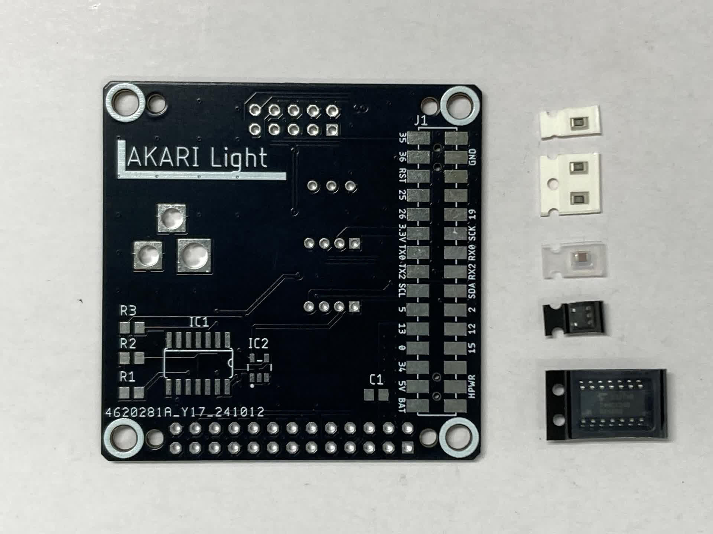
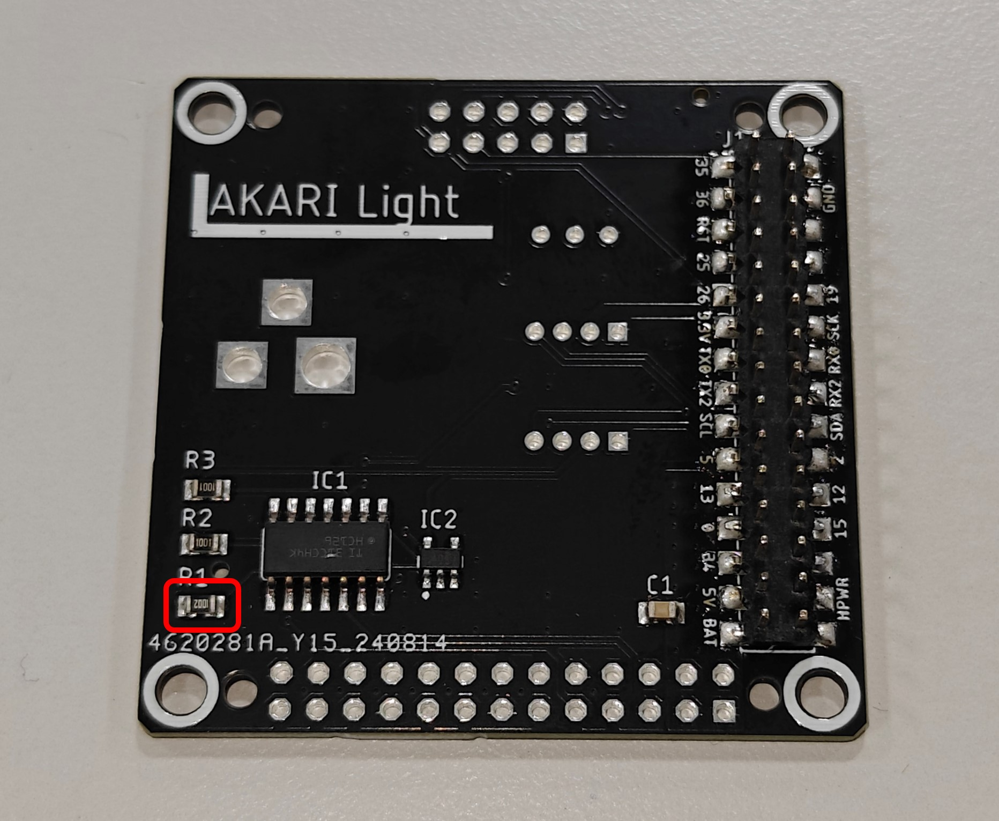
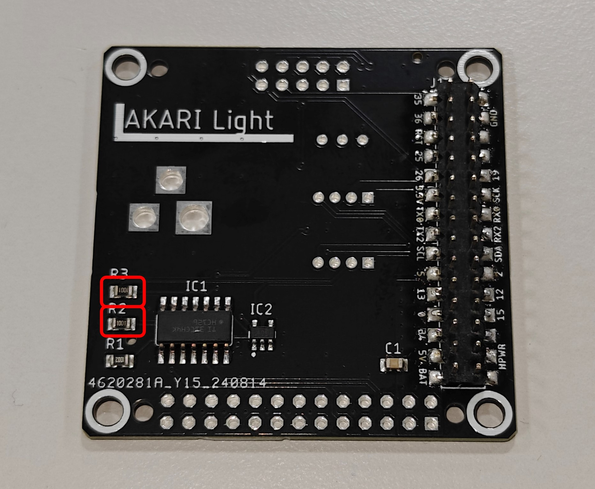
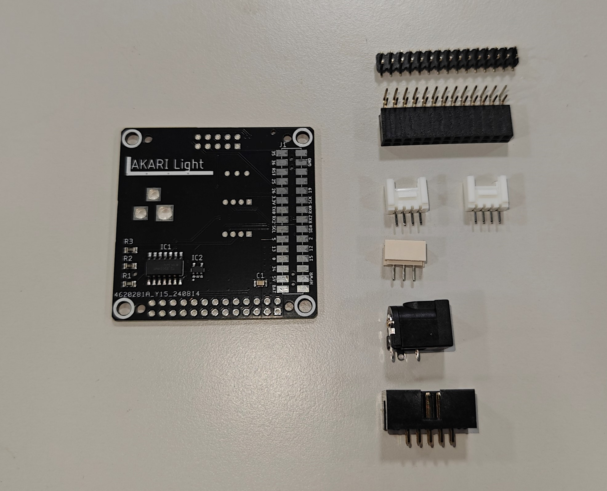
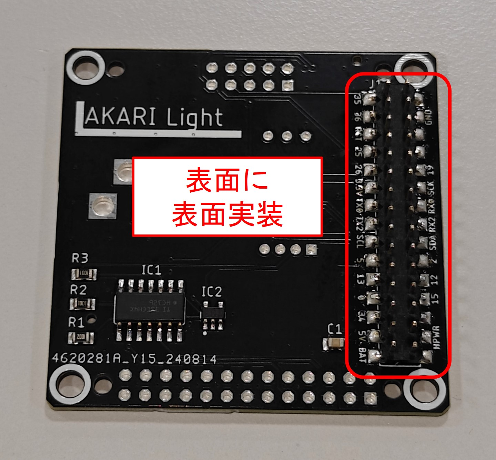
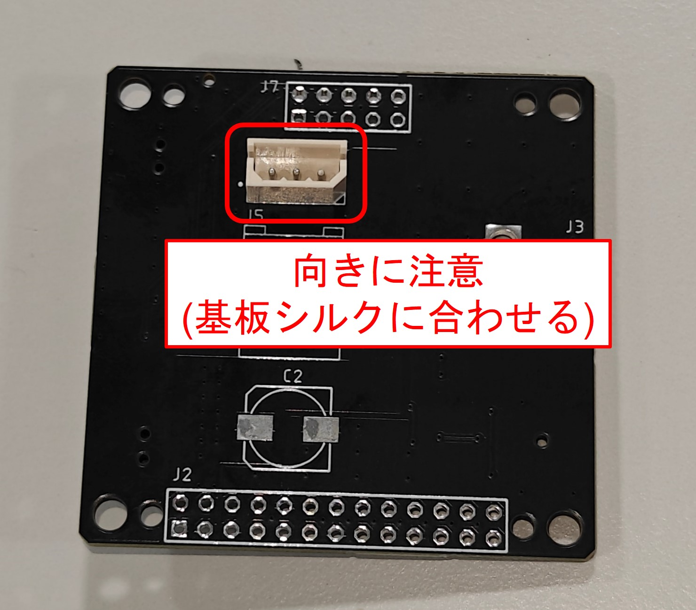
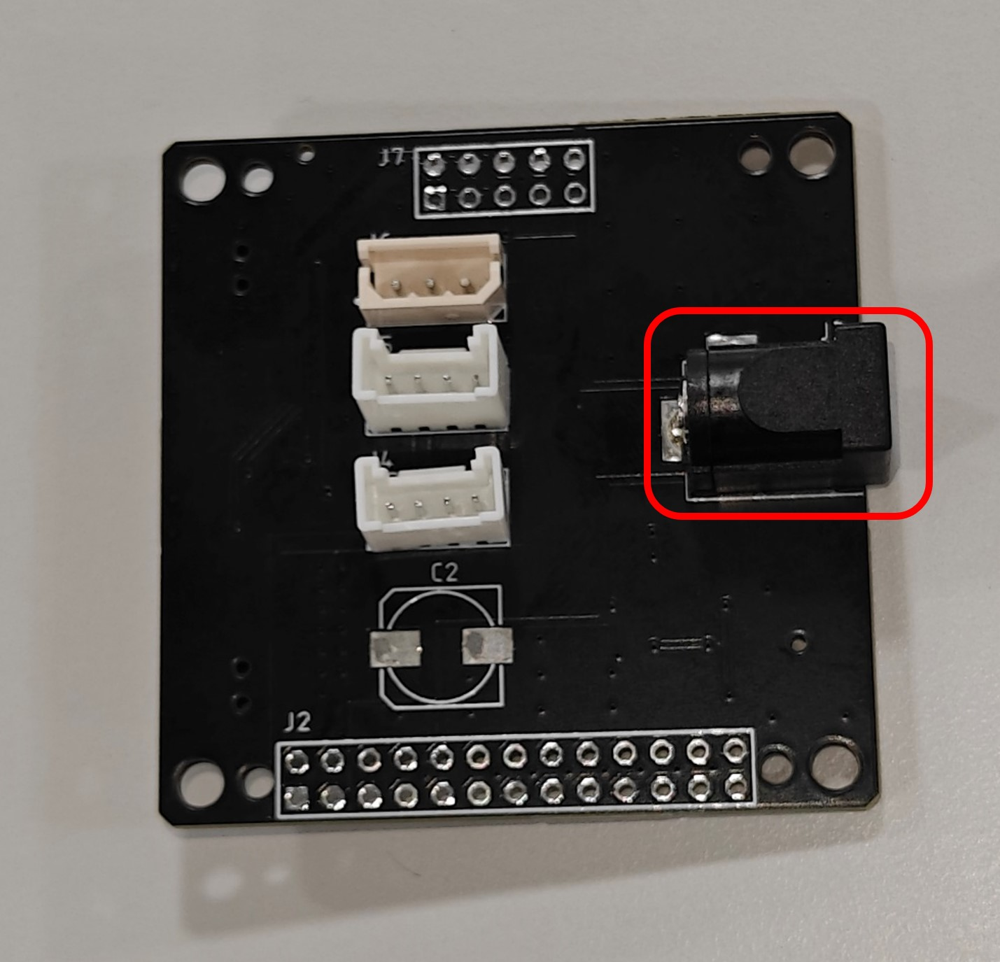
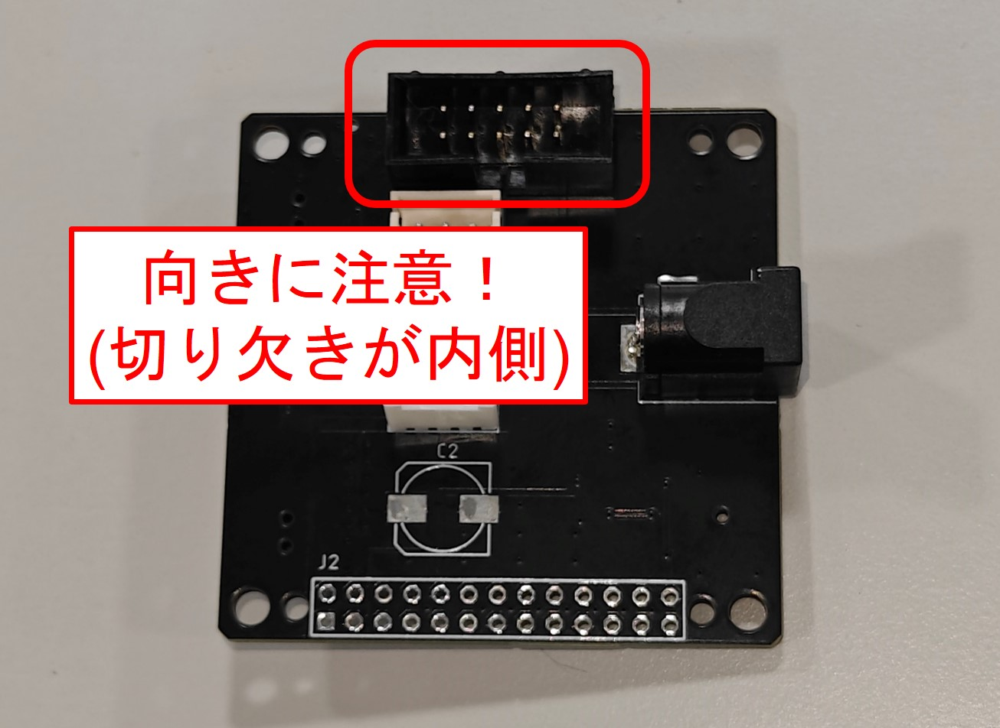
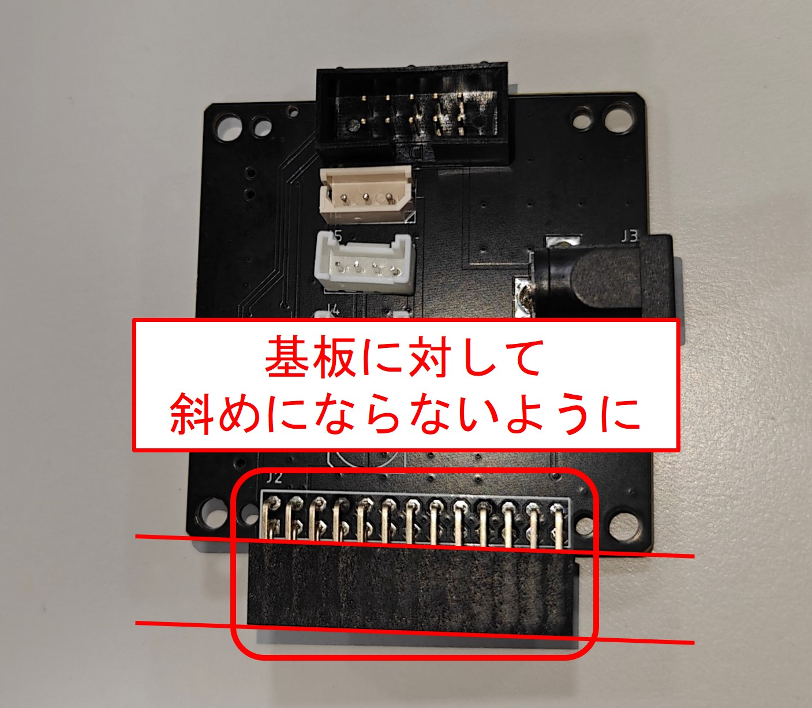
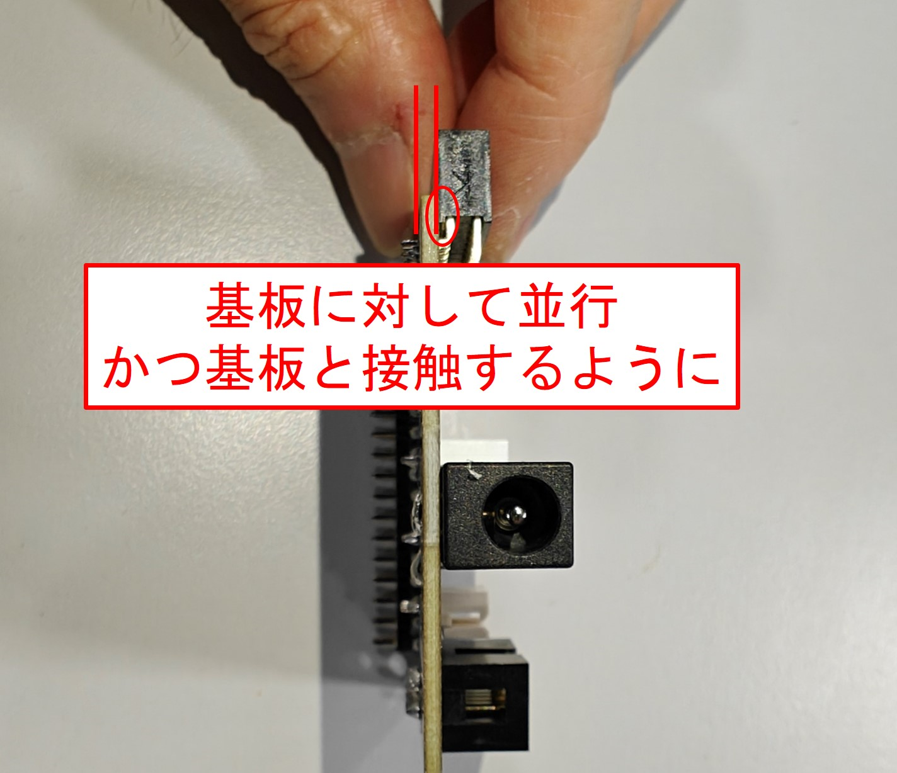

***********************************************************
基板に部品を実装しよう(AKARI Light)
***********************************************************

まずは基板に回路部品を実装していきましょう。

必要な道具
-----------------------------------------------------------
| - はんだごて
| - はんだ線
| - ニッパ

1 表面実装部品の実装
-----------------------------------------------------------

:doc:`pcb` で実装済み基板を購入した場合この手順は不要です。

必要な部品
^^^^^^^^^^^^^^^^^^^^^^^^^^^^^^^^^^^^^^^^^^^^^^^^^^^^^^^^^^^

| (1) M5stack基板(Light用) 1個
| (2) チップ抵抗 10kΩ 0805 1個
| (3) チップ抵抗 1kΩ 0805 2個
| (4) コンデンサ 0.1uF 0805 1個
| (5) バッファIC 1個
| (6) インバータ1CH 1個

手順
^^^^^^^^^^^^^^^^^^^^^^^^^^^^^^^^^^^^^^^^^^^^^^^^^^^^^^^^^^^

1. `チップ抵抗 10kΩ 0805` をR1にはんだ付けする。

2 `チップ抵抗 1kΩ 0805` をR2, R3にはんだ付けする。

3 `コンデンサ 0.1uF 0805` をC1にはんだ付けする。

.. image:: ../../images/assembly_light/pcb/pcb01-04.jpg
    :width: 400px

4 `バッファIC` をIC1にはんだ付けする。

.. image:: ../../images/assembly_light/pcb/pcb01-05.jpg
    :width: 400px

5 `インバータ1CH` をIC2にはんだ付けする。

.. image:: ../../images/assembly_light/pcb/pcb01-06.jpg
    :width: 400px

2 接続部品の実装
-----------------------------------------------------------

必要な部品
^^^^^^^^^^^^^^^^^^^^^^^^^^^^^^^^^^^^^^^^^^^^^^^^^^^^^^^^^^^

| 表面実装部品実装済みのM5stack基板(Light用) 1個
| (7) M5Stack用2x15ピンソケット 1個
| (8) Raspberry Pi用 L字ピンソケット2x13(26P) 1個
| (9) GROVEユニバーサル4ピンコネクター 2個
| (10) MOLEX 3ピン2.5mmコネクター 1個
| (11) DCジャック 2x5.5mm 1個
| (12) ボックスヘッダ10P 1個

手順
^^^^^^^^^^^^^^^^^^^^^^^^^^^^^^^^^^^^^^^^^^^^^^^^^^^^^^^^^^^

1. `(7) M5Stack用2x15ピンソケット` をM5stack基板(Light用)のJ1にはんだ付けする。

2. `(8) Raspberry Pi用 L字ピンソケット2x13(26P)` をM5stack基板(Light用)のJ2にはんだ付けする。

| - **ピンが基板外側に向くようにすること**
| - **基板に対して、水平方向、垂直方向共に斜めにならないよう、並行にはんだ付けすること。**
| - **かつ横から見たときに、基板とコネクタがピッタリ接触するようにすること。**
| - **まずは両端のピンを1つずつはんだ付けしながら位置を調整し、位置が整ったら他のピンをはんだ付けするとよい。**
| - **(10) MOLEX 3ピン2.5mmコネクターを使って基板の並行をとるとはんだ付けしやすい。**

.. image:: ../../images/assembly_light/pcb/pcb01-10.jpg
    :width: 400px

3. `(10) MOLEX 3ピン2.5mmコネクター` をM5stack基板(Light用)のJ6にはんだ付けする。

| **基板のシルクと図を参照に向きを合わせること**

4. `(9) GROVEユニバーサル4ピンコネクター` をM5stack基板(Light用)のJ4,J5にはんだ付けする。

| **基板のシルクと図を参照に向きを合わせること**

5. `(12) ボックスヘッダ10P` をM5stack基板(Light用)のJ7にはんだ付けする。

| **切り欠きが基板内側に向くようにすること**

6. `(11)  DCジャック 2x5.5mm` をM5stack基板(Light用)のJ3にはんだ付けする。

.. image:: ../../images/assembly_light/pcb/pcb01-15.jpg
    :width: 400px

| 以上で基板の実装は終わりです。
| 次はヘッド部の組み立てを行います。

:doc:`assembly_head` へ進む

:doc:`part_list` へ戻る
