***********************************************************
組み立てに必要なもの(AKARI Light)
***********************************************************
.. |1| image:: ../../images/assembly_light/part/01.jpg
   :width: 400px
.. |2| image:: ../../images/assembly_light/part/02.jpg
   :width: 400px
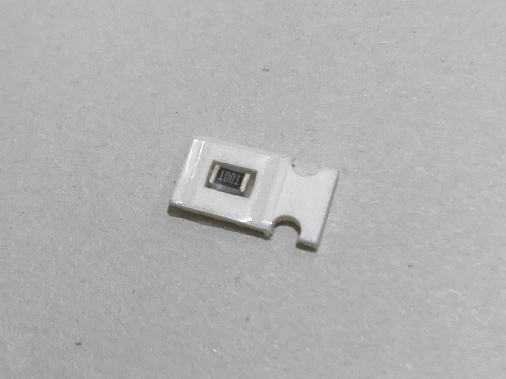
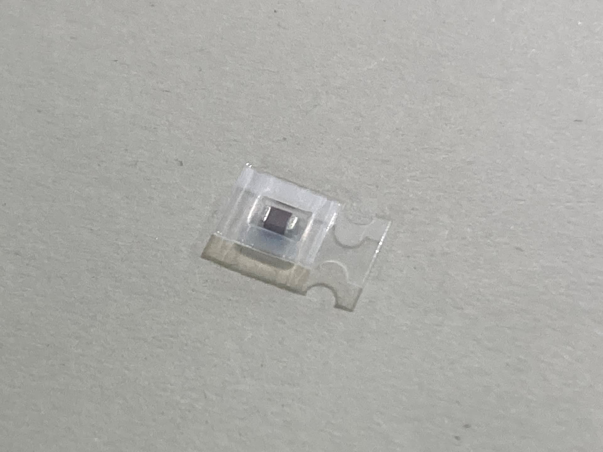
.. |5| image:: ../../images/assembly_light/part/05.jpg
   :width: 400px
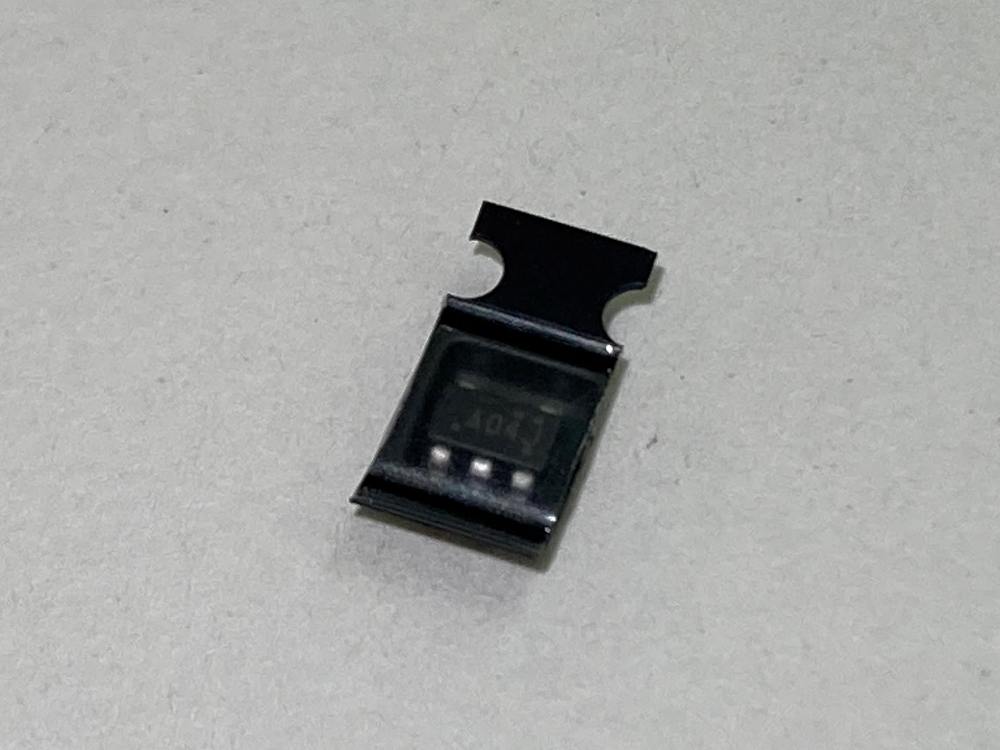
.. |7| image:: ../../images/assembly_light/part/07.jpg
   :width: 400px
.. |8| image:: ../../images/assembly_light/part/08.jpg
   :width: 400px
.. |9| image:: ../../images/assembly_light/part/09.jpg
   :width: 400px
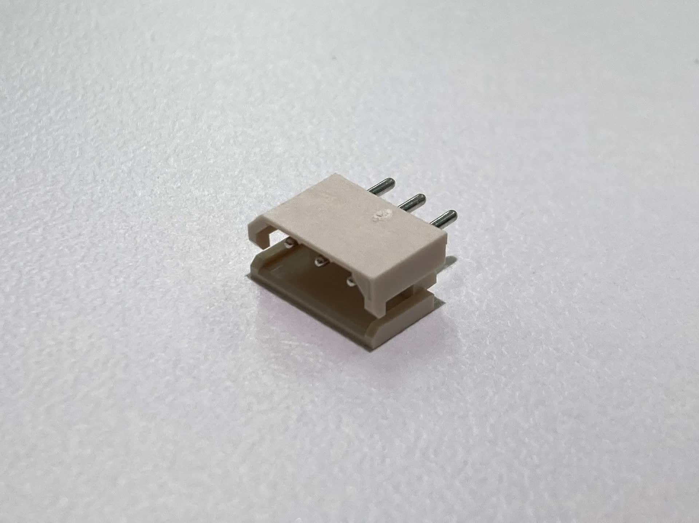
.. |11| image:: ../../images/assembly_light/part/11.jpg
   :width: 400px
.. |12| image:: ../../images/assembly_light/part/12.jpg
   :width: 400px
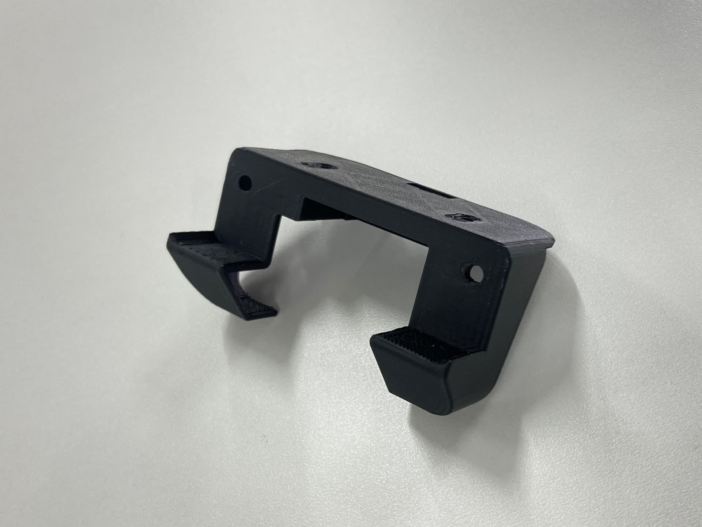
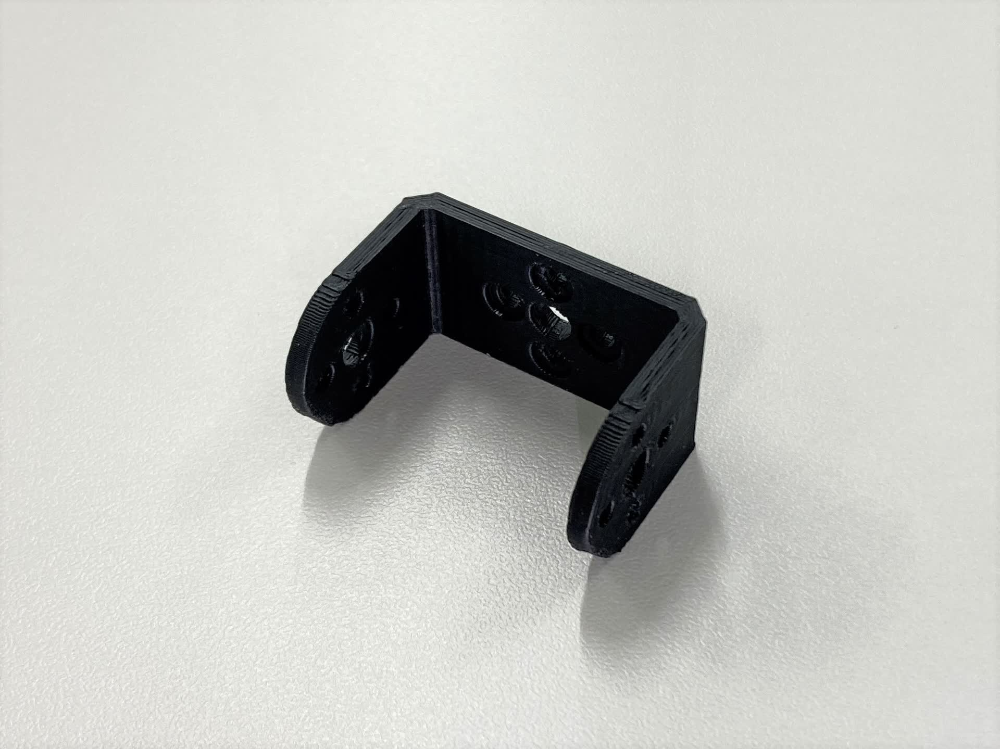
.. |15| image:: ../../images/assembly_light/part/15.jpg
   :width: 400px
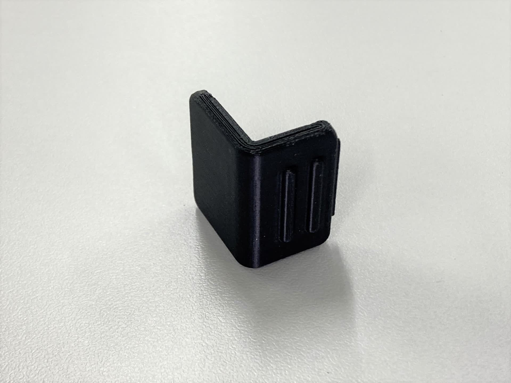
.. |17| image:: ../../images/assembly_light/part/17.jpg
   :width: 400px
.. |18| image:: ../../images/assembly_light/part/18.jpg
   :width: 400px
.. |19| image:: ../../images/assembly_light/part/19.jpg
   :width: 400px
.. |20| image:: ../../images/assembly_light/part/20.jpg
   :width: 400px
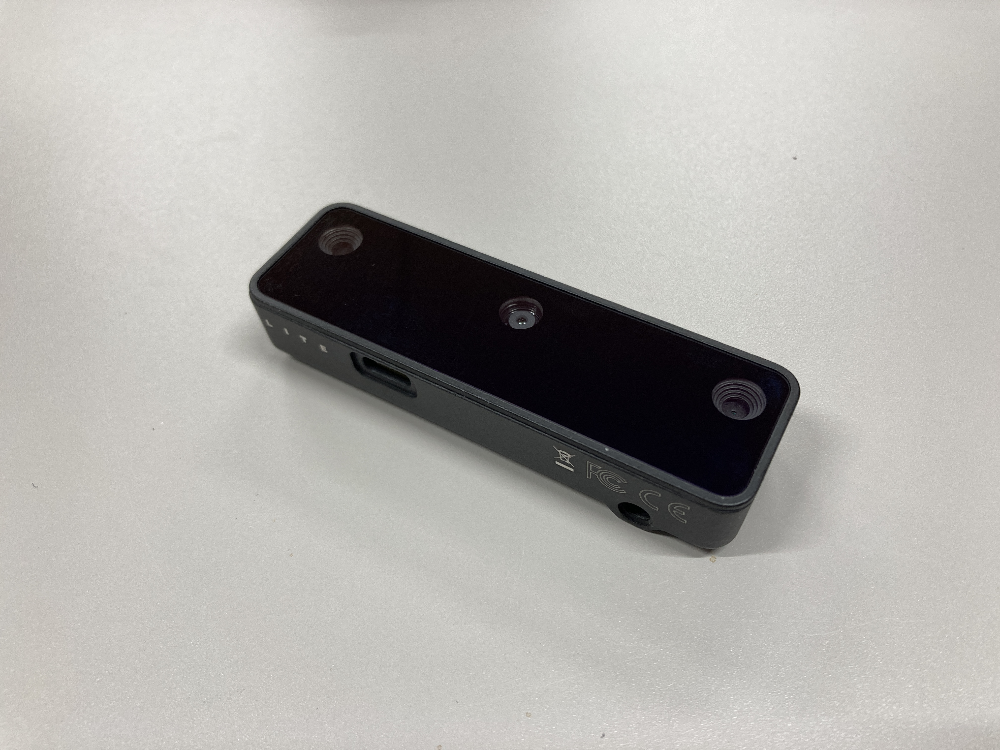
.. |22| image:: ../../images/assembly_light/part/22.jpg
   :width: 400px
.. |23| image:: ../../images/assembly_light/part/23.jpg
   :width: 400px
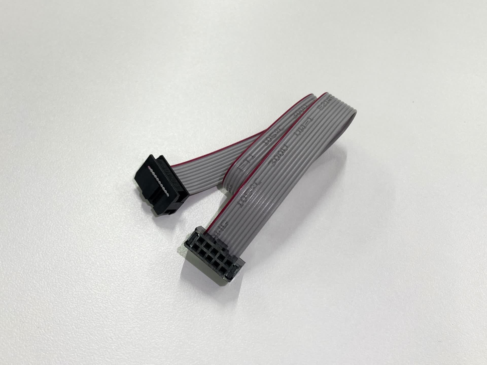
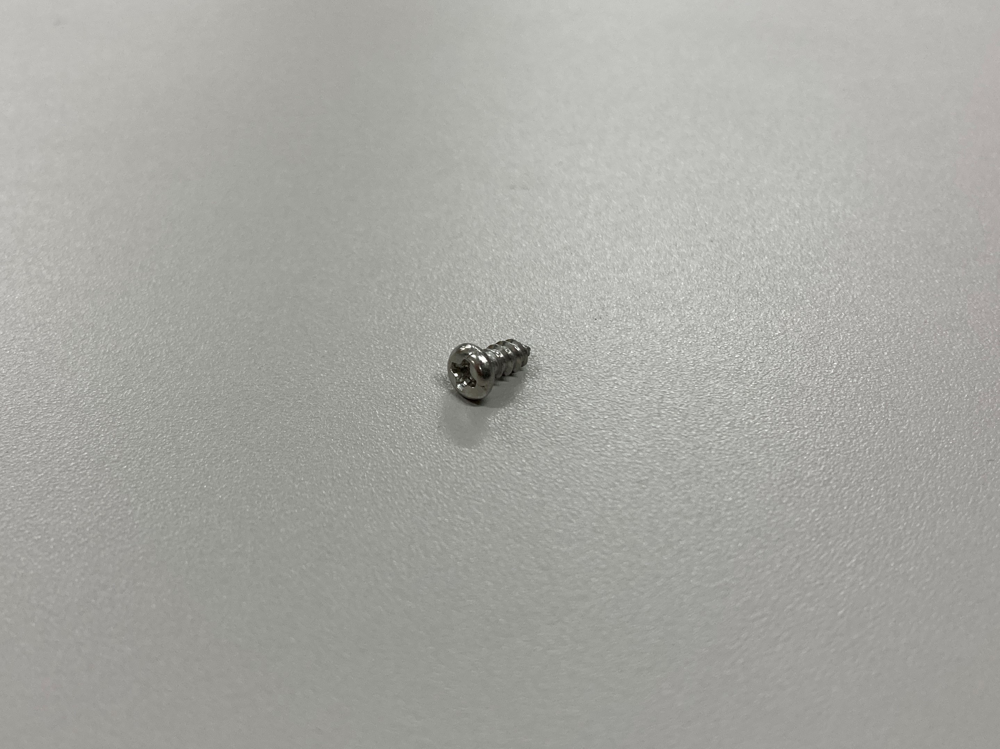
.. |26| image:: ../../images/assembly_light/part/26.jpg
   :width: 400px
.. |27| image:: ../../images/assembly_light/part/27.jpg
   :width: 400px
.. |28| image:: ../../images/assembly_light/part/28.jpg
   :width: 400px
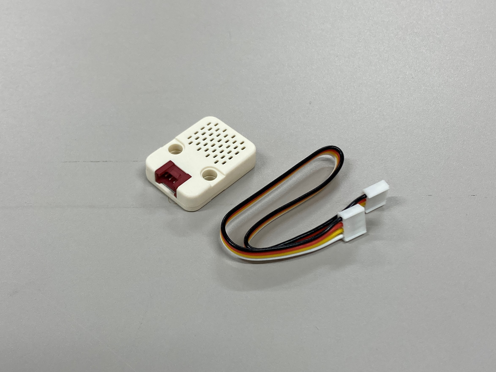
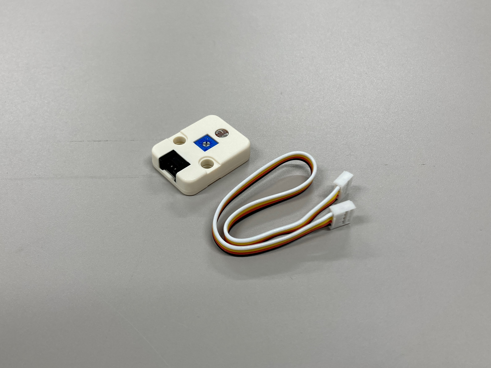

| AKARI Lightの組み立てに必要な道具、部品の一覧を記載します。
| 各部品にはご参考までに自分達の購入先のリンクを掲載してあります(秋月電子に関しては通販コードを用いて参照ください)。
| **購入先はあくまで一例ですので、同じ部品であれば他の購入先でも問題ありません。**

| またテストユニットを作成される方は、合わせて :doc:`テストユニットの部品 <../assembly_test_unit/part_list>` を購入することを推奨します。

必要な道具
-----------------------------------------------------------

* 精密ドライバ(＋)
* No.2サイズのドライバ(＋)
* はんだごて
* はんだ線

AKARI Lightのセットアップに必要なもの
-----------------------------------------------------------
* PC
* USB-microSDカードリーダ(PCにSDカードスロットがついていない場合)
* キーボード
* マウス
* ディスプレイ
* microHDMIとディスプレイを接続するケーブル
* microSDカード(:doc:`part_list` (39)で用意したもの)

部品表
-----------------------------------------------------------

| 必要数はAKARI1台の製作に必要な個数、購入数は、その個数を入手するために購入が必要なセット数です。
| 例えば、1台に2個使う部品が2個1セットで販売されていた場合は、必要数2、購入数1という表示になっています。

M5基板用
-----------------------------------------------------------
| 基板の作成方法は :doc:`pcb` を参照ください。
| また、この手順に沿ってJLCPCBで実装済み基板を購入する場合、2-6は購入不要です。

.. csv-table::

   "No.","分類","画像","名称","型番","必要数 [個]","購入数[組]","購入先リンク","備考"
   1,"製造品","|1|","M5stack基板(Light用)",,1,1, ー ,
   2,"購入品","|2|","チップ抵抗 10kΩ 0805","RK73B2ATTD103J",1,1,"| `マルツ <https://www.marutsu.co.jp/pc/i/2720378/>`__",
   3,"購入品","|3|","チップ抵抗 1kΩ 0805","RK73B2ATTD102J",2,2,"| `マルツ <https://www.marutsu.co.jp/pc/i/856914/>`__",
   4,"購入品","|4|","コンデンサ 0.1uF 0805","C2012X7R2A104K125AA",1,1,"| `マルツ <https://www.marutsu.co.jp/pc/i/41253870/>`__",
   5,"購入品","|5|","バッファIC","74HC126D",1,1,"| `マルツ <https://www.marutsu.co.jp/pc/i/26979466/>`__",
   6,"購入品","|6|","インバータ1CH","SN74AHC1G04DBVR",1,1,"| `マルツ <https://www.marutsu.co.jp/pc/i/15305173/>`__",
   7,"購入品","|7|","M5Stack用2x15ピンヘッダ/ピンソケットセット","M5STACK-BUS-SOCKET",1,1,"| `マルツ <https://www.marutsu.co.jp/pc/i/1346013/>`__",
   8,"購入品","|8|","Raspberry Pi用 L字ピンソケット2x13(26P)","SSCI-016544",1,1,"| `マルツ <https://www.marutsu.co.jp/pc/i/2349833/>`__",
   9,"購入品","|9|","GROVEユニバーサル4ピンコネクター","110990030",2,1,"| `マルツ <https://www.marutsu.co.jp/pc/i/829425/>`__",
   10,"購入品","|10|","MOLEX 3ピン2.5mmコネクター","0022035035",1,1,"| `マルツ <https://www.marutsu.co.jp/pc/i/33213647/>`__",
   11,"購入品","|11|","DCジャック 2x5.5mm","PJ-050AH",1,1,"| `マルツ <https://www.marutsu.co.jp/pc/i/13667288/>`__",
   12,"購入品","|12|","ボックスヘッダ10P","217010SE",1,1,"| `秋月電子 <https://akizukidenshi.com/catalog/g/g112664/>`__",

本体
-----------------------------------------------------------
| 13~17の製造方法は :doc:`3dprint` を参照ください。

.. csv-table::

   "No.","分類","画像","名称","型番","必要数 [個]","購入数[組]","購入先リンク","備考"
   13,"製造品","|13|","AKARI Light Head",,1,1, ー ,
   14,"製造品","|14|","AKARI Light Arm",,1,1, ー ,
   15,"製造品","|15|","AKARI Light Body",,1,1, ー ,
   16,"製造品","|16|","AKARI Light Cover",,1,1, ー ,
   17,"製造品","|17|","AKARI Light Base",,1,1, ー ,
   18,"購入品","|18|","RaspberryPi5 8GB","RPI5-8GB",1,1,"`マルツ <https://www.marutsu.co.jp/pc/i/46415211/>`__",
   19,"購入品","|19|","M5Stack BASIC","M5Stack BASIC V2.7",1,1,"| `マルツ <https://www.marutsu.co.jp/pc/i/2733151/>`__",
   20,"購入品","|20|","STS3215","STS3215",2,2,"| `マルツ <https://www.marutsu.co.jp/pc/i/2349133/>`__",
   21,"購入品","|21|","OAK-D Lite","OAK-D-LITE",1,1,"`マルツ <https://www.marutsu.co.jp/pc/i/2235787/>`__",
   22,"購入品","|22|","Raspberry Pi5用アクティブクーラー","SC1148",1,1,"`マルツ <https://www.marutsu.co.jp/pc/i/2782705/>`__",
   23,"購入品","|23|","ACアダプター 5V 6.2A","LTE36ES-S1-304",1,1,"| `マルツ <https://www.marutsu.co.jp/pc/i/2775202/>`__",
   24,"購入品","|24|","2x5両端コネクター付IDCリボンケーブル","DG01032-0012-01",1,1,"| `秋月電子 <https://akizukidenshi.com/catalog/g/g103796/>`__",
   25,"購入品","|25|","ボルトM4-5",,2,1,"`Amazon <https://www.amazon.co.jp/dp/B07MZQTTTV>`__",
   26,"購入品","|26|","USB Type-Cケーブル 0.5mL字",,1,1,"`Amazon <https://www.amazon.co.jp/dp/B08RMFTGHZ>`__",
   27,"購入品","|27|","MicroSDカード(RaspberryPi用)",,1,1,"`Amazon <https://www.amazon.co.jp/dp/B0CH2X5LBX>`__","容量128GB以上推奨"
   28,"購入品","|28|","MicroSDカード(M5Stack用)",,1,1,"`Amazon <https://www.amazon.co.jp/dp/B00VQOEWYO>`__","容量2GB以上推奨"

オプション
-----------------------------------------------------------

使用しない場合は購入不要です。

.. csv-table::

   29,"購入品","|29|","温湿度気圧センサユニット ENVIV","M5STACK-U001-C",1,1,"| `マルツ <https://www.marutsu.co.jp/pc/i/2764443/>`__","温度、気圧センサを使用しない場合は不要",
   30,"購入品","|30|","光センサユニット","M5STACK-LIGHT-UNIT",1,1,"| `マルツ <https://www.marutsu.co.jp/pc/i/1526328/>`__","光センサを使用しない場合は不要",

部品の準備が整ったら、まずはSDカードにRasuapberry Pi OSをセットアップする作業から行います。

:doc:`setup_raspi_os` へ進む

:doc:`pcb` へ戻る
