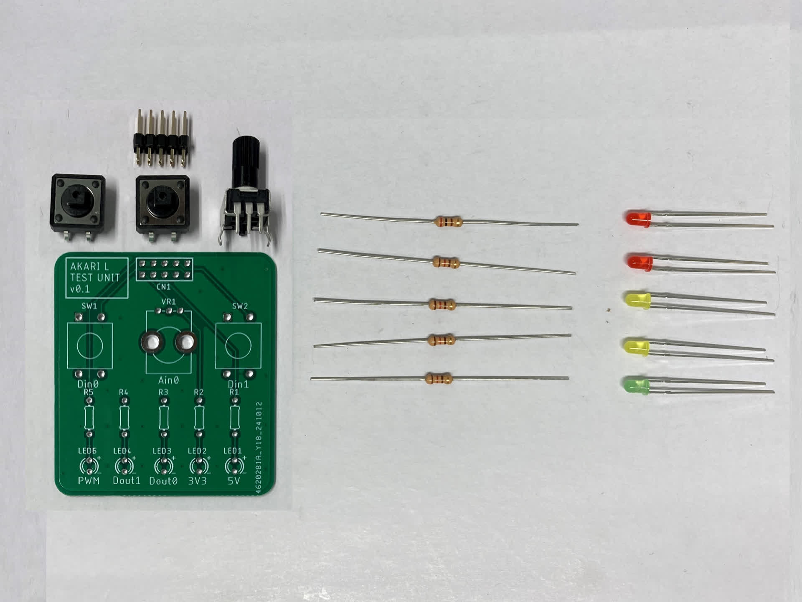
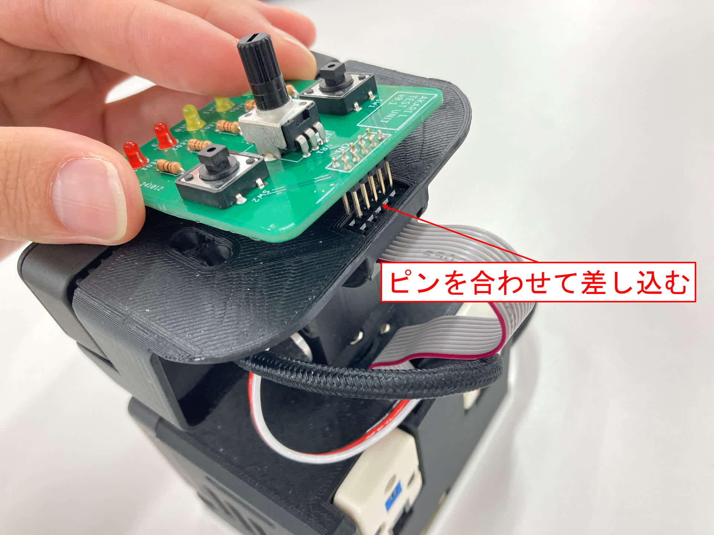

***********************************************************
テストユニットを作成しよう(AKARI Light)
***********************************************************

テストユニットを作成しましょう。

必要な道具
-----------------------------------------------------------
| - はんだごて
| - はんだ線
| - ニッパ

必要な部品
^^^^^^^^^^^^^^^^^^^^^^^^^^^^^^^^^^^^^^^^^^^^^^^^^^^^^^^^^^^
| (T1) Light TEST UNIT基板 1個
| (T2) 2.54mmピッチピンヘッダー 2×5 (10P) 1個
| (T3) タクトスイッチ 12mm 2個
| (T4) 3mm赤色LED 625nm 70度 2個
| (T5) 3mm黄色LED 595nm 70度 2個
| (T6) 3mm緑色LED 525nm 70度 1個
| (T7) カーボン抵抗（炭素皮膜抵抗）120Ω 4個
| (T8) カーボン抵抗（炭素皮膜抵抗）200Ω 1個
| (T9) 可変抵抗器 10KΩ 1個

手順
^^^^^^^^^^^^^^^^^^^^^^^^^^^^^^^^^^^^^^^^^^^^^^^^^^^^^^^^^^^
1. `(T8) カーボン抵抗（炭素皮膜抵抗）200Ω` をR1にはんだ付けし、足を切断する。

    .. image:: ../../images/assembly_light/test_unit/test_unit01-02.jpg
        :width: 400px

2. `(T7) カーボン抵抗（炭素皮膜抵抗）120Ω` をR2~R5にはんだ付けし、足を切断する。

    .. image:: ../../images/assembly_light/test_unit/test_unit01-03.jpg
        :width: 400px

3. `(T4) 3mm赤色LED 625nm 70度` をLED1~2にはんだ付けし、足を切断する。

    | **LEDの足の長い方(アノード側)を基板の＋側にすること**

    .. image:: ../../images/assembly_light/test_unit/test_unit01-04.jpg
        :width: 400px

4. `(T5) 3mm黄色LED 595nm` をLED3,4にはんだ付けし、足を切断する。

    | **LEDの足の長い方(アノード側)を基板の＋側にすること**

    .. image:: ../../images/assembly_light/test_unit/test_unit01-05.jpg
        :width: 400px

5. `(T6) 3mm緑色LED 525nm` をLED5にはんだ付けし、足を切断する。

    | **LEDの足の長い方(アノード側)を基板の＋側にすること**

    .. image:: ../../images/assembly_light/test_unit/test_unit01-06.jpg
        :width: 400px

6. `(T3) タクトスイッチ` をSW1,SW2にはんだ付けする。

    .. image:: ../../images/assembly_light/test_unit/test_unit01-07.jpg
        :width: 400px

7. `(T10) 可変抵抗器 10KΩ` をVR1にはんだ付けする。

    .. image:: ../../images/assembly_light/test_unit/test_unit01-08.jpg
        :width: 400px

8. `(T2) 2.54mmピッチピンヘッダー 2×5 (10P)` を `(T1) Light TEST UNIT基板` 裏面のCN1にはんだ付けする。

    .. image:: ../../images/assembly_light/test_unit/test_unit01-09.jpg
        :width: 400px

取り付け方法
^^^^^^^^^^^^^^^^^^^^^^^^^^^^^^^^^^^^^^^^^^^^^^^^^^^^^^^^^^^

AKARIのヘッド部のボックスヘッダに、テストユニットのピンヘッダを合わせる形で差し込むと取り付けができる。

.. image:: ../../images/assembly_light/test_unit/test_unit02-02.jpg
    :width: 400px

| 以上でテスト基板の作成は終わりです。
| 使い方については :doc:`../../spec/test_unit_light` を参照してください。

:doc:`../setup_soft/main` へ進む

:doc:`part_list` へ戻る
