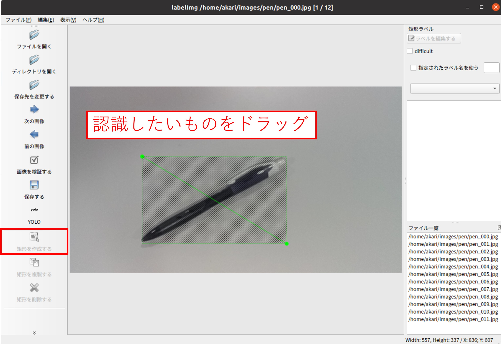

***********************************************************
2. 画像のアノテーションをする
***********************************************************

次に、収集した画像に学習用の教師ラベルをつける、アノテーションという作業をします。

===========================================================
アノテーションについて
===========================================================

| 学習を行うには、画像に学習のための情報を付与する必要があります。
| 画像のどこに何があるのか、を画像とセットで与えてあげることで、学習を行うことができるようになります。
| この画像内の物体の位置、名前を付与する作業をアノテーションといいます。
| アノテーションは:doc:`image_collection` で行ったように自動化する方法もありますが、基本的には手作業が必要となります。

===========================================================
アノテーションをする
===========================================================

| アノテーションには専用のソフトを用います。ソフトは様々な種類がありますが、今回はlabelImgを用います。
| 下記コマンドでlabelImgをインストールして実行します。

.. code-block:: bash

   sudo apt install -y python3-pyqt5
   pip3 install labelImg --user
   labelImg

| 下記のウィンドウが開くので、「ディレクトリを開く」で :doc:`image_collection` で収集した画像のディレクトリを選択します。
| 先程の画像の一覧が読み込まれます。

.. image:: ../../images/custom_object_detection/annotation_01.jpg
   :width: 700px

| 保存するデータのフォーマットを「YOLO」に変更します。

.. image:: ../../images/custom_object_detection/annotation_02.jpg
   :width: 700px

| 「矩形を作成する」を選択し、画像内の認識させたい物体を囲むようにドラッグします。

| ドラッグすると、ラベル名をつけるウィンドウが表示されるので、1でディレクトリとファイルに付けたラベル名を設定します。("pen"など)

.. image:: ../../images/custom_object_detection/annotation_04.jpg
   :width: 700px

| 「保存する」を押して、画像と同じ名前でアノテーションファイルを保存します。YOLOの場合は. *txt* 形式となります。

.. image:: ../../images/custom_object_detection/annotation_05.jpg
   :width: 700px

.. image:: ../../images/custom_object_detection/annotation_06.jpg
   :width: 700px

| 「次の画像」を押して、次の画像についても同様に行っていきます。

| この作業をファイル全てに対して繰り返します。
| ショートカットキーを使うことで作業を早く行うことができます。代表的なものとしては、
| w: 矩形を作成する
| d: 次の画像
| s: 前の画像
| Ctrl + s: 保存する
| などがあります。その他のショートカットキーは、labelImgの「ヘルプ」→「ショートカット一覧を見る」から確認できます。
|
| アノテーションは単純作業の繰り返しで枚数が多いほど大変ですが、ここの作業が後の学習の精度を左右します。頑張って全部の画像にアノテーションを行いましょう。

:doc:`training` へ進む

:doc:`image_collection` へ戻る
