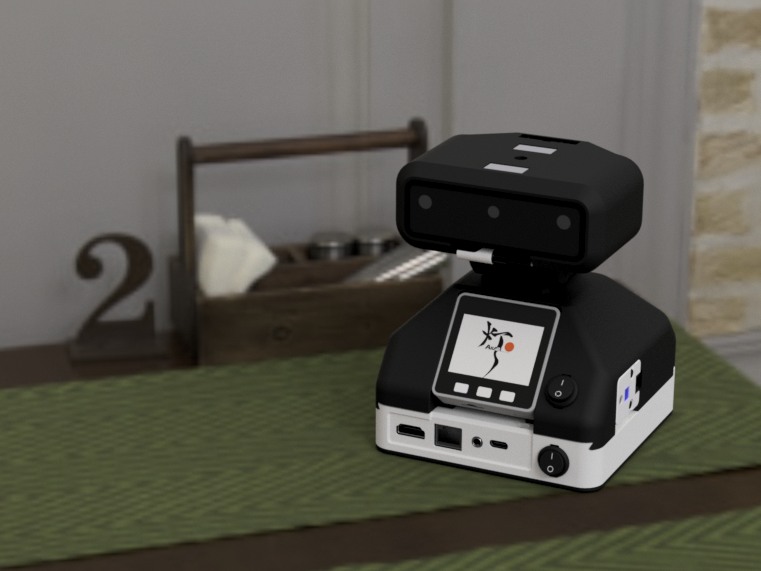
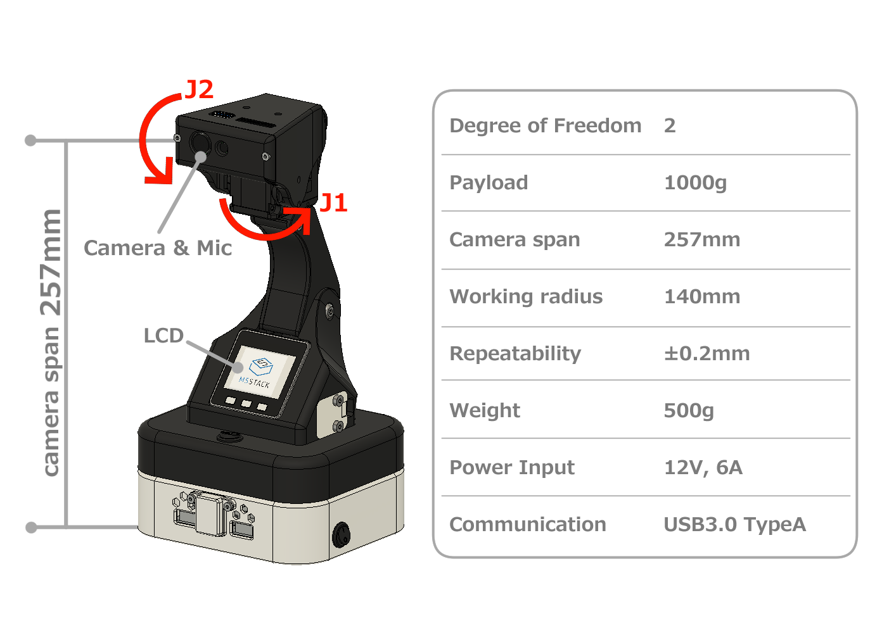
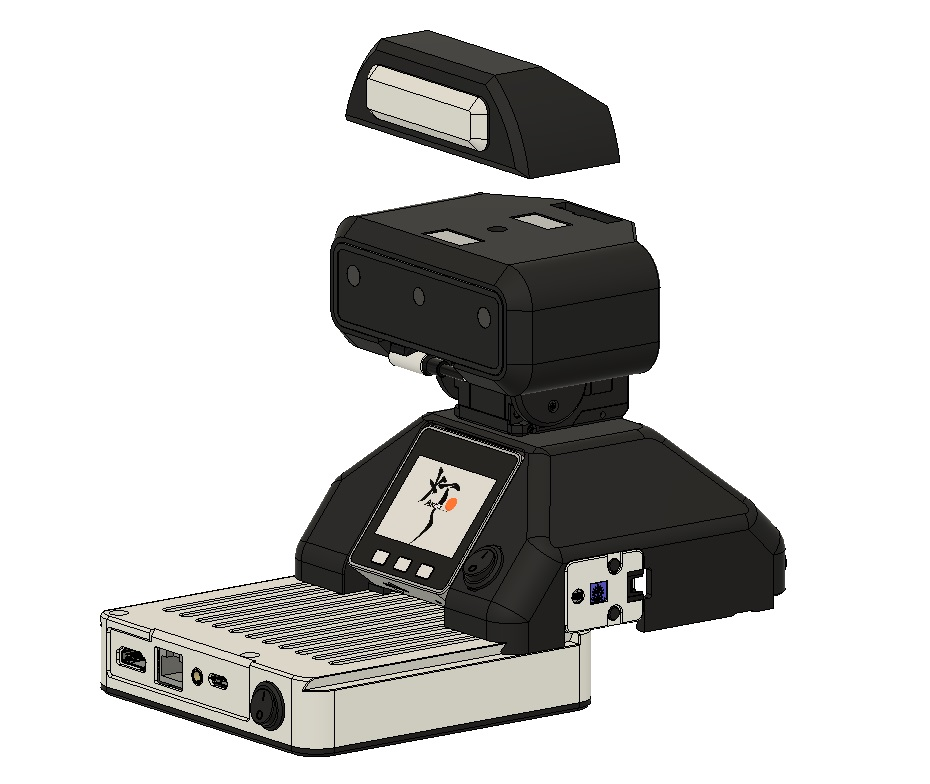

#########
はじめに
#########

***************************************
AKARIとは
***************************************

AKARIはパン・チルトの2自由度を持ったAIカメラです。

AKARIはヘッドとベースユニットをそれぞれスタックし、拡張することができます。

********************************************
AKARIを使って困りごとを解決しよう
********************************************

AKARIは好みのデバイスを接続できるようになっています。
また、ソフトウェアはすべて公開しており、誰でもアプリ開発を行うことができます。
AKARIは、好みのデバイスを使って独自にアプリ開発することで、無限の可能性を秘めています。

AKARIを使って、世の中の困りごとを一緒に解決していきましょう。

********************************************
AKARIの情報元
********************************************

* 基本マニュアル（本ドキュメント）

	AKARIの基本仕様や開発方法など、更新頻度の低い情報を記載しています。

* AKARIブログ(準備中)

	開発アイディアや開発アプリを共有したり、ディスカッションする場です。
	AKARIは日々進化しており、最新情報はこちらを参照してください。

* ソースコード

   - 本体PC上で動作するコード： https://github.com/AkariGroup/akari_main
   - ハードウェアの情報: https://github.com/AkariGroup/akarihardware
   - 基本マニュアルのソース: https://github.com/AkariGroup/akari_document

* パッケージreadme

	ソースコードの各パッケージに含まれるreadmeには、各パッケージの詳細仕様を記載しています。

********************************************
本マニュアルの構成
********************************************

本マニュアルは以下のような構成になっています。

1. :doc:`intro`

   AKARIの概要について記載しています。

#. :doc:`assembly/main`

   AKARIの組み立て方、セットアップ方法について記載しています。

#. :doc:`tutorial/main`

   AKARIの簡単な使い方について記載しています。

#. :doc:`spec/main`

   AKARIの詳細仕様について記載しています。

#. :doc:`practice/main`

   AKARIを使った練習問題集です。

#. :doc:`dev/main`

   AKARIを使った開発のヒントが記載してあります。

#. :doc:`ros2_tutorial/main`

   AKARIをROS2で使う場合の仕様や使い方、ROS2での開発チュートリアルです。

#. :doc:`troubleshoot/main`

   AKARIのトラブルシュートを記載します。

