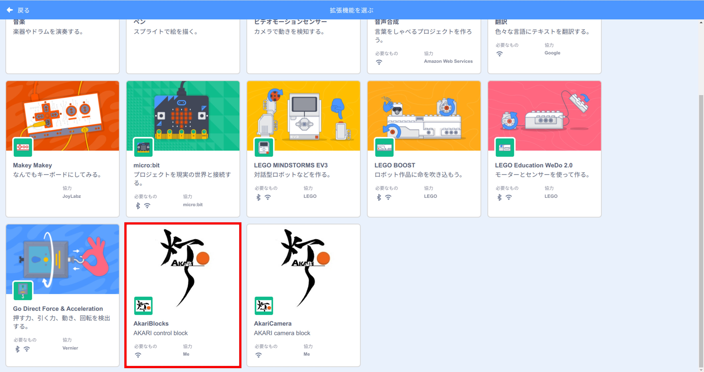
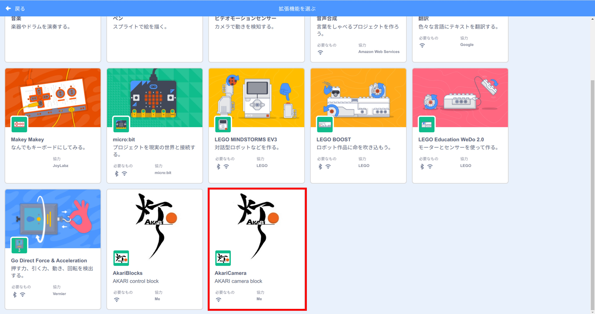
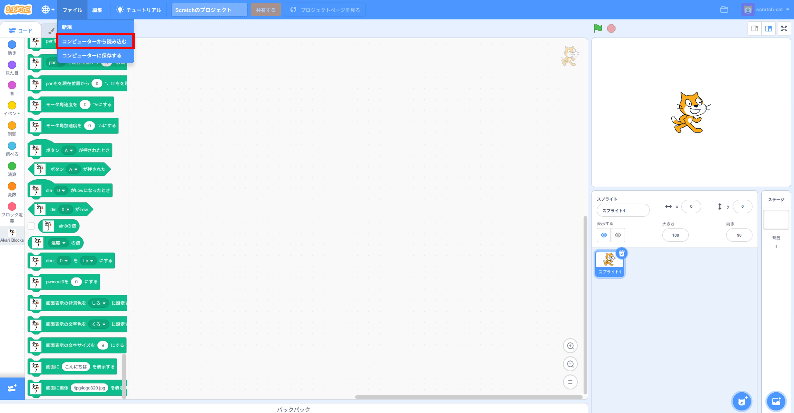
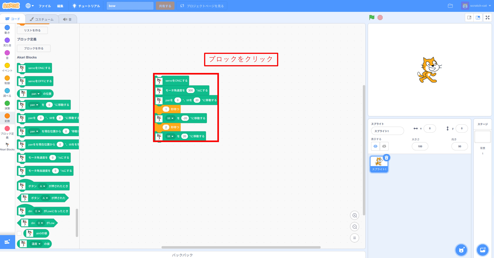

***********************************************************
Scratchで動かしてみよう
***********************************************************

| ここでは、Scratchを起動してAKARIを動かす方法を説明します。

===========================================================
Scratchの起動
===========================================================

| :doc:`setup` の準備が終わったら、scratchを起動します。

1. akari_scratchのdockerを起動する。

  | `akari_scratch/docker` 内で下記コマンドを実行し、akari_scratchを起動します。

  .. code-block:: bash

    docker compose -f docker-compose.yml up

  | akari_scratchのcompileが始まるので、Compiled successfullyの表示になるまでしばらく待ちます。

2. (別PCからアクセスする場合)AKARIが接続されているネットワークと同一のネットワークにPCを接続する。

3. ブラウザからscratchにアクセスする。

  | :doc:`../tutorial_web/access` と同様の方法でAKARIのIPアドレスを調べ、webブラウザのwebアドレス欄に `[AKARIのIPアドレス]:8601` を入力してアクセスします。
  | AKARI本体から直接アクセスしている場合は、 `localhost:8601` でもアクセスできます。

3. scratchが起動する。

===========================================================
AKARIの動かし方
===========================================================

| AKARIを動かすためには、専用の拡張機能をインポートする必要があります。

1. Scratchの画面左下の拡張機能ボタンを押す。

.. image:: ../images/scratch/playing_01.jpg
    :width: 600px

2. 拡張機能画面を下にスクロールして、AkariBlocksを選択する。

3. TOP画面でAkariBlocksのブロックが使えるようになる。

4. 同様に拡張機能画面を再度開き、AkariCameraの拡張機能を選択する。

5. AkariCameraのブロックが使えるようになる。

===========================================================
サンプルアプリを動かしてみよう
===========================================================

| まずはサンプルアプリを動かしてみましょう。

1. Scratchを使っているPCにサンプルアプリをダウンロードする。

  | サンプルアプリはScratchを開いているPC側から開く必要があります。
  | サンプルアプリは `akari_scratch/sample` に含まれているため、AKARI本体ではなく外部のPCからScratchを起動している場合はそちらのPCにもダウンロードし直す必要があります。
  | 外部のPC上でakari_scratchをcloneするか、`akari_scratch/sample <https://github.com/AkariGroup/akari_scratch/tree/main/sample>`_ からファイルを直接ダウンロードします。
  | 今回は `bow.sb3` をダウンロードしましょう。

2. Scratch上でサンプルアプリを開く。

  | Scratch上の画面上部の「ファイル」→「コンピュータから読み込む」を選択し、先程ダウンロードした `bow.sb3` を開きます。
  | Scratch画面中央に、サンプルプログラムが表示されます。

3. プロジェクトを実行する。

  | Scratch上のサンプルプログラムをクリックすると、動作が実行されAKARIがヘッドを上下に動かすおじぎのモーションをします。

===========================================================
その他のサンプルアプリ
===========================================================

- sleepy.sb3
| AKARIの明るさセンサの値が一定以下になったらAKARIが寝てしまいます。

..  youtube:: HSteJR8OdmU

|
- face_tracking.sb3
| 顔追従をするアプリです。

..  youtube:: 8kNUdVpN4tM

| 以上がScratchの使い方の簡単な説明となります。
| 次はAKARI拡張機能の各ブロックの仕様を説明します。
| これらを参考に、ブロックを組み合わせてアプリを作ってみてください。

:doc:`ref_akari_blocks` へ進む

:doc:`ref_akari_blocks_beginner` へ進む

:doc:`setup` へ戻る
