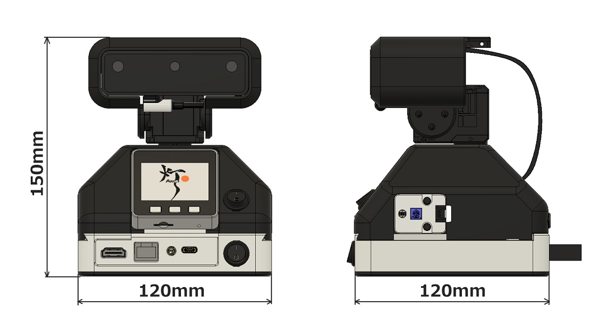
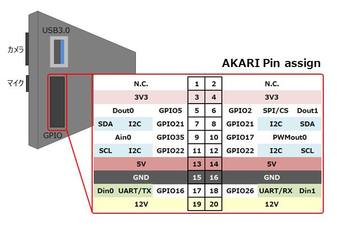
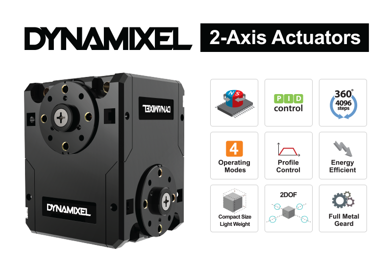
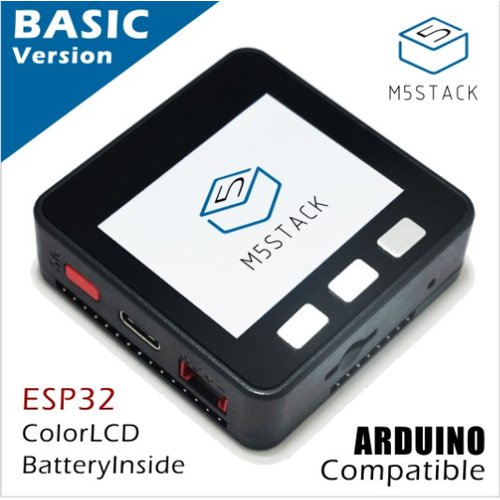
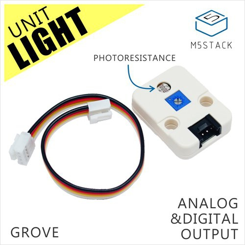
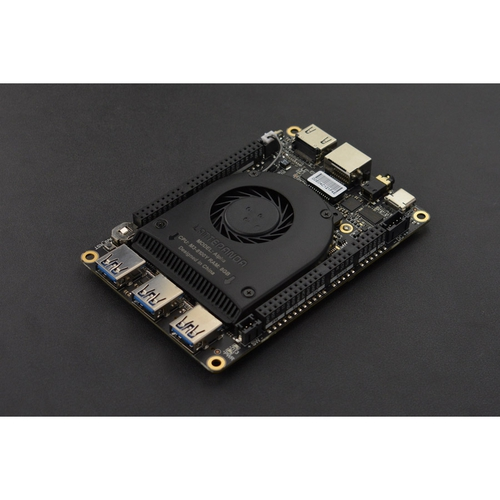

***********************************************************
ハードウェア仕様
***********************************************************

ハードウェアの仕様について説明します。

===========================================================
外観
===========================================================
AKARIは卓上に配置可能なサイズです。

.. raw:: html

   <iframe src="https://myhub.autodesk360.com/ue289b128/shares/public/SH512d4QTec90decfa6e0e3f281b1a14381e?mode=embed" width="800" height="600" allowfullscreen="true" webkitallowfullscreen="true" mozallowfullscreen="true"  frameborder="0"></iframe>

===========================================================
GPIO
===========================================================
ヘッドのGPIOにより3V3、5V、12Vの電源出力や、I2C、UART通信を行うことができます。
USB3.0のデバイスを接続することもできます。

===========================================================
DepthAIカメラ
===========================================================
OAK-D-LITE
^^^^^^^^^^^^^^^^^^^^^^^^^^^^^^^^^^^^^^^^^^^^^^^^^^^^^^^^^^^

ステレオカメラ2基と4Kカメラ1基を通して、深度情報と色情報を取得できるAIカメラです。

https://shop.luxonis.com/products/oak-d-lite-1?_pos=1&_psq=lite&_ss=e&_v=1.0

.. image:: ../images/oak-d-lite.jpg
   :width: 200px

.. csv-table::
   :widths: 6, 6

    メインカメラモデル, Sony IMX214
    焦点範囲, 8 cm〜∞
    有効焦点距離長, 3.37 mm
    ステレオカメラモデル, OmniVision OV725
    焦点範囲, 6.5 cm〜∞
    有効焦点距離長, 1.3 mm

===========================================================
モータ
===========================================================
Dynamixel 2XL430-W250-T
^^^^^^^^^^^^^^^^^^^^^^^^^^^^^^^^^^^^^^^^^^^^^^^^^^^^^^^^^^^

1つのモジュールで2軸交差構成のシリアルサーボです。

https://www.besttechnology.co.jp/modules/onlineshop/index.php?fct=photo&p=262

.. csv-table::
   :widths: 4, 4

   ストールトルク, 1.4Nm (at 11.1V 1.3A)
   電源電圧, 6.5～12V (Recommended 11.1V)
   動作角度, 位置決め制御時:0～360°(12ビット分解能)
   リンク方式, TTL

===========================================================
M5Stack
===========================================================
M5StackBasic
^^^^^^^^^^^^^^^^^^^^^^^^^^^^^^^^^^^^^^^^^^^^^^^^^^^^^^^^^^^

ESP32を搭載した開発デバイスです。

https://shop.m5stack.com/products/esp32-basic-core-lot-development-kit-v2-7

.. csv-table::
   :widths: 4, 4

    CPU, 240MHz dual core、 600 DMIPS、 520KB SRAM、 Wi-Fi、 dual mode Bluetooth
    ストレージ, microSDスロット
    搭載LCD, 320 x 240 カラーTFT LCD
    内蔵スピーカー, 1W

環境センサ（ENV Ⅲ）
^^^^^^^^^^^^^^^^^^^^^^^^^^^^^^^^^^^^^^^^^^^^^^^^^^^^^^^^^^^

SHT30とQMP6988を搭載した温度/湿度/気圧が測定できる環境センサです。

https://shop.m5stack.com/products/env-iii-unit-with-temperature-humidity-air-pressure-sensor-sht30-qmp6988

.. image:: ../images/ENV3_Sensor.png
   :width: 200px

.. csv-table::
   :widths: 5, 5

    温度測定範囲, 	-40 ~ 120 ℃
    標準温度許容差, 	0 ~ 60 ℃/±0.2 ℃
    湿度測定範囲, 	10 ~ 90 %RH / ±2 %
    気圧測定範囲,	300 ~ 1100 hPa / ±1 hPa
    通信プロトコル, 	I2C：SHT30（0x44） QMP6988（0x56）

光センサ
^^^^^^^^^^^^^^^^^^^^^^^^^^^^^^^^^^^^^^^^^^^^^^^^^^^^^^^^^^^

環境光の強度を検出します。

https://shop.m5stack.com/products/light-sensor-unit

===========================================================
コンピュータ
===========================================================
LattePanda Alpha 864s
^^^^^^^^^^^^^^^^^^^^^^^^^^^^^^^^^^^^^^^^^^^^^^^^^^^^^^^^^^^

Intelの第8世代Core m3-8100Yを搭載したシングルボードコンピュータ

https://www.lattepanda.com/lattepanda-alpha

.. csv-table::
   :widths: 9, 9

    CPU, Intel 第8世代Core m3-8100Y
    Core, 1.1-3.4 GHz 2コア/ 4スレッド
    GPU, Intel HD Graphics 615 900 MHz
    RAM, 8G LPDDR3-1866 デュアルチャンネル
    ストレージ, 64GB eMMC
    Wi-Fi, 802.11 ac（2.4 G & 5 G）
    Bluetooth, デュアルバンドBluetooth 4.2
    USBポート, USB 3.0 TypeA
    ディスプレイ出力, HDMI出力、Type C DP、eDP
