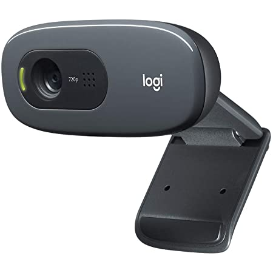
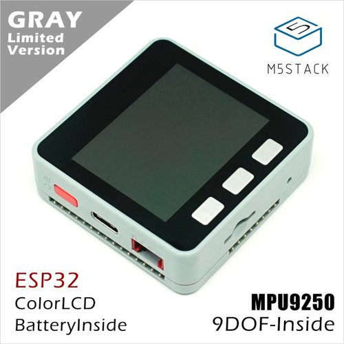
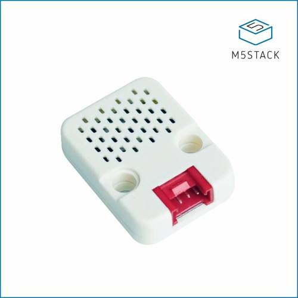

******************************
ハードウェア仕様(工事中)
******************************

ハードウェアの仕様について説明します。

=============================
外観
=============================
AKARIは卓上に配置可能なサイズです。

.. image:: ../images/AKARI_Size.jpg
   :scale: 100%
   :height: 400px
   :width: 600px

.. raw:: html

   <iframe src="https://myhub.autodesk360.com/ue289b128/shares/public/SH35dfcQT936092f0e437309b40f34ee6929?mode=embed" width="800" height="600" allowfullscreen="true" webkitallowfullscreen="true" mozallowfullscreen="true" frameborder="0"></iframe>

=============================
GPIO
=============================
ヘッドのGPIOにより3V3、5V、12Vの電源出力や、I2C、UART通信を行うことができます。
USB3.0のデバイスを接続することもできます。

.. image:: ../images/PinAssign.JPG
   :scale: 100%
   :height: 400px
   :width: 600px

=============================
カメラ
=============================
Logicool HD Webcam C270n
^^^^^^^^^^^^^^^^^^^^^^^^

マイク内蔵の120万画素ウェブカメラです。

https://www.logicool.co.jp/ja-jp/product/hd-webcam-c270n

.. csv-table::
   :widths: 5, 5
   :align: left

    最大解像度, 720p/30fps
    フォーカスタイプ, 固定フォーカス
    レンズテクノロジー, 標準
    内蔵マイク, モノラル
    視野, 60°

=============================
モータ
=============================
Dynamixel 2XL430-W250-T
^^^^^^^^^^^^^^^^^^^^^^^^

1つのモジュールで2軸交差構成のシリアルサーボです。

https://www.besttechnology.co.jp/modules/onlineshop/index.php?fct=photo&p=262

.. image:: ../images/2XL430-W250-T.png
   :scale: 100%
   :height: 200px
   :width: 300px

.. csv-table::
   :widths: 4, 4

   ストールトルク, 1.4Nm (at 11.1V 1.3A)
   電源電圧, 6.5～12V (Recommended 11.1V)
   動作角度, 位置決め制御時:0～360°(12ビット分解能)
   リンク方式, TTL

=============================
M5Stack
=============================
M5StackGray
^^^^^^^^^^^^^^^^^^^^^^^^

ESP32を搭載した開発デバイスです。

https://m5stack-store.myshopify.com/collections/m5-core/products/grey-development-core

.. csv-table::
   :widths: 5, 5

    CPU, 240MHz dual core、 600 DMIPS、 520KB SRAM、 Wi-Fi、 dual mode Bluetooth
    内蔵センサ, MPU9250（9軸センサ）
    ストレージ, microSDスロット
    搭載LCD, 320 x 240 カラーTFT LCD
    内蔵スピーカー, 1W

環境センサ（ENV II）
^^^^^^^^^^^^^^^^^^^^^^^^

SHT30とBMP280を搭載した温度/湿度/気圧が測定できる環境センサです。

https://m5stack-store.myshopify.com/products/env-ii-unit

.. csv-table::
   :widths: 5, 5

    温度測定範囲, 	-40 ~ 120 ℃
    標準温度許容差, 	0 ~ 60 ℃/±0.2 ℃
    湿度測定範囲, 	10 ~ 90 %RH / ±2 %
    気圧測定範囲,	300 ~ 1100 hPa / ±1 hPa
    通信プロトコル, 	I2C：SHT30（0x44） BMP280（0x76）

光センサ
^^^^^^^^^^^^^^^^^^^^^^^^

環境光の強度を検出します。

https://m5stack-store.myshopify.com/collections/m5-unit/products/light-sensor-unit

.. image:: ../images/LIGHT_Sensor.jpg
   :scale: 100%
   :height: 200px
   :width: 200px

=============================
コンピュータ
=============================
LattePanda Alpha 864s
^^^^^^^^^^^^^^^^^^^^^^^^

Intelの第8世代Core m3-8100Yを搭載したシングルボードコンピュータ

https://www.lattepanda.com/products/lattepanda-alpha-864s.html

.. image:: ../images/LattePanda.jpg
   :scale: 100%
   :height: 200px
   :width: 200px

.. csv-table::
   :widths: 9, 9
    
    CPU, Intel 第8世代Core m3-8100Y
    Core, 1.1-3.4 GHz 2コア/ 4スレッド
    GPU, Intel HD Graphics 615 900 MHz
    RAM, 8G LPDDR3-1866 デュアルチャンネル
    ストレージ, 64GB eMMC
    Wi-Fi, 802.11 ac（2.4 G & 5 G）
    Bluetooth, デュアルバンドBluetooth 4.2
    USBポート, USB 3.0 TypeA
    ディスプレイ出力, HDMI出力、Type C DP、eDP