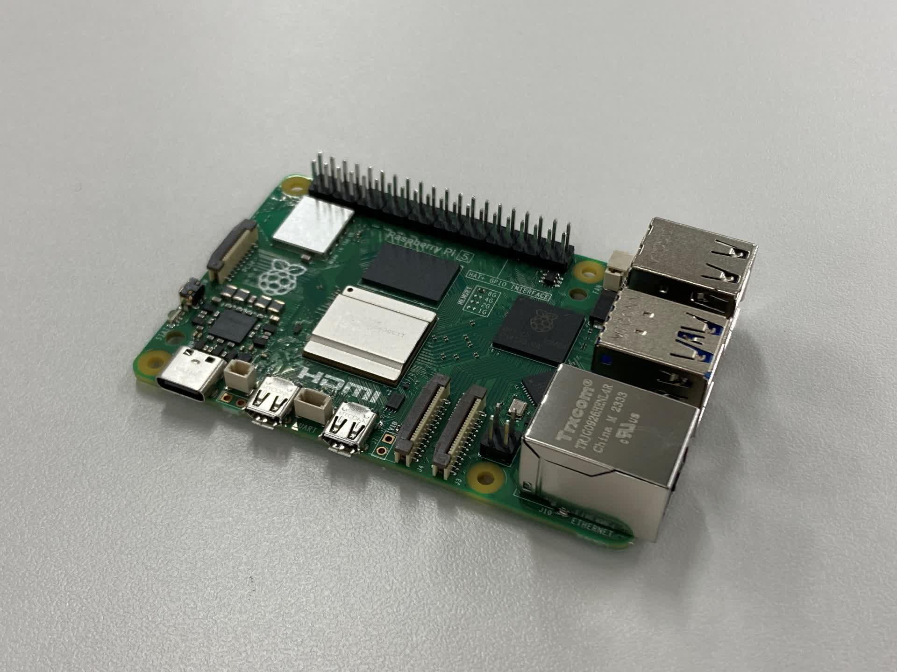

***********************************************************
ハードウェア仕様(AKARI Light)
***********************************************************

ハードウェアの仕様について説明します。

===========================================================
外観
===========================================================
AKARI Lightは卓上に配置可能なサイズです。AKARIとほぼ同等の機能を持ち、同じソフトで動作します。
より安価に、より簡単に組み立てることができます。

.. raw:: html

   <iframe src="https://a360.co/3AoEkZ6" width="800" height="600" allowfullscreen="true" webkitallowfullscreen="true" mozallowfullscreen="true"  frameborder="0"></iframe>

===========================================================
GPIO
===========================================================
ヘッドのGPIOにより3V3、5Vの電源出力を行うことができます。

===========================================================
DepthAIカメラ
===========================================================
OAK-D-LITE
^^^^^^^^^^^^^^^^^^^^^^^^^^^^^^^^^^^^^^^^^^^^^^^^^^^^^^^^^^^

ステレオカメラ2基と4Kカメラ1基を通して、深度情報と色情報を取得できるAIカメラです。

https://shop.luxonis.com/products/oak-d-lite-1?_pos=1&_psq=lite&_ss=e&_v=1.0

.. image:: ../images/oak-d-lite.jpg
   :width: 200px

.. csv-table::
   :widths: 6, 6

    メインカメラモデル, Sony IMX214
    焦点範囲, 8 cm〜∞
    有効焦点距離長, 3.37 mm
    ステレオカメラモデル, OmniVision OV725
    焦点範囲, 6.5 cm〜∞
    有効焦点距離長, 1.3 mm

===========================================================
モータ
===========================================================
Feetech STS3215
^^^^^^^^^^^^^^^^^^^^^^^^^^^^^^^^^^^^^^^^^^^^^^^^^^^^^^^^^^^

小型のシリアルサーボです。

https://www.feetechrc.com/74v-19-kgcm-plastic-case-metal-tooth-magnetic-code-double-axis-ttl-series-steering-gear.html

.. image:: ../images/STS3215.jpg
   :width: 200px

.. csv-table::
   :widths: 6, 6

    電源電圧min,  4V
    電源電圧max,  7.4V
    スピードmax,  0.192sec/60°
    トルクmax[kgf・cm],    19.5kgf・cm
    制御信号,  シリアル

===========================================================
M5Stack
===========================================================
M5StackBasic
^^^^^^^^^^^^^^^^^^^^^^^^^^^^^^^^^^^^^^^^^^^^^^^^^^^^^^^^^^^

ESP32を搭載した開発デバイスです。

https://shop.m5stack.com/products/esp32-basic-core-lot-development-kit-v2-7

.. image:: ../images/m5stack.jpg
   :width: 200px

.. csv-table::
   :widths: 4, 4

    CPU, 240MHz dual core、 600 DMIPS、 520KB SRAM、 Wi-Fi、 dual mode Bluetooth
    ストレージ, microSDスロット
    搭載LCD, 320 x 240 カラーTFT LCD
    内蔵スピーカー, 1W

環境センサ（ENV Ⅲ）
^^^^^^^^^^^^^^^^^^^^^^^^^^^^^^^^^^^^^^^^^^^^^^^^^^^^^^^^^^^

SHT30とQMP6988を搭載した温度/湿度/気圧が測定できる環境センサです。

https://shop.m5stack.com/products/env-iii-unit-with-temperature-humidity-air-pressure-sensor-sht30-qmp6988

.. image:: ../images/ENV3_Sensor.png
   :width: 200px

.. csv-table::
   :widths: 5, 5

    温度測定範囲, 	-40 ~ 120 ℃
    標準温度許容差, 	0 ~ 60 ℃/±0.2 ℃
    湿度測定範囲, 	10 ~ 90 %RH / ±2 %
    気圧測定範囲,	300 ~ 1100 hPa / ±1 hPa
    通信プロトコル, 	I2C：SHT30（0x44） QMP6988（0x56）

光センサ
^^^^^^^^^^^^^^^^^^^^^^^^^^^^^^^^^^^^^^^^^^^^^^^^^^^^^^^^^^^

環境光の強度を検出します。

https://shop.m5stack.com/products/light-sensor-unit

.. image:: ../images/LIGHT_Sensor.jpg
   :width: 200px

===========================================================
コンピュータ
===========================================================
RaspberryPi 5 (8GB)
^^^^^^^^^^^^^^^^^^^^^^^^^^^^^^^^^^^^^^^^^^^^^^^^^^^^^^^^^^^

Linuxが動作する手のひらサイズのシングルボードコンピュータ（SBC）です。

https://raspberry-pi.ksyic.com/main/index/pdp.id/1016/

基本仕様

.. csv-table::
   :widths: 5, 5

    CPU,    2.4GHz 4コア Cortex-A76 （ARMv8、64bit、L2: 512KB、L3: 2MB）
    GPU,    VideoCore VII®
    メモリー,  8GB LPDDR4X-4267 SDRAM、2133MHz
    RTC(Real Time Clock),  RTCと電池コネクタ
    電源,   USB Type-C ソケット 5V 5.0A PD使用

インタフェース／通信

.. csv-table::
   :widths: 5, 5

    イーサネット,    
    無線LAN,   IEEE 802.11 b/g/n/ac 2.4/5GHz デュアルバンド
    Bluetooth, Bluetooth Ver5.0＋LE （BLE）
    ビデオ出力,   2 x micro HDMI (最大4Kp60)、2 x MIPI DSI 4-lane （22pin 0.5mmピッチ） （カメラ入力と共有）
    オーディオ出力,  2 x HDMI（ビデオ出力と共有）、I2Sピンヘッダ
    カメラ入力,   2 x MIPI CSI 4-lane （22pin 0.5mmピッチ）（ビデオ出力と共有）
    PCIe,   1 x PCIe 2.0 シングルレーン （FFCコネクタ）
    USB,    4 x USB Type-A ソケット (2 x USB 2.0、2 x USB 3.0)
    GPIOコネクター, 40ピン 2.54mm ピンヘッダー
    カード スロット, micro SDメモリーカード（SDIO）
